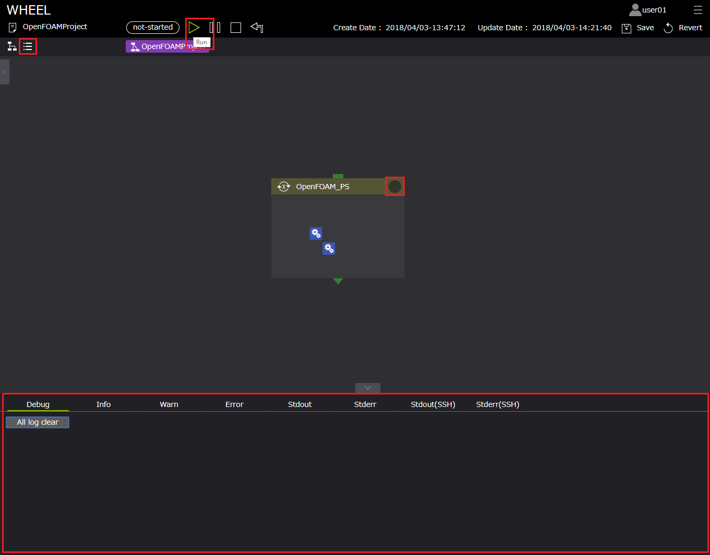
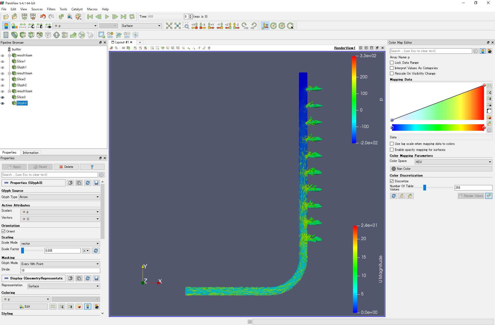
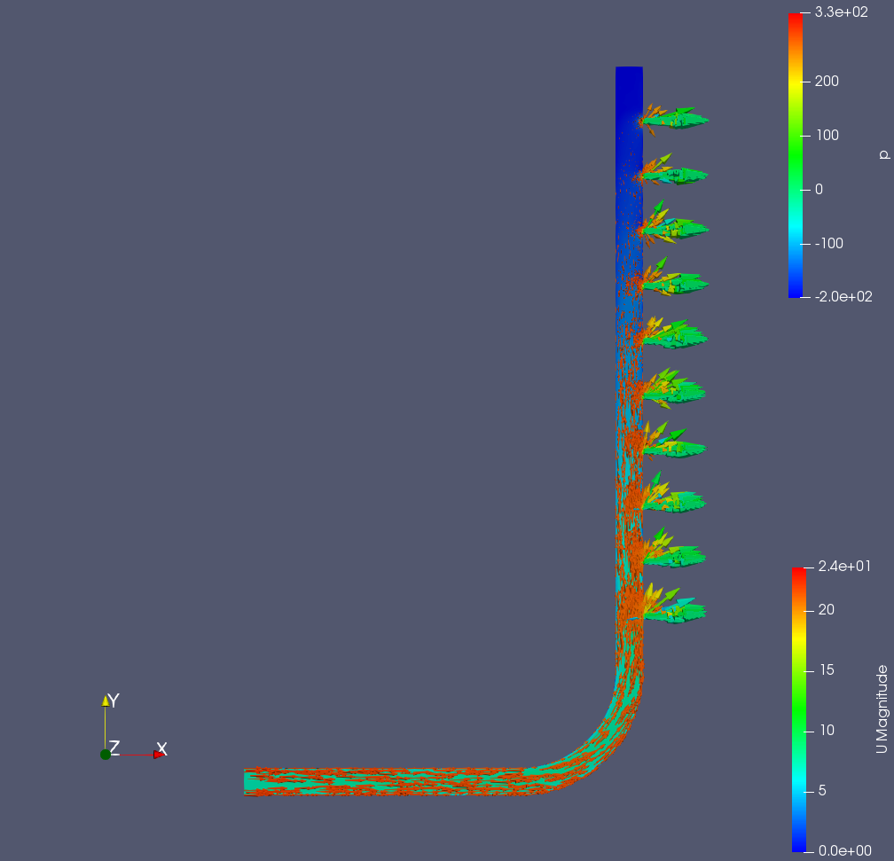

# OpenFOAMを利用したパラメトリックスタディ解析ワークフロー
本章では、WHEELを用いた計算事例として「OpenFOAMを利用したパラメトリックスタディ解析ワークフロー」を紹介します。  
3次元CADで作成した分配菅モデルに対しオープンソースCAEソフトウエア「SALOME-MACA」でメッシュ化し、WHEELを用いてパラメトリックスタディ解析を京コンピュータのmicroキューを利用して行います。  
以降、下記の順にて事例内容を紹介します。  

また、本章で使用するモデルデータ、OpenFOAMの計算実行ファイル、及びTaskコンポーネントで使用するスクリプト例は、  
下記よりダウンロード可能です。  
<a href="./sample/OpenFOAM_tutorial_sample.zip">OpenFOAMサンプルデータ</a>

1. 解析概要
1. オープンソースCAEソフトウエア「SALOME-MACA」によるメッシュ作成
1. WHEELによるワークフローの作成  
　1. Parameter Study コンポーネント  
　2. Task コンポーネント
1. ジョブの投入
1. 解析結果の確認

## 1. 解析概要
本事例で使用する解析対象モデルは、分配菅モデルです。

#### 解析モデル D50-d10

  

inletから流入した流体がoutletから出ていく解析を実施します。  
また、本解析では、**inletの流量**を対象としたパラメトリックスタディ解析を行います。

## 2. オープンソースCAEソフトウエア「SALOME-MACA」によるメッシュ作成
本解析では、オープンソースCAEソフトウエア「SALOME-MACA」にて解析モデルのメッシュを作成しました。  
本節では、SALOME-MACAでのメッシュの作成手順を簡単に示します。  
※本チュートリアルでは、オープンソースCAEソフトウエア「SALOME-MACA」はインストール済みであるものとして説明します。

### 「Geometry」モジュールのグループ設定
「Geometry」モジュールのグループ設定までの手順は以下です。
1. SALOME-MECA起動後、「新しいドキュメント」ボタンをクリックし新規ドキュメントを作成する
1. 「Geometory」モジュールを選択する
1. 「ファイル」-「インポート…」-「STEP」インポートをクリックし、3次元CADで作成した分配管モデル「D50-d10.stp」を選択する
1. 表示される単位変換の選択ウィンドウより、適切な単位系を選択する（本解析では、メートル[M]を選択）
1. OpenFOAMでの境界条件設定用に、入口/出口/壁面のそれぞれにFACEグループを設定する  
   本事例では、入口にinlet、10箇所の出口にoutet1～outlet10、壁面にwallのグループ名を設定

#### 「Geometry」モジュールのグループ設定

  

### 「Mesh」モジュールでのメッシュの設定と作成
「Geometory」モジュールにて、グループ名設定後、「Mesh」モジュールに切り替えて、メッシュの設定と作成します。  
このモデルでは、四面体テトラ要素と境界層メッシュ（プリズム）を設定しています。

  

### 「Mesh」モジュールのグループ設定
メッシュ作成後、入口/出口/壁面のそれぞれにFACEグループを設定します。  
「Geometory」モジュールで設定したグループを利用し、入口にinlet、10箇所の出口にoutet1～outlet10、壁面にwallのグループ名を設定します。

以上の操作後、作成されるメッシュは以下のようになります。

四面体　　　　　　：273726  
プリズム（三角柱）：109503  
合計　　　　　　　：383229

  


### メッシュデータのエキスポート
メッシュ作成、グループ作成後、Ideas universal形式でメッシュデータをエキスポートします。

### メッシュデータのOpenFOAM形式への変換
作成したメッシュデータをOpenFOAMでの計算に利用する場合、  
エキスポートしたメッシュデータをIdeas universalファイルから、OpenFOAM形式への変換する必要があります。  
手順は以下です。

ターミナルを起動し、
解析データの親ディレクトリ「D50-d10」にて、  

```
$ ideasUnvToFoam *.unv
```

コマンドを実行します。

この操作により、「constant/polyMesh」ディレクトリに  
・boundary  
・owner  
・faces  
・neighbor  
・points  
というOpenFOAM用のメッシュデータが生成されます。

## 3. WHEELによるワークフローの作成
本節では、WHEELでのパラメトリックスタディ解析に必要なワークフローコンポーネントについて説明します。  
本事例で必要なコンポーネントとその役割は以下です。

- Parameter Study コンポーネント：パラメータ化するデータの設定用
- Task コンポーネント - 1：PSコンポーネントにてパラメータ化したデータの転送用
- Task コンポーネント - 2：京へのジョブ投入及びOpenFOAM実行用

以降で、各コンポーネントについて説明します。
### Parameter Study コンポーネント（OpenFOAM_PS）
前述の通り本事例では、分配菅への流入量をパラメータ化します。  
そのため、OpenFOAM_PSコンポーネントのPSプロパティ[ parameter setting file ]には、OpenFOAMの初期状態の入力データである  
0ディレクトリ配下の「U」ファイルにパラメータセッティングしたファイルを設定します。  

OpenFOAM_PSコンポーネントに設定するプロパティは以下です。

##### OpenFOAM_PS  
| プロパティ名 | 設定値 |
| ---- | ---- |
| Name | OpenFOAM_PS |
| InputFiles | - |
| OutputFiles | - |
| Parameter setting file | U.txt.json |  
| Files | U.txt, U.txt.json |

手順は以下です。  

1. PSディレクトリにUファイル（U.txt）をインポートする
（後のファイル移動時を考慮し、一時的にファイル名を U -> U.txt と変更しています）
1. 読み込んだ U.txt を右クリック[ edit for PS ]よりファイル編集画面を開く
1. boundaryField -> inlet -> value の uniform (5 0 0)の5に対してターゲット設定を行う（Min Value:5, Max value:7, Step:1）
1. 設定後作成された「U.txt.json」ファイルをPSプロパティ[ parameter setting file ]に設定する

  

以上がPSコンポーネントでの設定になります。


### Task コンポーネント - 1
ファイル転送用コンポーネント「moveFile_Task」について説明します。  
本コンポーネントは、OpenFOAM_PSコンポーネントによりパラメータ化した「U.txt」ファイルをOpenFOAMでの計算で用いるために  
OpenFOAM_PSコンポーネントから京コンピュータへ計算を投入するTask（詳細は後述）へ転送するためのコンポーネントです。

moveFile_Taskコンポーネントに設定するプロパティ、及びスクリプトの中身は以下です。

##### moveFile_Task

| プロパティ名 | 設定値 |
| ---- | ---- |
| Name | moveFile_Task |
| Script | moveFile.bat |
| InputFiles | input.txt |
| OutputFiles | - |
| Remotehost | localhost |
| Files | resultRead.bat, value.txt *2 |

> moveFile.bat  
```
@echo off  
mv ../U.txt ../runOpenFOAM_Task  
```

設定は以下です。
1. moveFile_Taskコンポーネントへファイル転送をするスクリプトmoveFile.batをインポートする 
1. プロパティ[ script ]にmoveFile.batを設定する
1. プロパティ[ remotehost ]に「 localhost 」を設定する　*1  
*1 この処理は、京コンピュータへのジョブ投入前に実施するため、localhostで実施します。

  

以上がファイル転送用Taskコンポーネントの設定になります。

### Task コンポーネント - 2
続いて、京コンピュータへのジョブ投入用及びOpenFOAM解析実行用コンポーネント「runOpenFOAM_Task」について説明します。  
本コンポーネントは、京コンピュータのmicroキューを用いてOpenFOAMによる分配管の流体解析を実行するためのコンポーネントです。

runOpenFOAM_Taskコンポーネントに設定するプロパティ、及びスクリプトの中身は以下です。

##### runOpenFOAM_Task

| プロパティ名 | 設定値 |
| ---- | ---- |
| Name | runOpenFOAM_Task |
| Script | runOpenFOAM.sh |
| InputFiles | - |
| OutputFiles | - |
| Remotehost | K_micro |
| UseJobScheduler | true |
| Queue | micro |
| Clean up flag | keep files |
| include | D50-d10.tar.gz |
| exclude | - |
| Files | runOpenFOAM.sh, D50-d10.tar.gz* |

*　解析モデル及びOpenFOAMの計算設定ファイル一式  

> runOpenFOAM.sh  
```
#!/bin/sh  
#PJM --rsc-list "node=2"  
#PJM --mpi "shape=2"  
#PJM --mpi "proc=12"  
#PJM -s  
#   
. /work/system/Env_base  
#  
module load OpenFOAM/2.4.0-fujitsu-sparc64  
source $WM_PROJECT_DIR/etc/bashrc  
tar xvzf D50-d10.tar.gz  
mv ./U.txt U  
mv ./U ./D50-d10/0  
cd ./D50-d10  
decomposePar  
mpiexec -n 12 simpleFoam -parallel  
reconstructPar  
touch result.foam  
cd ..  
tar cvzf D50-d10.tar.gz D50-d10  
```

設定は以下です。
1. 京コンピュータでOpenFOAMを実行するために必要なデータ（OpenFOAMの入力ファイル「D50-b10.tar.gz」）及びジョブスクリプトrunOpenFOAM.shをインポートする
1. プロパティ[ script ]にrunOpenFOAM.shを設定する
1. プロパティ[ remotehost ]に事前に登録している京のリモートホスト情報「K_micro」設定する *
1. プロパティ[ useJobScheduler ]をチェックし、プロパティ[ queue ]に「micro」を設定する
1. moveFile_Taskコンポーネントへファイル転送をするスクリプトmoveFile.shをインポートする
1. includeに回収するファイル名「D50-b10.tar.gz」を設定する

*　京コンピュータでリソースグループmicroを使用して計算を行うため「K_micro」としています  
　 ユーザの環境に合わせて名称の変更が必要です

### ジョブスクリプトに関して
WHEELは、リソースグループmicroを用い、効率的に計算資源を利用することを目的としています。  
よって、microキュー内（30分）で解析が完了するようにモデル規模、またノード数、プロセス数を設定しジョブを投入する必要があります。  
本解析は**2ノード12プロセス**にて解析を行っております。

また、ジョブスクリプトrunOpenFOAM.shには、#PJMで始まるジョブへのオプション設定の他に「OpenFOAMを実行するためのコマンド」を用意しています。  
ここでは、京でOpenFOAMを実行するためのコマンドを紹介します。

通常、京で計算を行うためには計算用の実行モジュールを京のユーザが用意する必要があります。  
しかし、オープンソースであるOpenFOAMは京に用意されているため、実行モジュールを用意する必要が無く  
[ module load ]コマンドを使用することで、OpenFOAMのモジュールを利用することができます。

本事例では、メッシュは作成済みであるため下記コマンドをスクリプトに組み込んでいます。  

```
$ module load OpenFOAM/version..  
$ source $WM_PROJECT_DIR/etc/bashrc  
$ simpleFoam  
```

京で利用できるOpenFOAMのバージョンを確認するためには、  

```
$ module avail
```

コマンドで確認してください。  

また、解析完了後、Paraviewで解析結果を確認するためには、空の「○○.foam」ファイル（○○は任意の文字列）が  
必要であるため、空ファイルを作成するコマンド

```
$ touch ○○.foam
```

をスクリプト内に組み込んでおくと結果確認をスムーズに行うことができます。

### リモートホスト登録情報に関して
本事例は、京のリソースグループmicroを利用してジョブを投入することを前提としております。  
そのため、前述のホスト情報登録方法に従い、京のリソースグループmicroにジョブを投入するためのホスト情報を登録しておく必要があります。
本サンプルでは、京コンピュータでリソースグループmicroを使用して計算を行うため「K_micro」としています。  

参考として、本事例で設定したホスト情報の中で注意すべき項目を示します。

- Host Work Dir：/scratch/groupname/.....  
※リソースグループmicroを用いてジョブを投入する場合、/home,/dataからジョブを投入することはできません。詳細は京のユーザガイドをご確認ください。  
- Job Scheduler：ParallelNavi  
※ジョブスケジューラの設定は、WHEELのモジュールディレクトリ内[ app/db/jobSceduler.json ]にて行ってください。  
- Queue：micro  
※ホスト情報のQueue欄に[ micro ]登録を登録しておくことで、Taskのプロパティからの選択が可能となります。  

  

moveFile_TaskとrunOpenFOAM_Taskを結線で繋ぎます。

以上でワークフローの設定は終了です。

## 4. ジョブの投入
ジョブの投入を行います。前述の「9.ワークフローの作成」にありますように、ジョブの投入は、ワークフロー実行画面上部の実行ボタンより行います。  
実行状況の確認は、ログエリアやコンポーネント右上の実行状況表示アイコン、及びリストビュー画面から行います。  

  

## 5. 解析結果の確認

解析結果の確認を行います。  
リモート環境から回収した計算結果ファイルをローカル環境に移動し、「Paraview」にて確認します。  

### 解析結果のオープン  
実行したパメトリックスタディ解析の結果のひとつ、**流入速度5[m]** の結果を確認します。  
Paraviewを起動し、[ File ] -> [ Open ].... より、「result.foam *1」ファイルを選択し、[ OK ]ボタンを押下します。    
*1 result.foam ファイルは、ジョブスクリプト内の「touch」コマンドにて作成したものです。（詳細は、前述の「ジョブスクリプトに関して」をご参照ください）

  

### 解析結果
**流入速度5[m]** の解析結果において、分配菅の断面図に **速度 U** を、ベクトルで **圧力 p** を表示した結果は以下になります。

##### 流入速度5[m]

  

同様に、**流入速度6[m]**、**流入速度7[m]** の結果を示します。

##### 流入速度6[m]

  

##### 流入速度7[m]

  


OpenFOAMを利用したパラメトリックスタディ解析ワークフロー例は以上になります。