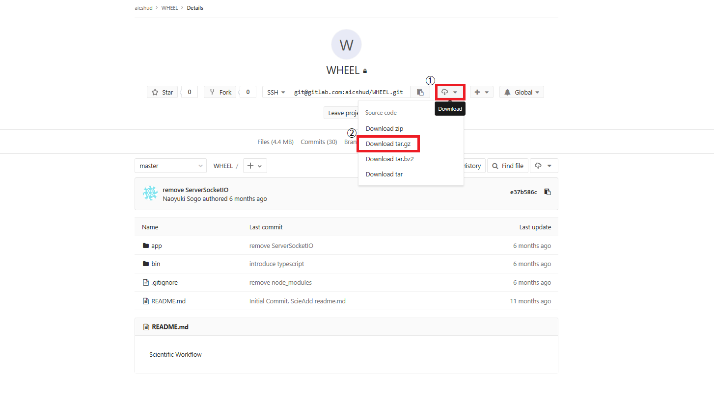

# WHEELのインストール
本作業は、WHEELのサーバとなるマシン上で行います。
WHEELの起動や終了に関しては、次章にて説明します。

## 事前準備
WHEELのインストールと動作には、node.js(version 8.0.0以降)が必要になります。 
node.jsは、 以下の方法にてインストールできます。
1. 次サイト https://nodejs.org/en にて、配布されているアーカイブをダウンロードしてインストールする
1. お使いのOSのパッケージマネージャを利用してインストールする。

## WHEELのダウンロード、インストール方法
***
### WHEELのダウンロード
インストールを実行する前に理化学研究所の公開gitLabサイトより、
WHEELのモジュールを任意のディレクトリにダウンロードしておく必要があります。
WHEELのダウンロード先は、次のURLです。
> 理化学研究所公開 gitLab URL：https://gitlab.com/aicshud/WHEEL  

サイトへ遷移後、下図内の手順に従い、WHEELのモジュールをユーザマシンへダウンロードします。

1. ボタンをクリックします。
1. 拡張子[ tar.gz ]を選択します。  

  

### WHEELのインストール
WHEELのダウンロード完了後、ターミナルアプリ、コマンドプロンプト等を起動し以下の手順に従い
WHEELのインストールを行います。
1. WHEELをダウンロードしたディレクトリへ遷移する。
1. ダウンロードした WHEEL-{version}.tar.gz を解凍する。
1. 解凍した WHEEL-{version} ディレクトリへ遷移する。
1. [ > npm install -g ] を実行する。
1. 2 実行時にターミナル（またはコマンドプロンプト）に表示される [.....\node_modules\WHEEL]ディレクトリに遷移する。
1. [ > npm install webpack ] を実行する。
1. [ > npm run prepare ] を実行する。  

以上でインストールは終了です。