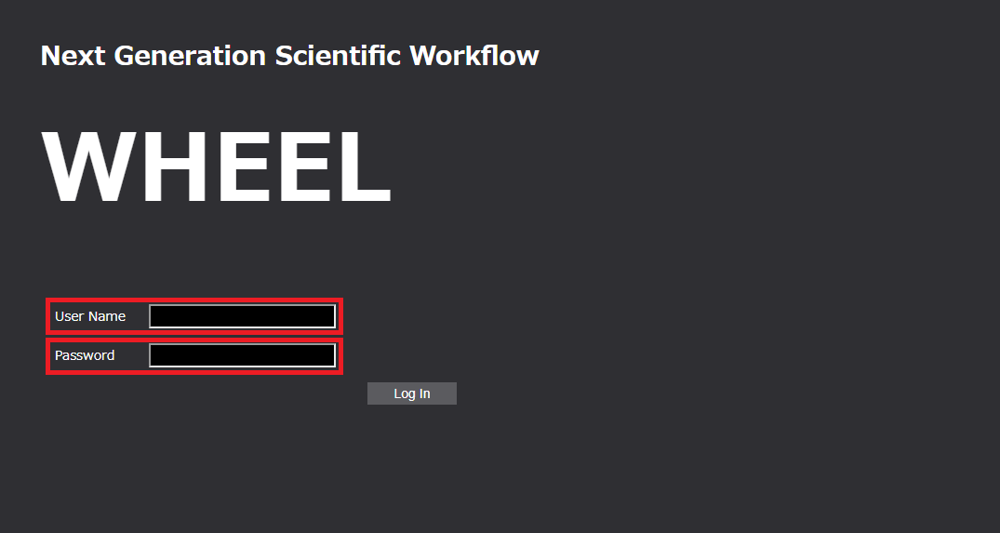
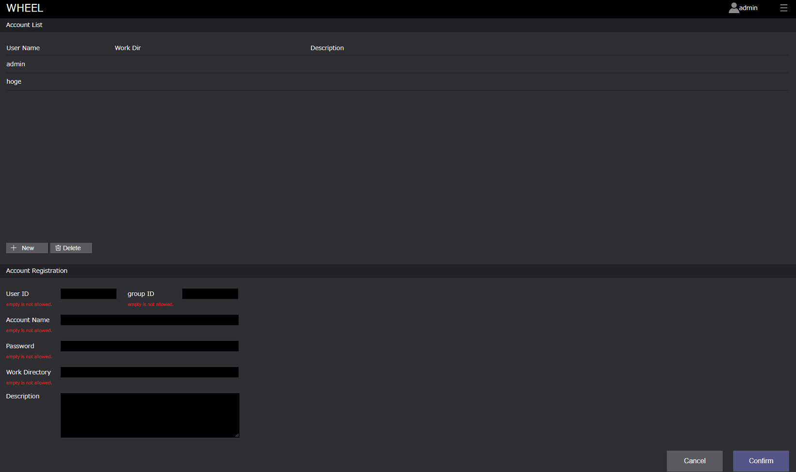
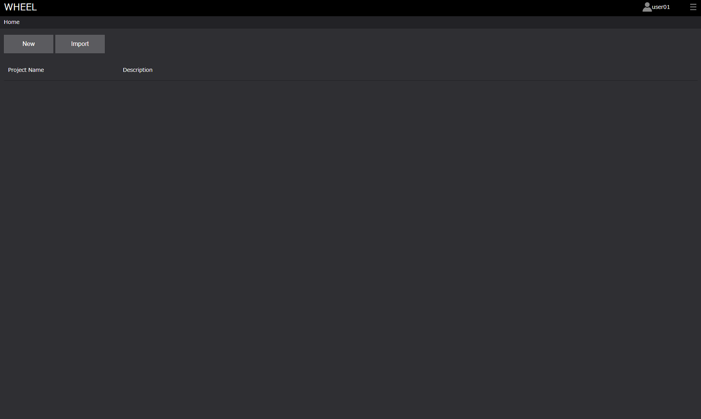

# WHEELへのログイン
WHEELへのログインは、  
WHEELのユーザアカウントとして登録されている  
>ユーザ名（User Name）  
>パスワード（Password）  

を入力することで行います。  

  

また、WHEELへのログイン方法は、2パターンあります。

1. 管理者としてログインする  
1. ユーザとしてログインする  

ログイン方法により、WHEELの操作できる機能が異なります。  

> 管理者：ユーザアカウントの作成  
> ユーザ：プロジェクトの作成、ワークフローの作成など、**ユーザアカウントの作成を除く**WHEELの全機能  

よって、管理者とユーザでは、ログイン後に遷移する画面が異なります。

> 管理者  

  

> ユーザ  

 