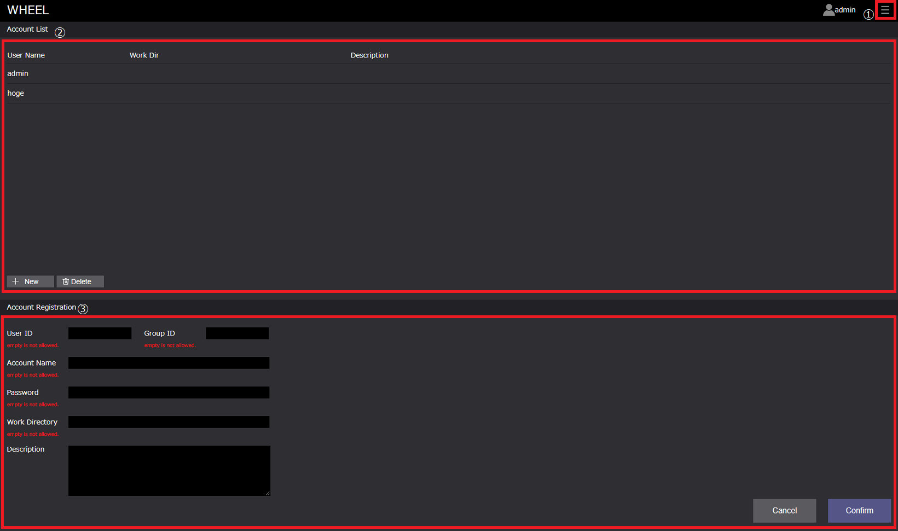
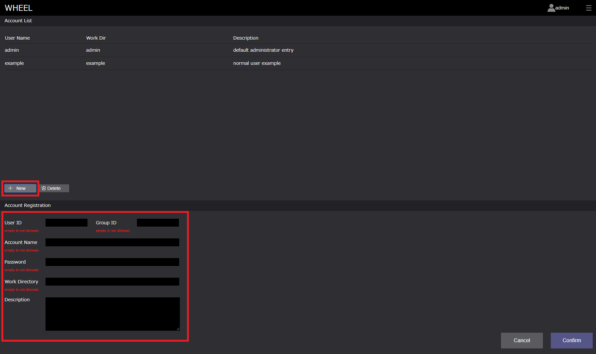
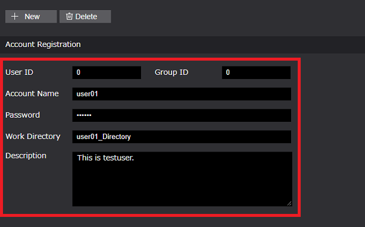
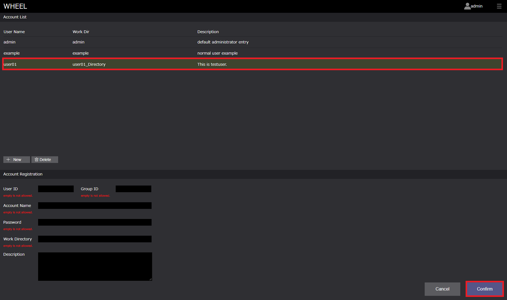
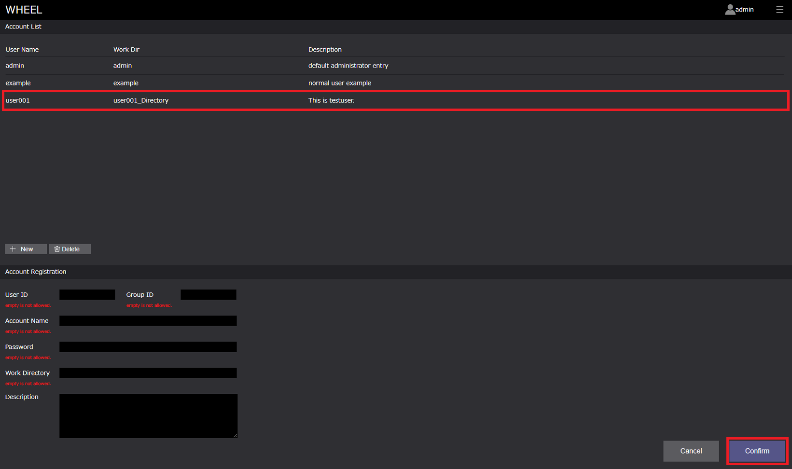
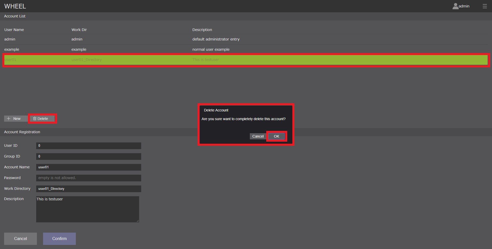
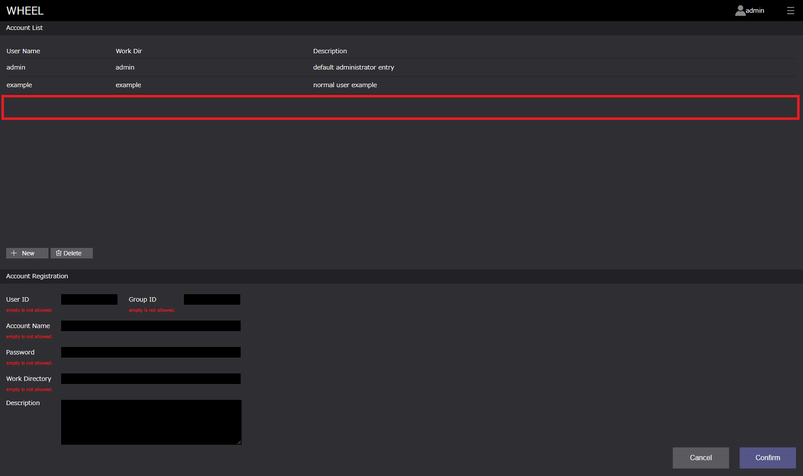

# アカウントの登録
WHEELを使用するためには事前に登録されているユーザアカウントにてWHEELにログインする必要があります。  
本章では、ユーザアカウントの登録方法を説明します。    

## アカウント登録画面への移動
***
前章「WHEELへのログイン」にあるように、アカウント登録画面へは**管理者**でのログインが必要です。  
WHEELにあらかじめ用意されている管理者アカウントを使用し、ログインを行ってください。  

> ユーザアカウント登録時には管理者でログインする

  

## アカウント登録画面
***
アカウント登録画面の構成は以下のようになっています。 
  

1. 画面遷移ドロワー：ログイン画面への遷移ボタンを表示するドロワー
1. Account List エリア：登録済みアカウントリスト
    1. アカウントリスト：登録済みアカウント情報
    1. New ボタン：新規アカウント登録ボタン
    1. Deleteボタン：登録済みアカウントの削除
1. Account Registration エリア：アカウント登録用情報入力エリア
    1. アカウント情報入力エリア：新規アカウント情報、登録済みアカウント情報の編集エリア
    1. Cancel ボタン：入力情報のリフレッシュ
    1. Confirm ボタン：入力情報の登録

また、Host List, Host Registrationエリアの各プロパティは以下です。  

| プロパティ名 | プロパティ | 入力上の注意点 |
|----|----|----|
| User ID | ユーザアカウントのID | 必須入力項目 |
| Group ID | ユーザの属するグループのID | 必須入力項目 | 
| Account Name | アカウント名 | 必須入力項目、任意文字列 、同一名登録不可| 
| Password | ログイン時のパスワード | 必須入力項目 | 
| Work Directory | ユーザの作業ディレクトリ | 必須入力項目 | 
| Description | アカウントに関する情報記述領域 | ー | 
|  |  |  |   

## ユーザの登録
***
ユーザの登録の手順は以下になります。
1. Account List エリア「New」ボタンをクリックする
1. Account Registration エリアの必要項目を入力する
1. Account Registration エリア「Confirm」ボタンをクリックする  

> 1. Account List エリア「New」ボタンをクリックする 

Account Registrationがクリアされます。

  

> 2. Account Registration エリアの必要項目を入力する  

必要項目を入力します。Descriptionを除く全ての項目に入力してください。

  

> 3. Account Registration エリア「Confirm」ボタンをクリックする  

入力内容をユーザ情報として登録します。Account List エリアにユーザ情報が追加されます。  

  

## ユーザの編集
***
ユーザの編集の手順は以下になります。
1. Account List エリアの編集したいユーザをクリックする
1. Account Registration エリアのユーザ情報を編集する
1. Account Registration エリア「Confirm」ボタンをクリックする  

> 1. Account List エリアの編集したいユーザをクリックする

Account Registrationエリアに選択したユーザの登録情報が表示されます。

  

> 2. Account Registration エリアのユーザ情報を編集する

項目を編集します。

  

> 3. Account Registration エリア「Confirm」ボタンをクリックする  

ユーザ情報を更新します。

  

## ユーザの削除
***
ユーザの削除は、以下の手順で行います。
1. Account List エリアの削除したいユーザをクリックする
1. Account List エリア「Delete」ボタンをクリックする
1. 表示される「削除確認メッセージダイアログボックス」の「OK」ボタンをクリックする。  

  

削除されていることを確認します。  

  