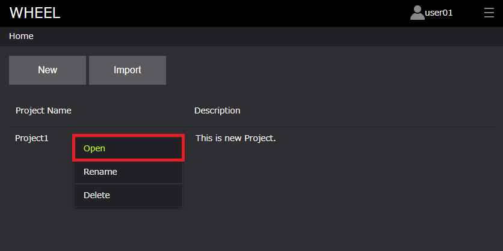
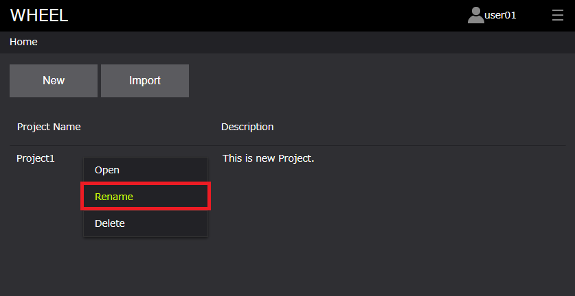
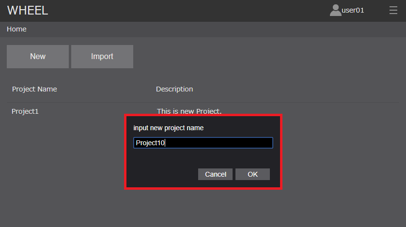
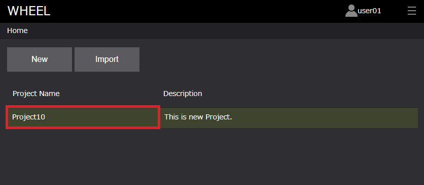
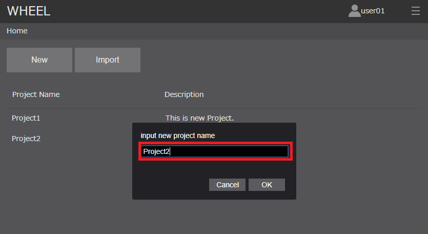
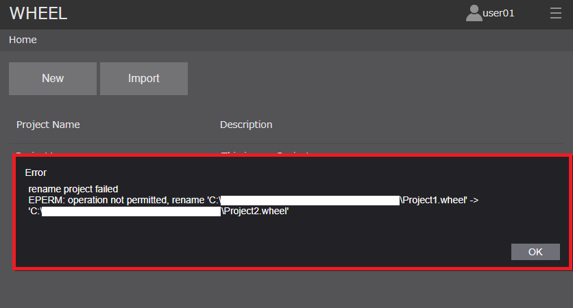
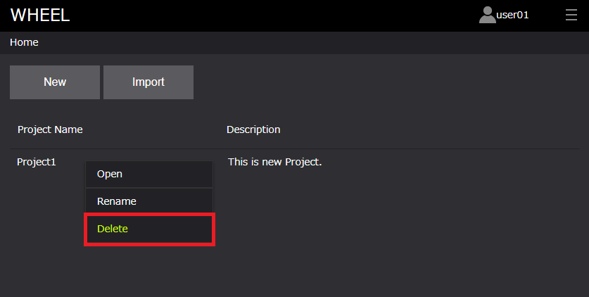
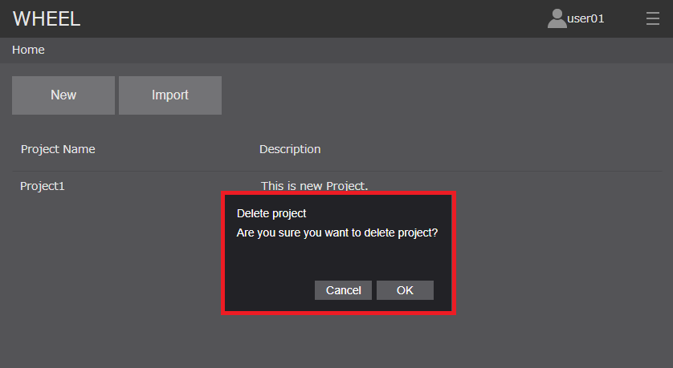
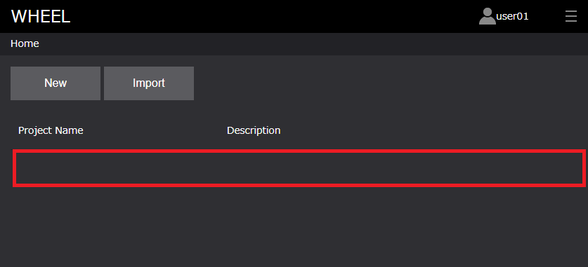

## 2. 既存プロジェクトの編集

### プロジェクトのオープン
プロジェクトを開く操作は、
1. プロジェクトリスト上でダブルクリックする
1. プロジェクトリスト上で [ 右クリック -> Open ] 操作する  
の2種類です。後述するプロジェクトの名称変更、削除も[2]の右クリック操作から行うことができます。  
右クリック操作によるプロジェクトのオープン方法を以下に示します。  

##### プロジェクトのオープン [ 右クリック -> Open ]  

  

### プロジェクトの名称変更
前述にあるように、プロジェクトの名称変更は右クリック操作により行うことができます。  
手順は以下です。
1. プロジェクトリスト上で [ 右クリック -> Rename ] 操作する 
1. 名称変更ダイアログに変更後の名称を入力し、[ OK ]ボタンをクリックする  
**既にプロジェクトリストに存在するプロジェクト名には変更できません**のでご注意ください。  

##### プロジェクトの名称変更 [ 右クリック -> Rename ]  

  

##### 名称変更ダイアログ  

  

##### 名称変更後  

  

プロジェクト名を既存プロジェクト名に変更しようとした場合のエラー例を示します。  

##### プロジェクト名を既存のプロジェクト名（Project2）の変更する  

 

##### エラーメッセージが表示される  

 

### プロジェクトの削除
プロジェクトの名称変更同様、プロジェクトの削除も右クリック操作により行うことができます。  
1. プロジェクトリスト上で [ 右クリック -> Delete ] 操作する 
1. 削除確認ダイアログの [ OK ] ボタンをクリックする  

##### プロジェクトの削除 [ 右クリック -> Delete ]  

  

##### 削除確認ダイアログ  

  

##### 削除後  

  