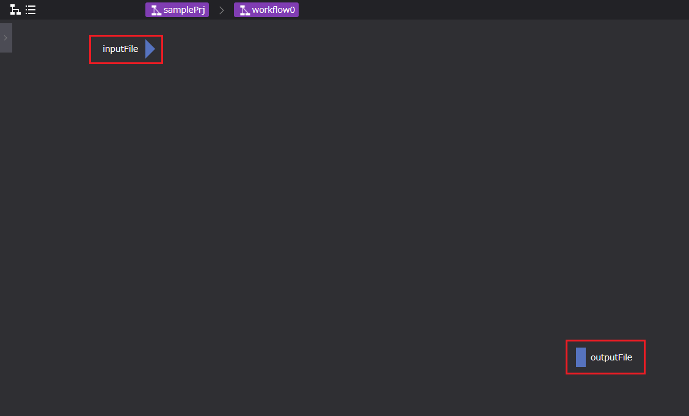

## 2. 各コンポーネントのプロパティ説明
この節では、ワークフローの作成に用いる各ワークフローコンポーネントのプロパティについて
説明します。

ワークフローコンポーネントは以下の7種です。  

  

以下で各コンポーネントについて説明します。

### Workflow コンポーネント
  

Workflowコンポーネントのプロパティについて説明します。

| プロパティ | 入力値 | プロパティ説明 |
|----|----|----|
| name | 文字列 *1 | コンポーネントを識別するための名称 |
| description | 文字列 | コンポーネントの説明文 | 
| inputFiles | ファイル名 | 先行コンポーネントから受け取るファイル名 | 
| outputFiles | ファイル名 | 後続コンポーネントへ渡すファイル名 | 
| clean up flag | ラジオボタン | リモート環境に作成した一時ファイルの取り扱い決定フラグ | 
|  | clean up | 削除する | 
|  | keep files | 削除しない | 
|  | follow parent setting | 親コンポーネントと同じ挙動をする *2 | 

*1 プロパティに使用できる文字列は、半角英数字[0-9 a-Z]、ハイフン[ - ]、アンダースコア[ _ ]のみです。  
　ただし、Descriptionは任意の文字列を使用できます。    
*2 clean up flag の初期値は、[ follow parent setting ]です。  
　ただし、rootワークフロー作成時は、[ clean up ]へ変更します。

### Task コンポーネント
  

Taskコンポーネントのプロパティについて説明します。

| プロパティ | 入力値 | プロパティ説明 |
|----|----|----|
| name | 文字列 | コンポーネントを識別するための名称 |
| description | 文字列 | コンポーネントの説明文 | 
| inputFiles | ファイル名 | 先行コンポーネントから受け取るファイル名 | 
| outputFiles | ファイル名 | 後続コンポーネントへ渡すファイル名 | 
| script | ファイル名 | Task内の処理を記述したスクリプトのファイル名 | 
| host | セレクトボックス | Taskを実行するhost、localhostまたは登録済のremotehostのlabelを指定する | 
| useJobScheduler | チェックボックス | scriptをバッチスケジューラ経由で実行するか直接実行するかのフラグ | 
| queue | セレクトボックス | ジョブの投入先キュー(useJobSchedulerを使用しない場合は使われない) | 
| clean up flag | ラジオボタン | リモート環境に作成した一時ファイルの取り扱い決定フラグ | 
|  | clean up | 削除する | 
|  | keep files | 削除しない | 
|  | follow parent setting | 親コンポーネントと同じ挙動をする | 
| include | ファイル名 | リモート環境から回収してくるファイル *1 | 
| exclude | ファイル名 | リモート環境から回収しないファイル *1 | 
| state clean | ボタン | コンポーネントの進行状態を初期状態に戻す *2 | 

*1 include, excludeともにglobパターンを指定することができる。 includeにマッチしなおかつexcludeにマッチしないファイルを回収してくる。  
　ただし、outputFilesに指定されたファイルは、include/excludeの指定に関わらず全て回収される。  
*2 コンポーネントの進行状態が"finished"もしくは"failed"の時のみ表示される。

### Parameter Study コンポーネント
  

Parameter Studyコンポーネントのプロパティについて説明します。

| プロパティ | 入力値 | プロパティ説明 |
|----|----|----|
| name | 文字列 | コンポーネントを識別するための名称 |
| description | 文字列 | コンポーネントの説明文 | 
| inputFiles | ファイル名 | 先行コンポーネントから受け取るファイル名 | 
| outputFiles | ファイル名 | 後続コンポーネントへ渡すファイル名 | 
| parameterFile | ファイル名 | パラメータスタディの設定を記述したファイル | 
| state clean | ボタン | コンポーネントの進行状態を初期状態に戻す *1 | 

*1 コンポーネントの進行状態が"finished"もしくは"failed"の時のみ表示される。

### If コンポーネント
  

Ifコンポーネントのプロパティについて説明します。

| プロパティ | 入力値 | プロパティ説明 |
|----|----|----|
| name | 文字列 | コンポーネントを識別するための名称 |
| description | 文字列 | コンポーネントの説明文 | 
| inputFiles | ファイル名 | 先行コンポーネントから受け取るファイル名 | 
| outputFiles | ファイル名 | 後続コンポーネントへ渡すファイル名 | 
| condition | ファイル名 | 条件判定を行うスクリプトのファイル名*1 | 
| else | 整数値 | 条件判定が偽だった時の後続ノードのindex | 
| state clean | ボタン | コンポーネントの進行状態を初期状態に戻す *2 | 

*1 conditionに指定されたスクリプトの終了コードが0の時は真それ以外の時は偽と判定して後続のノードへ遷移する。  
　ただし、conditionに指定された文字列と一致するファイルが存在しなかった時は、Javascriptの式とみなしてそのコードを実行します。  
*2 コンポーネントの進行状態が"finished"もしくは"failed"の時のみ表示される。

### For コンポーネント
  

Forコンポーネントのプロパティについて説明します。

| プロパティ | 入力値 | プロパティ説明 |
|----|----|----|
| name | 文字列 | コンポーネントを識別するための名称 |
| description | 文字列 | コンポーネントの説明文 | 
| inputFiles | ファイル名 | 先行コンポーネントから受け取るファイル名 | 
| outputFiles | ファイル名 | 後続コンポーネントへ渡すファイル名 | 
| start | 整数値 | ループの始値 | 
| end | 整数値 | ループの終値 | 
| step | 整数値 | 1回のループでのインデックスの増分（負値も可） *1| 
| state clean | ボタン | コンポーネントの進行状態を初期状態に戻す *2 | 

*1 ループカウンタインデックスは、環境変数`$WHEEL_CURRENT_INDEX`に設定されます。  
*2 コンポーネントの進行状態が"finished"もしくは"failed"の時のみ表示される。

### While コンポーネント
  

Whileコンポーネントのプロパティについて説明します。

| プロパティ | 入力値 | プロパティ説明 |
|----|----|----|
| name | 文字列 | コンポーネントを識別するための名称 |
| description | 文字列 | コンポーネントの説明文 | 
| inputFiles | ファイル名 | 先行コンポーネントから受け取るファイル名 | 
| outputFiles | ファイル名 | 後続コンポーネントへ渡すファイル名 | 
| condition | ファイル名 | 条件判定を行うスクリプトのファイル名 | 
| state clean | ボタン | コンポーネントの進行状態を初期状態に戻す *1 | 

*1 コンポーネントの進行状態が"finished"もしくは"failed"の時のみ表示される。

### Foreach コンポーネント
  

Foreachコンポーネントのプロパティについて説明します。

| プロパティ | 入力値 | プロパティ説明 |
|----|----|----|
| name | 文字列 | コンポーネントを識別するための名称 |
| description | 文字列 | コンポーネントの説明文 | 
| inputFiles | ファイル名 | 先行コンポーネントから受け取るファイル名 | 
| outputFiles | ファイル名 | 後続コンポーネントへ渡すファイル名 | 
| indexList | ファイル名 | ループインデックスに指定される値のリスト *1| 
| state clean | ボタン | コンポーネントの進行状態を初期状態に戻す *2 | 

*1 ループカウンタインデックスの取り扱いは `Forコンポーネント` と同様です。   
*2 コンポーネントの進行状態が"finished"もしくは"failed"の時のみ表示される。

## 階層間（親子間）のファイル移動  
Workflow, ParameterStudy, 及びループ系（For, While, Foreach）のコンポーネントは、  
コンポーネント内にコンポーネント（子コンポーネント）を持つことができます。  
親コンポーネントから子コンポーネントへのファイル移動は、親子間ファイル移動機能を使用することで行うことができます。  
使用方法は以下です。  

1. コンポーネントに入力ファイル、出力ファイルを設定する。  
1. コンポーネントの子階層へ遷移する。
1. 子階層にてコンポーネントを作成する。
1. 親コンポーネントからのファイルを子コンポーネントへ接続する。*1

*1 子階層において親のインプットファイルをアウトプットファイルへ直接渡すことはできません。   

##### コンポーネントへの入力・出力ファイルの設定  
  

##### 子階層
   

##### 親子間のファイルの接続
   

## コンポーネントディレクトリへのファイル操作
コンポーネントで使用するファイルは、コンポーネント選択時に表示されるプロパティ画面の[ Files ]領域より設定します。  

例：Workflowコンポーネントのプロパティ画面  

  

Files領域の構成は、以下です。  

  

1. rootワークフローからの相対パス表示領域
1. JupyterNotebookの起動ボタン
1. コンポーネントディレクトリへの新規ディレクトリの作成ボタン
1. コンポーネントディレクトリへの新規ファイルの作成ボタン
1. コンポーネントディレクトリへのファイルのアップロードボタン（ファイルブラウザの起動）
1. ファイル編集ボタン
1. PS用ファイル編集ボタン

以下で各ボタンの機能について説明します。

### コンポーネントディレクトリへの新規ディレクトリの作成
コンポーネントディレクトリへの新規ディレクトリの作成手順は以下になります。

1. 新規ディレクトリを作成したいコンポーネントをクリックする。
1. [ Files ]領域内の上記Files領域図ボタン「3」をクリックする。
1. 表示されるダイアログより、作成するディレクトリ名を入力し、[ OK ]ボタンをクリックする。

##### 新規ディレクトリの作成  

  

##### 作成結果 

  

### コンポーネントディレクトリへの新規ファイルの作成
新規ファイルの作成もディレクトリの作成と同様に以下の手順になります。

1. 新規ファイルを作成したいコンポーネントをクリックする。
1. [ Files ]領域内の上記Files領域図ボタン「4」をクリックする。
1. 表示されるダイアログより、作成するファイル名を入力し、[ OK ]ボタンをクリックする。

### コンポーネントディレクトリへのファイルのアップロード

コンポーネントディレクトリへのファイルのアップロード手順は以下になります。

1. 新規ディレクトリを作成したいコンポーネントをクリックする。
1. [ Files ]領域内の上記Files領域図ボタン「5」をクリックする。
1. 表示されるファイルブラウザ画面、アップロードしたいファイルを選択し、[ 開く ]ボタンをクリックする。

##### ファイルのアップロード 

  

##### アップロード結果 

  