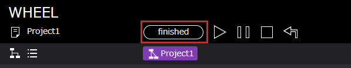
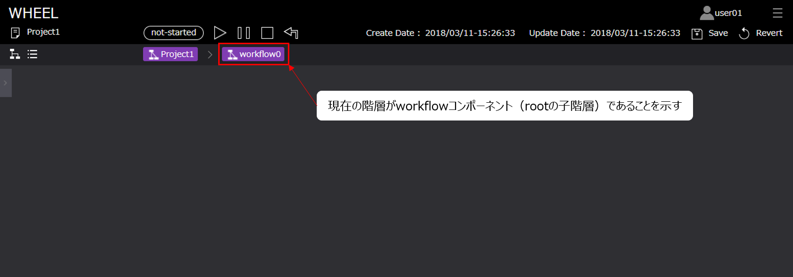
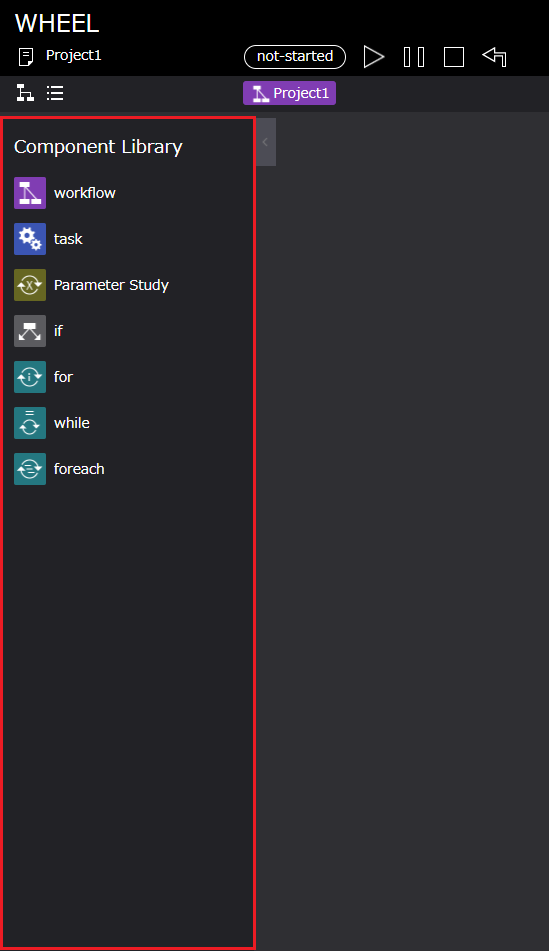
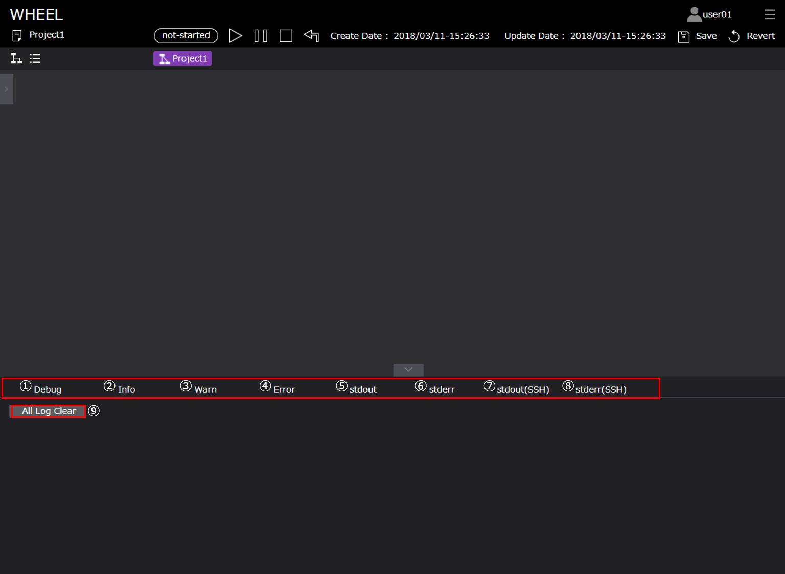
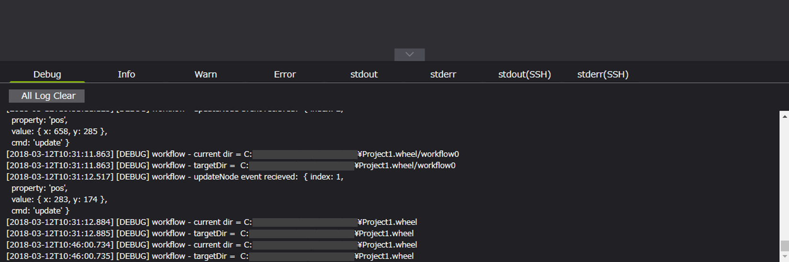

# ワークフロー編集画面（グラフビュー）の機能説明
本章では、WHEELのメイン画面であるワークフロー編集画面（グラフビュー）の機能について説明します。  
ワークフローの作成・実行等の例題については、後述の「ワークフローの作成」において説明します。

## 1. 画面仕様説明
***
ワークフロー編集画面（グラフビュー）は以下のように構成されています。  

  

1. タイトル　　　　　　　　　　　　　：ホーム画面遷移ボタン
1. ユーザー名　　　　　　　　　　　　：ログインユーザ名
1. 画面遷移ドロワー　　　　　　　　　：ホスト登録画面、ログアウト用
1. プロジェクト名　　　　　　　　　　：ワークフロー編集中のプロジェクト名
1. プロジェクトの状態表示エリア　　　：プロジェクトのstate（実行状態）表示
1. プロジェクトの操作ボタンエリア　　：プロジェクトの実行、一時停止、停止、クリーンボタン
1. プロジェクトの編集日時表示エリア　：プロジェクトの作成、更新日時
1. プロジェクトの保存ボタンエリア　　：プロジェクトの保存、リバートボタン
1. ワークフロー画面切替ボタン　　　　：グラフビュー、リストビューの切替ボタン
1. プロジェクトの階層表示・遷移ボタン：現在表示中のプロジェクトディレクトリの階層表示、また、階層間の遷移ボタン
1. コンポーネントライブラリ表示ボタン：ワークフロー作成用のライブラリ表示用ボタン
1. ワークフロー作成用エリア　　　　　：ワークフロー作成のためコンポーネント操作用エリア
1. ログ表示ボタン　　　　　　　　　　：ワークフローの作成、実行に関するログ表示用ボタン

次に各エリア、ボタンの詳細について説明します。  

### プロジェクトの状態表示エリア
***
プロジェクトの状態表示エリアは、プロジェクト全体の進行状態によって以下の状態を示します。  

1. not-started：プロジェクト実行前

 

2. running    ：プロジェクト実行中

 

3. finished   ：プロジェクト実行終了

 

4. failed     ：プロジェクトの失敗

 

### プロジェクトの操作ボタンエリア
***
プロジェクト実行、停止などを操作するボタンとその詳細は以下です。  

 

1. run ボタン：プロジェクトの実行開始
1. pause ボタン：プロジェクト実行の一時停止
1. stop ボタン：プロジェクトの実行停止と初期化
1. clean：プロジェクトの初期化  

また、WHEELでは、gitを用いたファイル管理を行っております。
そのため、上記[ clean ]ボタンは、以下の gitコマンド操作を行っております。

> clean -> git clean -fd  

### プロジェクトの保存ボタンエリア
***
プロジェクト保存、リバートを操作するボタンとその詳細は以下です。  

 

1. save ボタン：projectのsave(commit)を指示する
1. revert ボタン：projectの状態を直前のcommitまで戻すことを指示する

[ save ], [ revert ] ボタンは、以下の gitコマンド操作を行っております。

> save   -> git commit  
> revert -> git reset HEAD --hard  

### ワークフロー画面切替ボタン
***
ワークフロー画面には、ワークフローの作成を行うグラフビュー画面とワークフローの進行状態を確認するリストビュー画面があります。  
下記のボタンによって画面の切替を行います。

> グラフビュー画面  

 

> リストビュー画面  

   

### プロジェクトの階層表示・遷移ボタン
***
ワークフローの作成時には、コンポーネント内にコンポーネントを作成するケースがあります。
その場合の現在のコンポーネントディレクトリの階層、およびコンポーネント名の確認、および階層間の移動用として
本ボタンは利用します。  

> root階層の場合  

   

> 子階層 (root階層の1階層下) の場合  

   

作成したworkflowコンポーネント内へ遷移する（rootの子階層に相当）

   

### コンポーネントライブラリ表示ボタン
***
ワークフローの作成に用いるコンポーネントライブラリを表示します。  
コンポーネントライブラリの詳細については次章にて説明します。  

> コンポーネントライブラリ非表示  

> コンポーネントライブラリ表示  

   

### ワークフロー作成用エリア
***
ワークフローの作成用領域です。  
ワークフローを作成する場合、この領域にコンポーネントを配置し、ワークフローを作成します。  

> ワークフロー作成用エリア  

### ログ表示ボタン
***
ワークフローの作成時や実行時等に出力されるログを表示します。  

> ログ非表示  

> ログ表示  

  

ログ表示エリア内の各ボタンは以下のようになっております。  
ログは、サーバサイドの処理中に発生した出力内容を分類し表示しています。

1. Debug：デバッグメッセージ
1. Info：メッセージ
1. Warn：ワーニングメッセージ
1. Error：エラーメッセージ
1. Stdout：ローカルホストで実行されたtaskの標準出力
1. Stderr：ローカルホストで実行されたtaskの標準エラー出力
1. Stdout(SSH)：リモートホストで実行されたtaskの標準出力
1. Stderr(SSH)：リモートホストで実行されたtaskの標準エラー出力
1. All log clear：ログを全て消去する  

> ログ表示例 (Debug)

  

