# ワークフローの作成（使用例と実行）
この章では、各ワークフローコンポーネントの作成例と実行例を示します。

## Task コンポーネント  
Taskコンポーネントは、WHEELにおいて、ジョブを投入する計算機の設定や処理スクリプトを設定する重要なコンポーネントです。  
以下では、「ログにメッセージを出力する」Taskコンポーネントを例に、ワークフローの基本的な作成方法と実行手順、実行状況の確認について説明します。  
本章は、ローカルホスト内での設定方法について説明します。リモートホストへのジョブ投入サンプルに関しては、最終章「OpenFOAMを利用したパラメトリックスタディ解析ワークフロー」にて説明します。

### ワークフローの作成
はじめに、ワークフローの作成手順（実行に必要なファイルの設定方法）について説明します。  
ここでは、例として、ログエリア[ Stdout ]にメッセージ「Hello World!」を出力するTaskコンポーネントの設定を紹介します。  
手順は以下です。

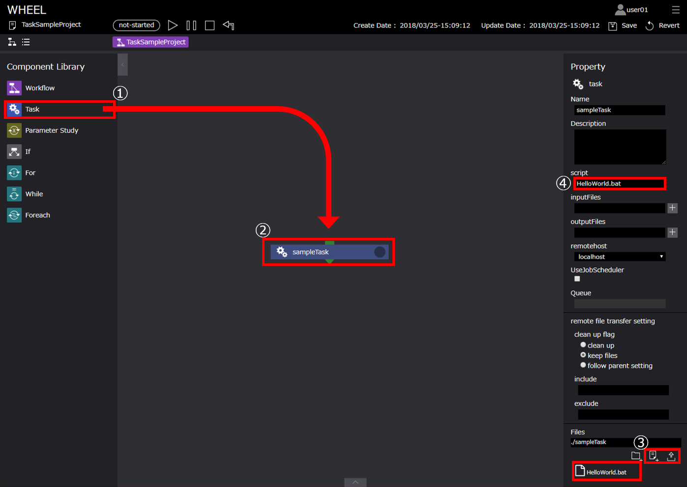  

1. グラフビュー画面左部 Component Libraryより、Taskコンポーネントをグラフビュー画面に配置する
1. Taskコンポーネントをクリックし、プロパティ画面を表示する
1. プロパティ画面下部[ Files ]より、メッセージ表示（Stdout）するスクリプト*1 をTaskコンポーネントディレクトリへアップロードする *2
1. プロパティ[ script ]にアップロードしたファイルのファイル名(HelloWorld.bat)を入力する  
*1 Windows環境では、「.bat」バッチファイルを設定します。本チュートリアルでは、ローカルマシンをWindowsとし、バッチファイルでの記述方法を示しています。  
*2 Taskコンポーネントディレクトリへのスクリプトの設定方法は、ファイルをアップロードする方法と  
　[ Files ]の新規ファイル作成機能によりファイルを作成する方法があります。

また、ここで設定したスクリプト「HelloWorld.bat」の中身は以下です。

> HelloWorld.bat  
```
@echo off  
echo Hello World!  
```

### プロジェクトを保存する
ファイルの設定が完了後、プロジェクトを保存します。  
保存前後でワークフロー画面上部[ Create date ]が更新されることを確認します。


  
  


### ワークフローの実行と実行状況の確認
ワークフローを実行します。  
ワークフローは、デフォルト値[ localhost ]で実行します。

ワークフローの実行は、ワークフロー画面上部[ Run ]ボタンより開始します。

#### 実行

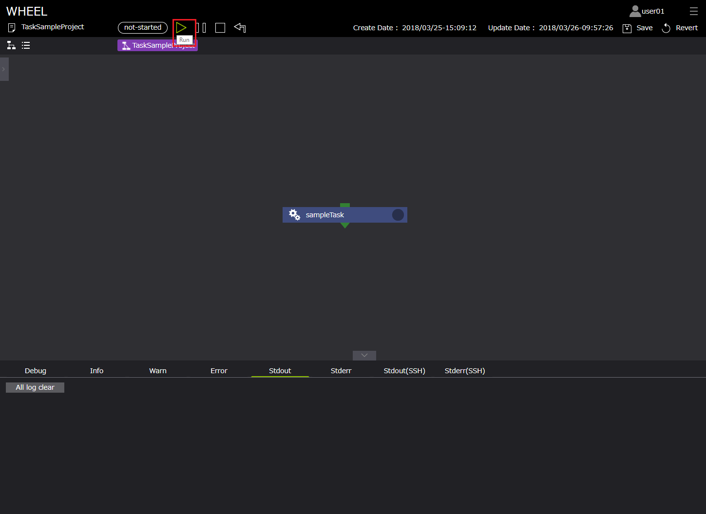  

実行ボタン押下後、実行の状況の確認はグラフビュー画面、リストビュー画面のいずれかから確認することができます。

#### グラフビュー画面

グラフビュー画面では、ワークフロー画面上部よりプロジェクト全体の進行状況とコンポーネント右上のアイコンにより実行状況を確認できます。  

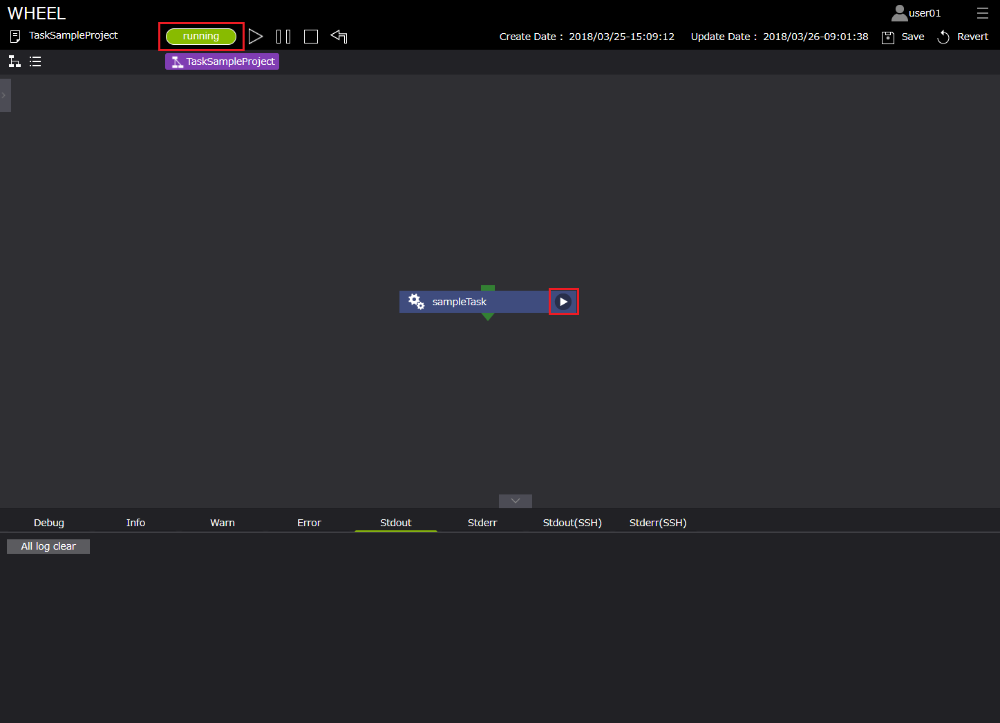  

#### リストビュー画面

リストビュー画面では、各コンポーネントの進行状況がグラフビュー画面より詳細に表示されます。

  

#### 実行完了

実行が完了したとき、状態は[ finish ]へと変化し、  
また、ログエリア[ Stdout ]に「Hello World!」と表示されます。  

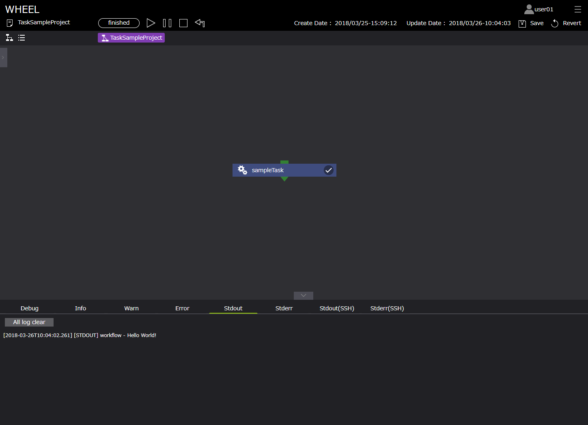  


以上が基本的なコンポーネント設定、ワークフローの実行手順となります。  
以下では、その他コンポーネントのサンプルを示します。  
WHEELでは、複雑なワークフローもこれらコンポーネントを組み合わせることにより、視覚的・直感的に理解しやすいワークフローを構成することができます。


## Parameter Study コンポーネント  
Parameter Study コンポーネントは、パラメトリックスタディ用のコンポーネントです。（以下、Parameter StudyはPSと称します）  
WHEELのPS用ファイル編集機能によりインプットデータにパラメータ設定を行うことで、簡単にPSを実施することができます。  
以下に、サンプルを用いてPSワークフローの設定方法を示します。  

また、本章では、ソルバーの例として、ある空間に位置する3点の座標値からなる三角形の面積を導出するプログラム（面積算出ソルバー:wheel_tutorial_solver.cc）を用います。

用意するコンポーネントは以下です。

| コンポーネントタイプ | コンポーネント名 | 入力ファイル | 出力ファイル | 設定ファイル | 備考 |
|----|----|----|----|----|----|
| Parameter Study | samplePS | ー | ー | パラメータスタディの設定を記述したファイル | パラメータ化するファイルを用意 | 
| Task | moveFileTask | ー | ー | パラメータ化により値が変更された入力データをcalcTaskへ移動するスクリプト | PSコンポーネント内に配置（PS子階層） | 
|  | calcTask | ー | ー | ソルバー実行スクリプト * | PSコンポーネント内に配置（PS子階層） | 

*　面積算出ソルバー 

また、ここで使用しているコンポーネント samplePS, moveFileTask、calcTaskに設定されているプロパティとスクリプトの中身は以下です。

##### samplePS

| プロパティ名 | 設定値 |
| ---- | ---- |
| Name | samplePS |
| InputFiles | - |
| OutputFiles | - |
| Parameter setting file | inputdata.txt.json*1 |  
| Files | inputdata.txt, inputdata.txt.json |

*1 inputdata.txtのパラメータ化したデータの情報をもつJSONファイル、詳細は後述  

##### moveFileTask  

| プロパティ名 | 設定値 |
| ---- | ---- |
| Name | moveFileTask |
| Script | moveFiles.bat |
| InputFiles | - |
| OutputFiles | - |
| Remotehost | localhost *2 |  
| Files | moveFiles.bat |  

*2 本タスクは、ローカルマシンでの実行のため、その他プロパティ（UseJobScheduler以下）の設定は行いません。(本章内他のTaskコンポーネントも同様)  

> ex. moveFiles.bat  
　`@echo off`  
　mv ../inputdata.txt ../calcTask  

##### calcTask

| プロパティ名 | 設定値 |
| ---- | ---- |
| Name | calcTask |
| Script | calc.bat |
| InputFiles | - |
| OutputFiles | - |
| Remotehost | localhost |
| Files | calc.bat, wheel_tutorial_solver.cc, inputdata.txt *3 |  

*3 inputdata.txtは、moveFileTask実行後にPSディレクトリより移動されるファイルです。

> ex. calc.bat  
　`@echo off`  
　g++ wheel_tutorial_solver.cc -o wheel_tutorial_solver  
　wheel_tutorial_solver.exe  

#### Parameter Study ワークフロー  

コンポーネント内に配置しているコンポーネント（子コンポーネント）は、親コンポーネントにアイコンとして表示されます。

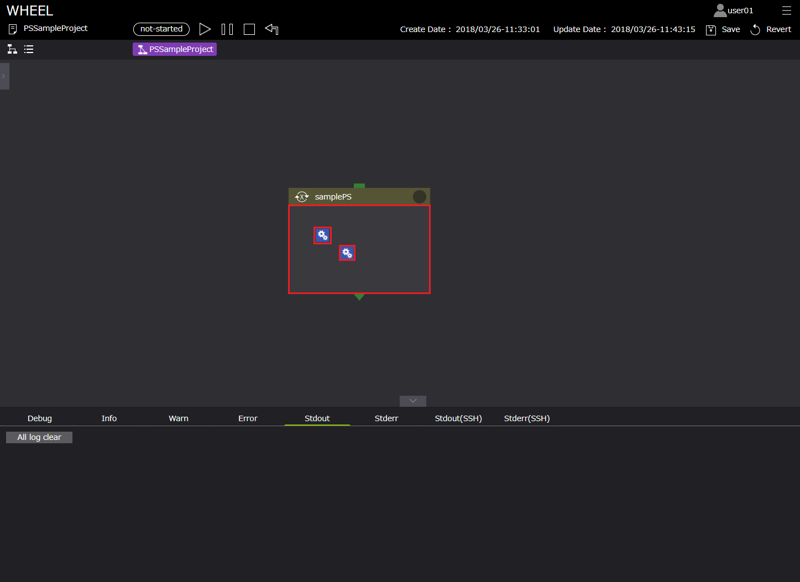  

#### PSワークフロー　子階層

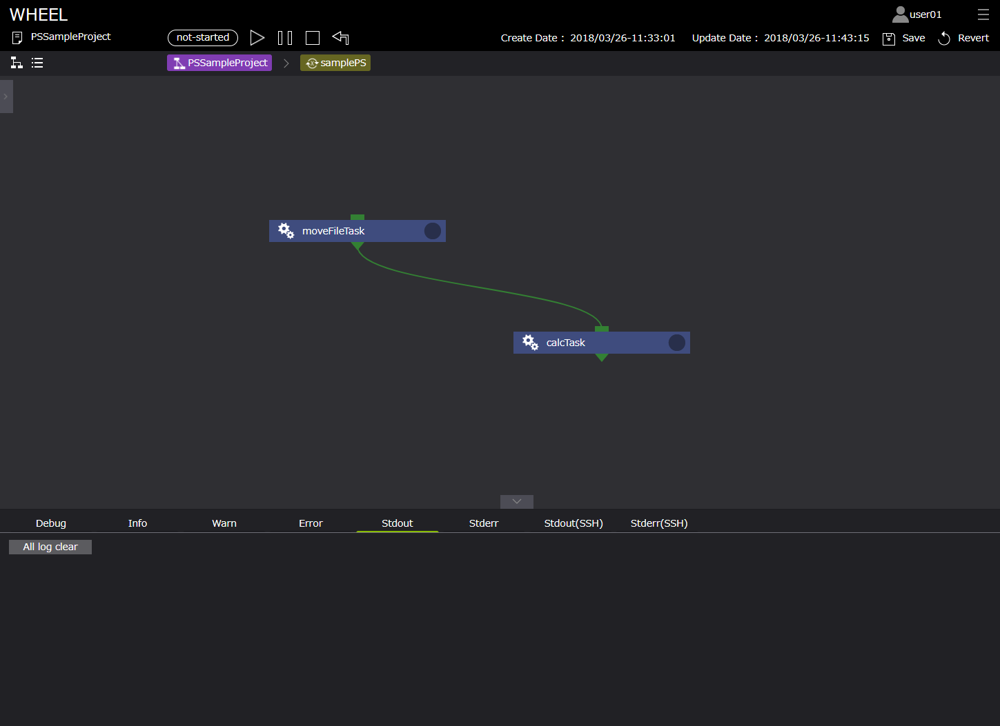  


### PS用ファイル編集画面

入力データにパラメータ設定を行う場合、プロパティ画面[ Files ]エリアよりファイル編集を行います。  
手順は以下です。

1. PSコンポーネントにパラメータ設定を行う入力データをインポート、または作成する
1. 入力データにマウスカーソル合わせ、右クリック操作によりコンテキストメニューを表示する
1. 表示されたコンテキストメニューより「edit for PS」を選択する

上記操作により、PS用ファイル編集画面がブラウザの新規タブとして表示されます。

#### PS用ファイル編集画面

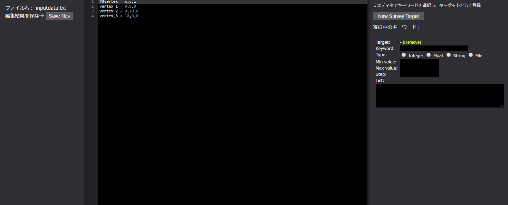  

PS用ファイル編集画面でのパラメータ設定手順は以下です。  
次の手順では、上記図 「vertex_2 のY座標値」を「6から10」まで変化させる場合の設定を示しています。  
1. パラメータ化するキーワードを範囲選択する
1. 右画面「選択中のキーワード」に選択したいキーワードが正しく表示されていることを確認し、「New Survey Target」をクリックする
1. 右画面より、選択したキーワードに対し変化させる値を設定します
1. 左画面より、「Save files」をクリックし設定内容を保存します


#### 1. キーワードの選択

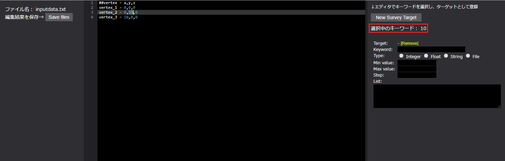  

#### 2. ターゲットの定義

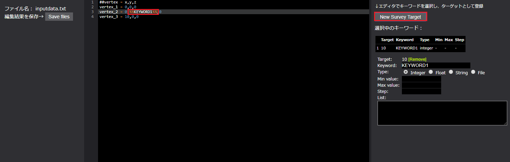  

#### 3. パラメータの設定

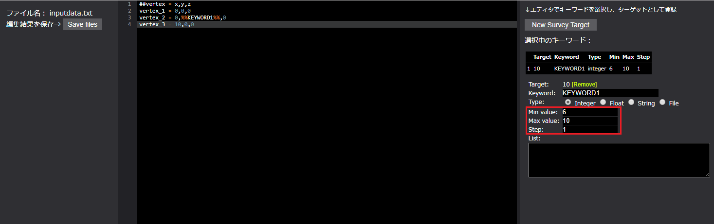  

#### 4. 設定内容の保存

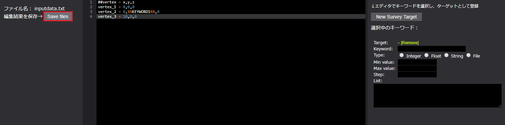  

保存後、ワークフロー編集画面に戻りプロパティを表示すると、「 編集したファイル名.json 」ファイルが作成されていることを確認します。  
このデータをプロパティ[ parameter setting file ]に設定します。

#### 編集したファイル名.jsonの確認

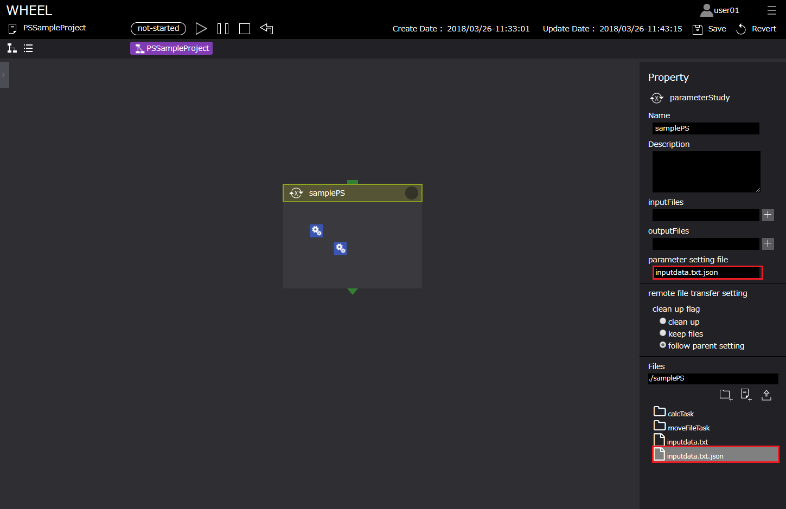  

以上がParameter Studyワークフローにおけるパラメータ設定手順になります。

### PSワークフローの実行
PSワークフロー実行時のWHEELの動作について説明します。  
PSワークフロー実行時には、プロジェクトディレクトリ内に変化させるパラメータの数だけディレクトリを生成します。  
上記例では、三角形を構成する一つの頂点のY座標値を6から10まで変更しているため、「10-6＋1=5」計5個のディレクトリが生成されます。  
各ディレクトリには、PSコンポーネントのデータ及びパラメータ変化させたインプットデータが格納されています。

#### プロジェクトディレクトリ内に生成されるディレクトリ

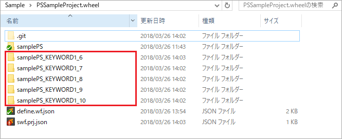  

PSワークフローを実行すると生成されたワークフローが順に実行されます。  
実行後の結果は以下です。

#### PSワークフロー実行結果

 

また、標準出力（Stdout）の結果は以下です。  

 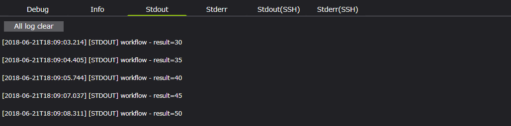   

## If コンポーネント
ifコンポーネントはTaskコンポーネントにより得られた結果を[ condition ]プロパティに設定したスクリプトにより真偽判別し、  
後のワークフローの挙動を変化させるために用います。

以下に、サンプルを示します。  
サンプルでは、calcTaskコンポーネントにより三角形の面積を計算し、その計算結果を元にsampleIfコンポーネントにて真偽判定を行います。  
面積が20より大きい場合、trueTaskコンポーネントを、小さい場合、falseTaskコンポーネントを実行します。（true/falseTaskは、"true"/"false"を標準出力するTaskです。）  
ワークフローに設定されているファイルは以下です。  

| コンポーネントタイプ | コンポーネント名 | 入力ファイル | 出力ファイル | 設定ファイル |
|----|----|----|----|----|
| Task | calcTask |  | 計算結果データファイル | ソルバー実行スクリプト | 
|  | trueTask | 計算結果データファイル |  | 計算結果データを利用した計算をするスクリプト | 
|  | falseTask | - |  | 計算結果データを利用した計算をするスクリプト | 
| If | sampleIf | - | 計算結果データファイル | 真偽判別スクリプト |  

各コンポーネントのプロパティ、スクリプトの中身は以下です。

##### calkTask

| プロパティ名 | 設定値 |
| ---- | ---- |
| Name | calcTask |
| Script | calc.bat *1 |
| InputFiles | - |
| OutputFiles | result.txt *2 |
| Remotehost | localhost |
| Files | calc.bat, wheel_tutorial_solver.cc, inputdata.txt |  

*1 前述PSコンポーネントと同様  
*2 計算結果データ

##### trueTask

| プロパティ名 | 設定値 |
| ---- | ---- |
| Name | trueTask |
| Script | true.bat |
| InputFiles | data.txt |
| OutputFiles | - |
| Remotehost | localhost |
| Files | true.bat |  

>ex. true.bat  
　`@echo off`  
　echo true

##### falseTask

| プロパティ名 | 設定値 |
| ---- | ---- |
| Name | falseTask |
| Script | false.bat |
| InputFiles | - |
| OutputFiles | - |
| Remotehost | localhost |
| Files | false.bat |  

>ex. false.bat  
　`@echo off`  
　echo false

##### sampleIf

| プロパティ名 | 設定値 |
| ---- | ---- |
| Name | sampleIf |
| InputFiles | input.txt |
| OutputFiles | - |
| Condition | condition.bat |
| Files | condition.bat |  

>ex. condition.bat  
　`@echo off`    
　for /f "tokens=2 delims==" %%a in (input.txt) do (  
　　set result=%%a  
　)  
　if %result% gtr 20 echo true  

#### ワークフロー構成図

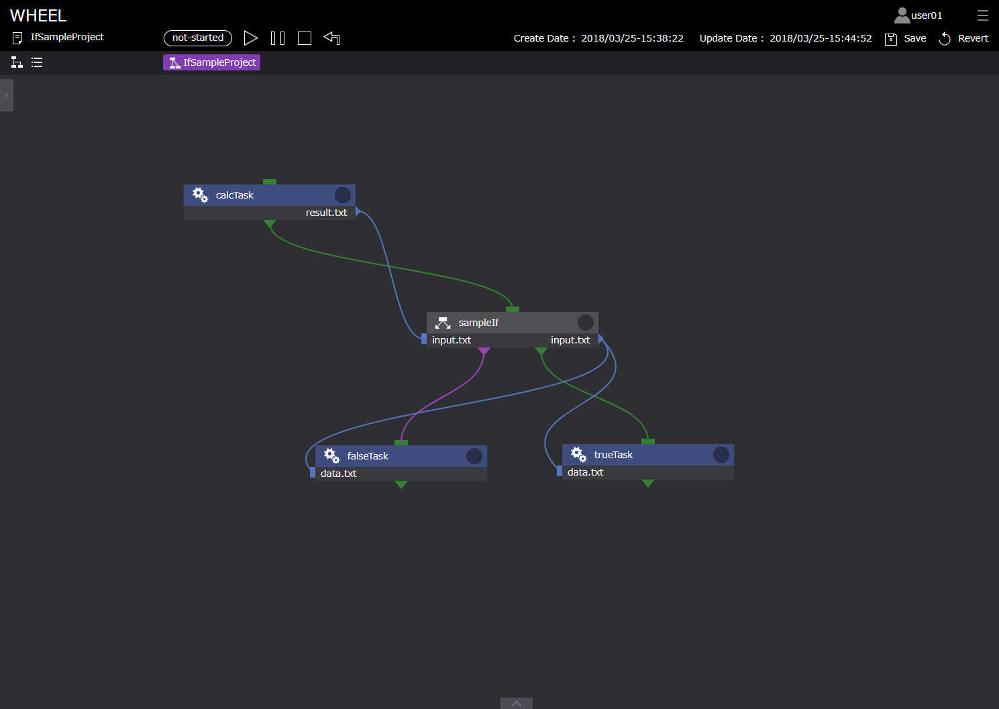   

このサンプルは下記の処理を行います。

1. calcTaskコンポーネントにより、面積算出ソルバーを実行する
2. 実行結果をifコンポーネントに渡す
3. ifコンポーネントで設定したスクリプトにより結果ファイルの真偽を判定する
4. 真偽判定を踏まえ、trueTask, falseTaskのいずれかを実行する

サンプルの実行結果は以下です。
#### ワークフロー実行結果

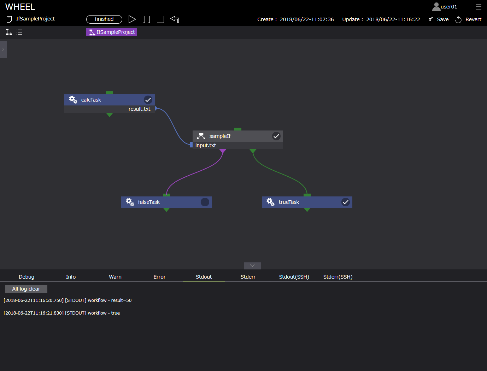   

## Loop系コンポーネント
***  
WHEELには、For, Foreach, Whileの3種類のループ系コンポーネントが用意されています。    
Loop系コンポーネントは、プロジェクトディレクトリ内にループの回数分コンポーネントが複製されます。  
複製されるコンポーネントは、**1つ前のループにより生成されたディレクトリをコピーしたもの** *1 となります。  
*1 ループ回数が3回の場合、2回目のループは1回目のループ内の処理結果を含めたディレクトリを複製します。
   同様に、3回目のループは2回目のループ実行後のディレクトリを複製したものになります。  

Loop系コンポーネントは、ループの設定方法の違いから、For, ForeachとWhileの2種類に分けられます。  
### ＊ For, Foreach
For, Foreachコンポーネントは、コンポーネントのプロパティよりForは整数値（start, end, step）を、Foreachは数字及び文字列（indexList）からループの設定を行います。  
設定したループインデックスは、コンポーネント内の処理にて環境変数`$WHEEL_CURRENT_INDEX`に設定されるため、`$WHEEL_CURRENT_INDEX`を用いることでループ内の処理を
変更することができます。

### ＊ While
Whileコンポーネントは、コンポーネントのプロパティconditionに設定した条件判定スクリプトを満たす限りループ処理を行います。  
conditionに設定したスクリプトの終了条件は、Ifコンポーネントのconditionと同様です。  
conditonに設定したスクリプトには、For, Foreachコンポーネントと同様に環境変数`$WHEEL_CURRENT_INDEX`を使用することが可能です。  
Whileコンポーネントで使用する`$WHEEL_CURRENT_INDEX`は初期値を0とし、1ずつ増加します。  

以下で、For, Foreach, Whileコンポーネントのサンプルを示します。  

## For コンポーネント  
Forコンポーネントのサンプルを示します。  
サンプルでは、calcTaskコンポーネントによって計算した三角形の面積に対し、sampleForコンポーネントで設定されるループインデックス(`$WHEEL_CURRENT_INDEX`)を  
loopCalcTaskコンポーネントにて使用するワークフローを実行します。  
ワークフローに設定されているファイルは以下です。  

| コンポーネントタイプ | コンポーネント名 | 入力ファイル | 出力ファイル | 設定ファイル | 備考 |
|----|----|----|----|----|----|
| For | sampleFor | ー | ー | ー | ループインデックスは、1から5まで1ずつ増加させる |
| Task | calcTask | ー | 計算結果データファイル | ソルバー実行スクリプト | ソルバー、インプットデータを格納 | 
|  | loopCalcTask | 計算結果データファイル | ー | 計算結果データ、ループインデックスを利用した計算をするスクリプト | ー |  

各コンポーネントのプロパティ、スクリプトの中身は以下です。

##### sampleFor

| プロパティ名 | 設定値 |
| ---- | ---- |
| Name | sampleFor |
| InputFiles | - |
| OutputFiles | - |
| start | 1 |
| end | 5 |
| step | 1 |
| Files | - |

##### calkTask

| プロパティ名 | 設定値 |
| ---- | ---- |
| Name | calcTask *1 |
| Script | calc.bat |
| InputFiles | - |
| OutputFiles | result.txt |
| Remotehost | localhost |
| Files | calc.bat , wheel_tutorial_solver.cc, inputdata.txt |  
 
 *1 前述PSコンポーネントと同様

##### loopCalkTask

| プロパティ名 | 設定値 |
| ---- | ---- |
| Name | loopCalcTask |
| Script | resultRead.bat |
| InputFiles | input.txt |
| OutputFiles | - |
| Remotehost | localhost |
| Files | resultRead.bat, value.txt *2 |

*2 result.batの計算結果ファイル、loopCalcTask内でインプットデータとして利用  

>ex. resultRead.bat  
　`@echo off`  
　for /f "tokens=2 delims==" %%a in (input.txt) do (  
　　set result=%%a  
　)  
　if not %WHEEL_CURRENT_INDEX% == 1 (  
　　for /f "tokens=2 delims==" %%a in (value.txt) do (  
　　 　set value=%%a  
　　)  
　)  
　set /a x=result*WHEEL_CURRENT_INDEX + value  
　echo value=%x%  
　echo value=%x% > value.txt  

#### For ワークフロー  

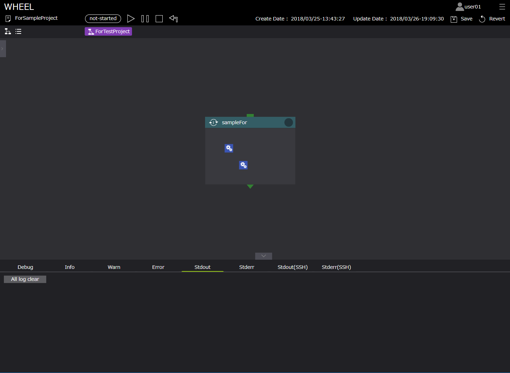   

#### For ワークフロー　子階層

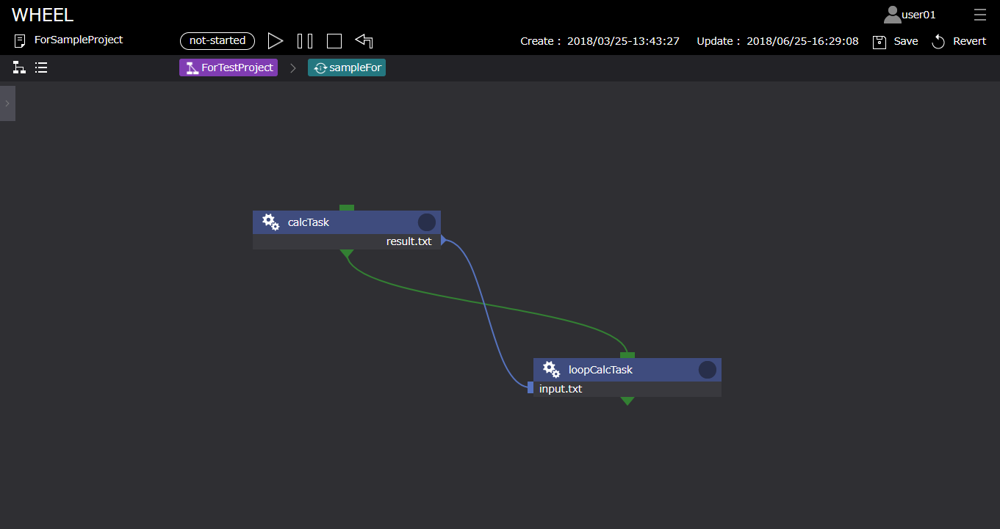

このサンプルは下記の処理を行います。

1. calcTaskコンポーネントにより、面積算出ソルバーを実行する
1. 実行結果をloopCalcTaskコンポーネントに渡す
1. 1により得られた結果（面積の値）を読み込み、ループインデックス、及び本計算結果* を使用した計算を行う
1. 3の計算結果をファイルとして出力する
1. 上記処理をループインデックスの上限値まで繰り返す（ループインデックス1～5）  

*　ループ回数2回目以降の計算にて使用する

サンプルの実行結果は以下です。
#### ワークフロー実行結果

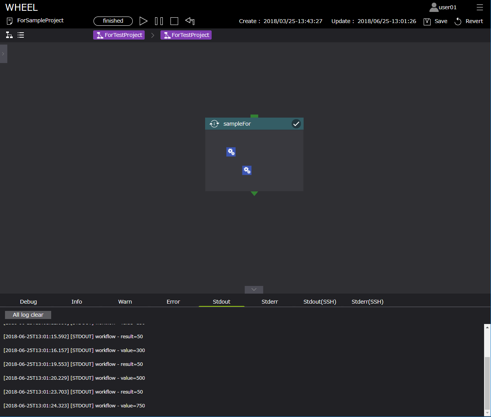

## Foreach コンポーネント  
Foreachコンポーネントのサンプルを示します。 
サンプルでは、ForコンポーネントサンプルのループインデックスをForeachコンポーネントのプロパティindex listに変更したものを実行します。  
ワークフローに設定されているファイルは以下です。  

| コンポーネントタイプ | コンポーネント名 | 入力ファイル | 出力ファイル | 設定ファイル | 備考 |
|----|----|----|----|----|----|
| Foreach | sampleForeach | ー | ー | ー | ループインデックスは、1, 3, 5を設定する |
| Task | calcTask | ー | 計算結果データファイル | ソルバー実行スクリプト | ソルバー、インプットデータを格納 | 
|  | loopCalcTask | 計算結果データファイル | ー | 計算結果データ、ループインデックスを利用した計算をするスクリプト | ー |  

sampleForeachコンポーネントのプロパティは以下です。  
calcTask, loopCalcTaskコンポーネントは、前述のForコンポーネントで使用しているものと同様です。  

##### sampleFor

| プロパティ名 | 設定値 |
| ---- | ---- |
| Name | sampleForeach |
| InputFiles | - |
| OutputFiles | - |
| index list | 1, 3, 5 |
| Files | - |
#### Foreach ワークフロー  

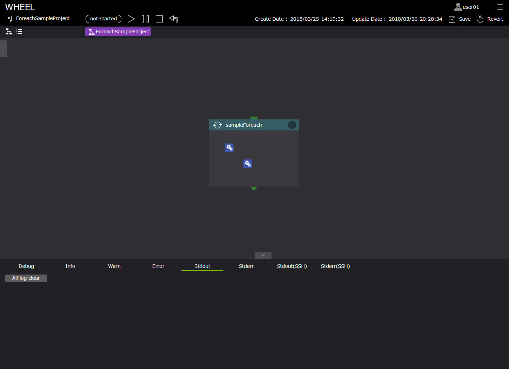   

#### Foreach ワークフロー　子階層

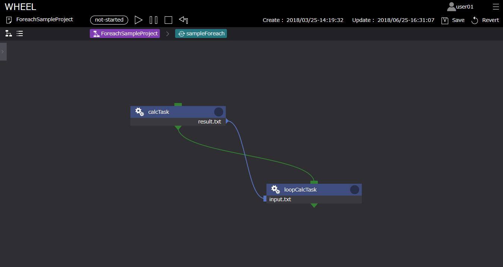

このサンプルは下記の処理を行います。

1. calcTaskコンポーネントにより、面積算出ソルバーを実行する
1. 実行結果をtask1コンポーネントに渡す
1. 1により得られた結果（面積の値）を読み込み、ループインデックス、及び本計算結果* を使用した計算を行う
1. 3の計算結果をファイルとして出力する
1. 上記処理をループインデックスの上限値まで繰り返す（ループインデックス1, 3, 5）

*　ループ回数2回目以降の計算にて使用する

サンプルの実行結果は以下です。
#### ワークフロー実行結果

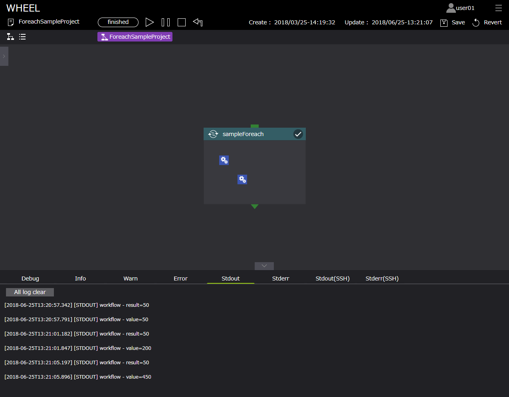

## While コンポーネント  
Whileコンポーネントのサンプルを示します。  
サンプルでは、Conditionプロパティの条件判定要素として環境変数`$WHEEL_CURRENT_INDEX`を使用しています。  
Whileコンポーネントにおける環境変数`$WHEEL_CURRENT_INDEX`は、初期値0,増加率1として扱われます。  
ワークフローに設定されているファイルは以下です。  

| コンポーネントタイプ | コンポーネント名 | 入力ファイル | 出力ファイル | 設定ファイル | 備考 |
|----|----|----|----|----|----|
| While | sampleWhile | ー | ー | ループ終了判定用スクリプト | 計算値がある値を超えたらループ処理を終了する |
| Task | calcTask | ー | 計算結果データファイル | ソルバー実行スクリプト | ソルバー、インプットデータを格納 | 
|  | loopCalcTask | 計算結果データファイル | ー | 計算結果データ、ループインデックスを利用した計算をするスクリプト | ー |

sampleWhileコンポーネントのプロパティ、及びConditionプロパティに設定されるスクリプトの内容は以下です。  
calcTask, loopCalcTaskコンポーネントは、前述のForeachコンポーネントで使用しているものと同様です。  

##### sampleWhile

| プロパティ名 | 設定値 |
| ---- | ---- |
| Name | sampleWhile |
| InputFiles | - |
| OutputFiles | - |
| Condition | condition.bat |
| Files | condition.bat |

>ex. condition.bat  
`@echo off`  
if %WHEEL_CURRENT_INDEX% gtr 5 (  
    exit /b 1  
) else (  
    goto:eof  
)  

#### While ワークフロー  

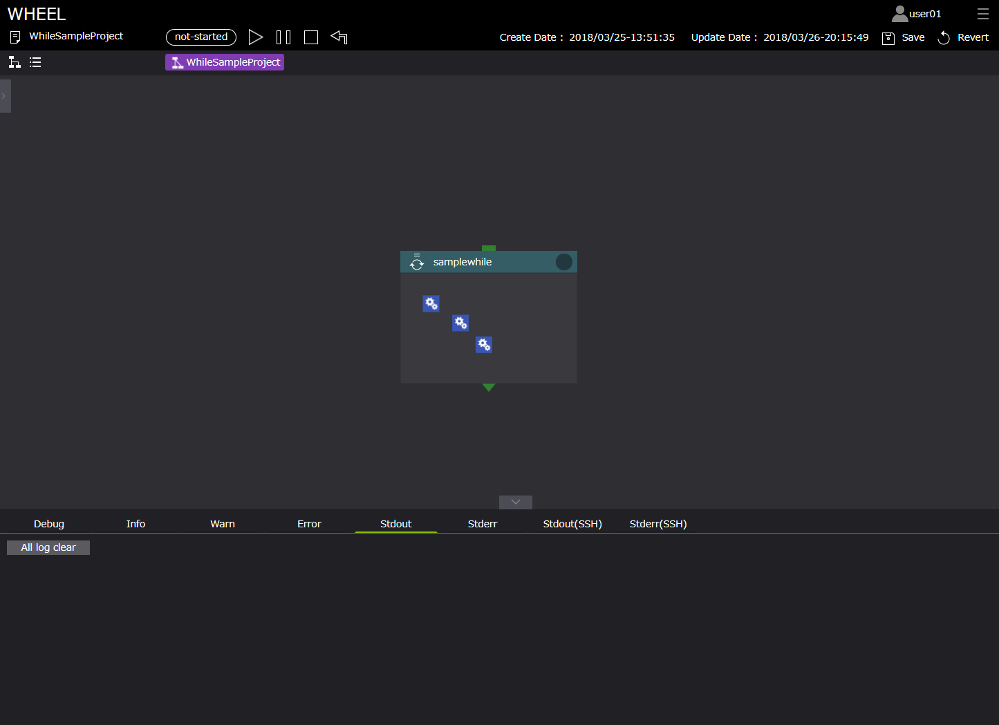   

#### While ワークフロー　子階層

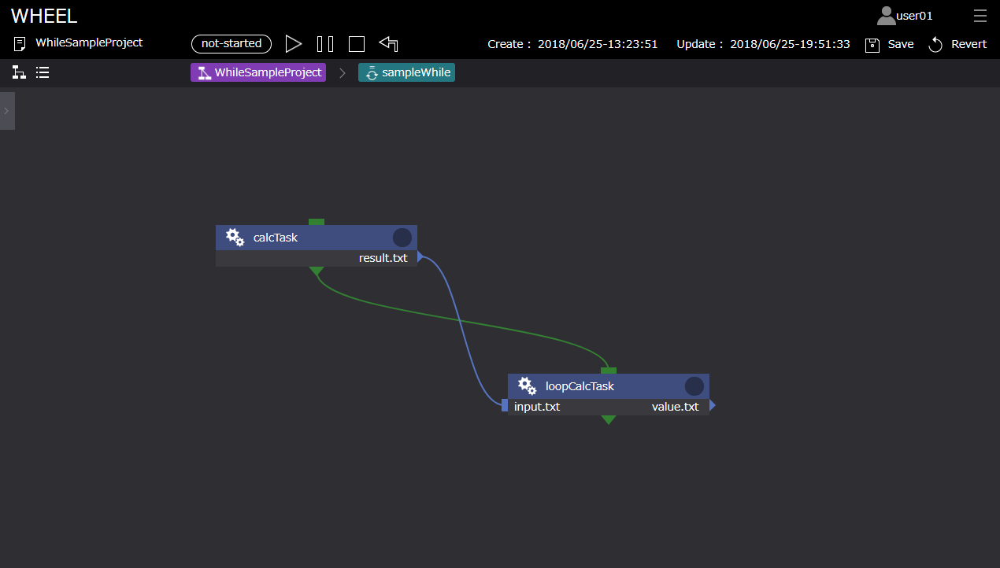

このサンプルは下記の処理を行います。

1. calcTaskコンポーネントにより、面積算出ソルバーを実行する
1. 実行結果をloopCalcTaskコンポーネントに渡す
1. 1により得られた結果（面積の値）を読み込み、ループインデックス、及び本計算結果* を使用した計算を行う
1. 3の計算結果をファイルとして出力する
1. Whileコンポーネントに設定された条件判定スクリプトで、ループ継続判定をする
1. ループ継続であればループインデックスに1を加算し処理1に戻り、ループ終了であればワークフローを終了する

*　ループ回数2回目以降の計算にて使用する

サンプルの実行結果は以下です。
#### ワークフロー実行結果

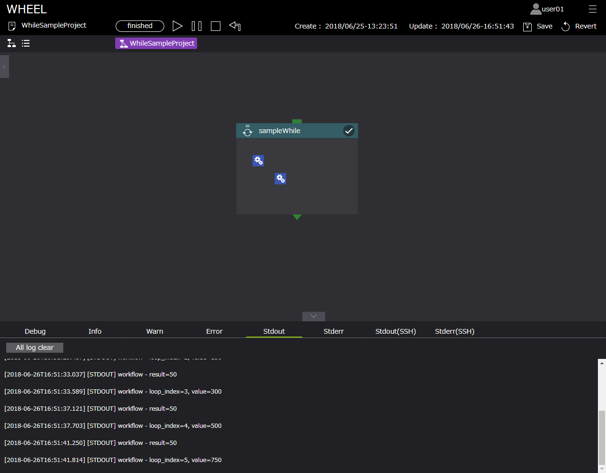

## Workflow コンポーネント  
Workflowコンポーネントは、複数のコンポーネントからなる処理を一つのコンポーネントに纏めるために用います。  
Workflowコンポーネントを使用することで、ワークフロー編集画面上を処理毎に集約することができ、ワークフロー全体の見通しを良くすることができます。

#### Workflow コンポーネント 未使用  

   

#### Workflow コンポーネント 使用  

   