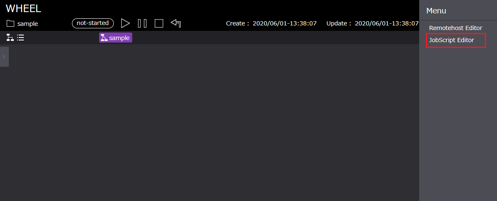
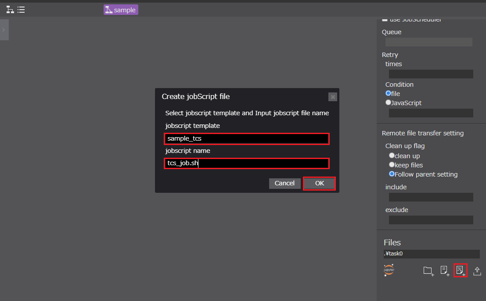
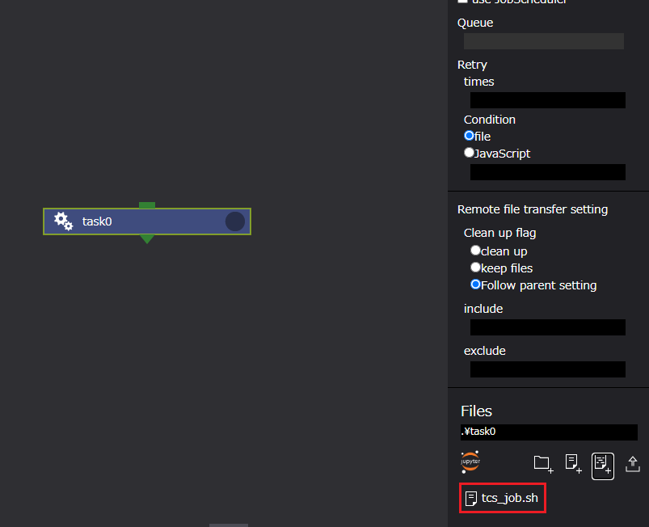

# ジョブスクリプトテンプレートの登録

本画面では、リモートホストマシンへのジョブ投入に使用するジョブスクリプトの生成を支援するジョブスクリプトのテンプレートを作成、登録できます。  
現在、本画面で対応しているジョブスケジューラは以下です。  

* FUJITSU Software Technical Computing Suite (TCS、九州大学ITO向け)  
* Univa Grid Engine (UGE)

## 登録画面への移動

登録画面には、下記の方法によって遷移します。

* ホーム画面右上ドロワー内の[ jobScript Editor ]
* ワークフロー画面右上ドロワー内の[ jobScript Editor ]

1. ホーム画面右上ドロワー  
  

1. ワークフロー画面右上ドロワー  
  

## ジョブスクリプトテンプレート登録画面仕様

本画面の構成は、以下のようになっています。  
  

1. タイトル　：ホーム画面遷移ボタン
1. 登録エリア：登録するジョブスクリプトの情報を入力する
1. 登録エリアボタン
    1. Confirmボタン：登録エリアの入力内容を登録する
    1. Cancelボタン：登録エリアの入力内容を空にする
1. テンプレートリストエリア：登録済みのテンプレート情報を表示する
    1. Copyボタン：テンプレートをコピーする
    1. Deleteボタン：テンプレートを削除する

また、本画面で登録できるプロパティは以下です。  

### ■ TCS

| プロパティ名 | プロパティ | 備考 |
|----|----|----|
| Template Name | 登録するテンプレート名 | 重複不可 |
| Resource Unit | リソースユニット名 | セレクトボックスから選択 |
| Resource Group | リソースグループ名 | セレクトボックスから選択 |
| JobScheduler | HPCシステムで使用されているジョブスケジューラ名 | 入力不可 |
| Node | 使用するノード数 | 数値 |
| Core per Node |1ノードあたりに使用するコア数 | 数値 |
| Elapsed Time | 最大経過時間 | HH:MM:SS の形式 |
| Stdout Name | 標準出力情報を保存するファイル名 | ー|
| Stderr Name | 標準エラー出力情報を保存するファイル名 | ー|
| Job Name | 投入するジョブ名 | ー |
| other | 自由記述箇所 | 文字列 |

より詳細な情報は、以下を参考にしてください。  
[九州大学情報基盤センタースーパーコンピュータシステムITO](https://www.cc.kyushu-u.ac.jp/scp/system/ITO/)

### ■ UGE

| プロパティ名 | プロパティ | 備考 |
|----|----|----|
| Template Name | 登録するテンプレート名 | 重複不可 |
| Resource Type | リソースタイプ名 | ー |
| Resource Number | 使用するノード数 | ー |
| JobScheduler | HPCシステムで使用されているジョブスケジューラ名 | 入力不可 |
| Elapsed Time | 最大経過時間 | HH:MM:SS の形式 |
| Priority | SpotサービスでのPOSIX優先度 | 数値：０～１の間|
| Task Id | アレイジョブのタスクIDの指定 | n[-m[x]] の形式 |
| Hold Id | 依存関係があるジョブのID | 数値 |
| Ar Id | 予約した計算ノードの予約ID | 数値 |
| Stdout Name | 標準出力情報を保存するファイル名 | ー|
| Stderr Name | 標準エラー出力情報を保存するファイル名 | ー|
| Job Name | 投入するジョブ名 | ー |
| other | 自由記述箇所 | 文字列 |

## テンプレートの登録

テンプレートの登録方法は、2パターンあります。

1. 新規に登録する
1. 登録済みテンプレート情報を引用し登録する  

### 1. 新規に登録する  

手順は以下になります。  

1. HPC Centerを選択する
1. テンプレート登録情報を入力する
1. Confirmボタンをクリックする  

#### 1. HPC Centerを選択する

KYUSHU UNIVERSITY ITO、または、otherが選択できます。選択したHPC Centerによって入力する項目が変化します。

##### KYUSHU UNIVERSITY ITO

##### other

#### 2. テンプレート登録情報を入力する  

テンプレート登録情報を入力する。必須項目はTemplate Nameのみです。

##### KYUSHU UNIVERSITY ITO

##### other

#### 3. Confirmボタンをクリックする  

入力内容をテンプレートとして登録します。テンプレートリストエリアに情報が追加されます。  

  

### 2. 登録済みテンプレート情報を引用し登録する  

続いて、「2. 登録済みテンプレート情報を引用し登録する」方法を説明します。  

手順は以下になります。

1. テンプレートリストエリアに表示されている登録済みのジョブスクリプトのテンプレートを選択する
1. テンプレートリストエリア[ Copy ]ボタンをクリックする
1. コピーしたテンプレートの入力情報を編集し、入力画面[ Confirm ]ボタンをクリックする

#### 1. テンプレートを選択する

登録済みのテンプレートを選択します。選択したテンプレートの情報は、入力エリアに反映されます。  

  

#### 2. [ Copy ]ボタンをクリックする

Copyボタンをクリックします。テンプレート入力エリアに選択したテンプレートが複製されます。  
複製したテンプレート名は「選択したテンプレート名_1」となります。

#### 3. コピーしたテンプレートを編集し、[ Confirm ]ボタンをクリックする

  
## テンプレートの削除

テンプレートの削除は、以下の手順で行います。

1. テンプレートリストエリアに表示されている削除したいテンプレートを選択する
1. テンプレートリストエリア[ Delete ]ボタンをクリックする
1. 表示される「削除確認メッセージダイアログボックス」の[ OK ]ボタンをクリックする。  

削除されていることを確認します。

## ジョブスクリプトの作成

登録したジョブスクリプトのテンプレートをもとにジョブスクリプトを生成します。  
ジョブスクリプトの生成は、ワークフロー画面で生成したコンポーネントのプロパティ[ Files ]のジョブスクリプト生成ボタンから行います。  

ジョブスクリプトの生成手順は以下です。

1. コンポーネントのプロパティ[ Files ]のジョブスクリプト生成ボタンをクリックする
1. 表示されたダイアログボックスから、[ jobscript template ]セレクトボックスより使用するテンプレートを選択する
1. [ jobscript name ]テキストボックスに生成するジョブスクリプト名を入力する
1. [ OK ]ボタンをクリックする

ファイルが生成されていることを確認します。

