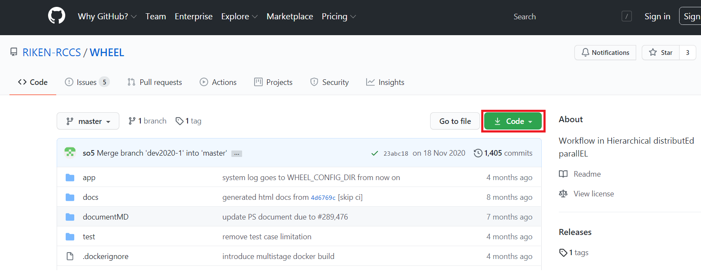

# WHEELのインストール
本作業は、WHEELのサーバとなるマシン上で行います。
WHEELの起動や終了に関しては、次章にて説明します。

## 事前準備
WHEELのインストールと動作には、node.js(version 12以降)が必要になります。 
node.jsは、 以下の方法にてインストールできます。
1. 次サイト https://nodejs.org/ja にて、配布されているアーカイブをダウンロードしてインストールする。
1. お使いのOSのパッケージマネージャを利用してインストールする。

## WHEELのダウンロード、インストール方法
***
### WHEELのダウンロード
WHEELモジュールは、理研RCCSのgithubにOSS(BSDライセンス)として公開されています。  
github: https://github.com/RIKEN-RCCS/WHEEL  

WHEELを使用する場合は、上記URLの**Code**ボタンからダウンロード、または、git cloneしてください。

  

### WHEELのインストール
WHEELのダウンロード完了後、ターミナルアプリ、コマンドプロンプト等を起動し以下の手順に従い
WHEELのインストールを行います。
1. WHEELをダウンロードしたディレクトリへ遷移する。
1. ダウンロードしたモジュールを解凍する。
1. [ > npm install モジュール名] を実行する。

以上でインストールは終了です。