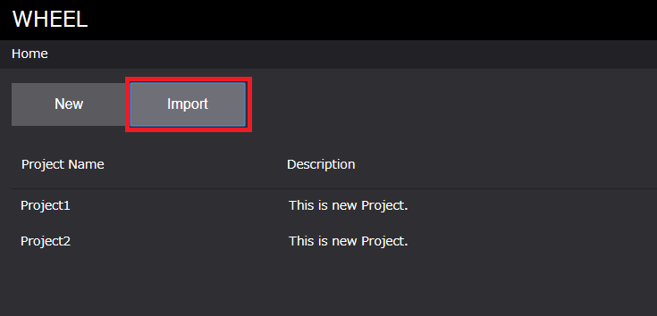

# プロジェクトの作成と編集
新規プロジェクトの作成や既存プロジェクトの編集はホーム画面で行います。  
ホーム画面の構成は以下のようになっています。  

  
1. ユーザ名：ログインユーザ名
1. 画面遷移ドロワー：ホスト登録画面、ログイン画面への遷移用
1. New ボタン   ：新規プロジェクトの作成
1. import ボタン：既存プロジェクトの読込
1. プロジェクト一覧表示エリア　：WHEEL登録済みプロジェクトの表示エリア
1. プロジェクト名表示エリア　　：プロジェクトの名称表示エリア
1. プロジェクト説明文エリア　　：プロジェクトに関するコメント表示エリア
1. プロジェクトパスエリア　　　：プロジェクトパスの表示アリア
1. プロジェクト作成時間エリア　：プロジェクトの作成時間表示エリア
1. プロジェクト更新時間エリア　：プロジェクトの更新時間表示エリア
1. プロジェクトステータスエリア：プロジェクトのステータス表示エリア

## 1. 新規プロジェクトの作成
プロジェクトの作成方法は、  
1. 新規プロジェクトの作成
1. 既存プロジェクトデータの読み込み  
の2つの方法から行うことができます。  
それぞれ、Newボタン、Importボタンから行います。

### 1. [ New ]：新規プロジェクトの作成 
以下の手順で行います。
1. [ New ] ボタンをクリックする
1. プロジェクトデータ作成場所を選択する
1. プロジェクト名を入力し、[ OK ] ボタンをクリックする  

#### 1. [ New ] ボタンをクリックする  

  
#### 2. プロジェクトデータ作成場所を選択する
#### 3. プロジェクト名を入力し、[ OK ] ボタンをクリックする  

  

##### 新規作成後  

  

### 2. [ Import ]：既存プロジェクトデータの読み込み 
以下の手順で行います。
1. [ Import ] ボタンをクリックする
1. プロジェクトデータ作成場所を選択し、[ OK ] ボタンをクリックする  

#### 1. [ Import ] ボタンをクリックする  

  

#### 1. プロジェクトデータ作成場所を選択し、[ OK ] ボタンをクリックする  

読み込みたいプロジェクトのディレクトリ内にある「swf.prj.json」を選択します。  

  　

##### 新規作成後  

  
