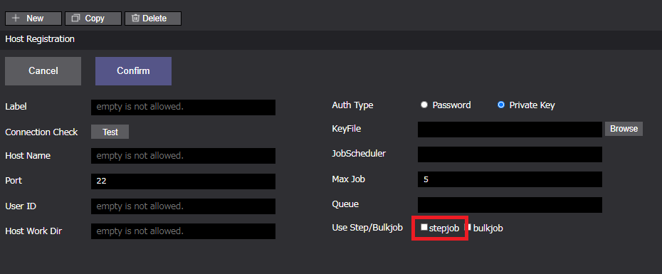
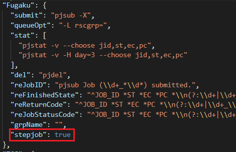
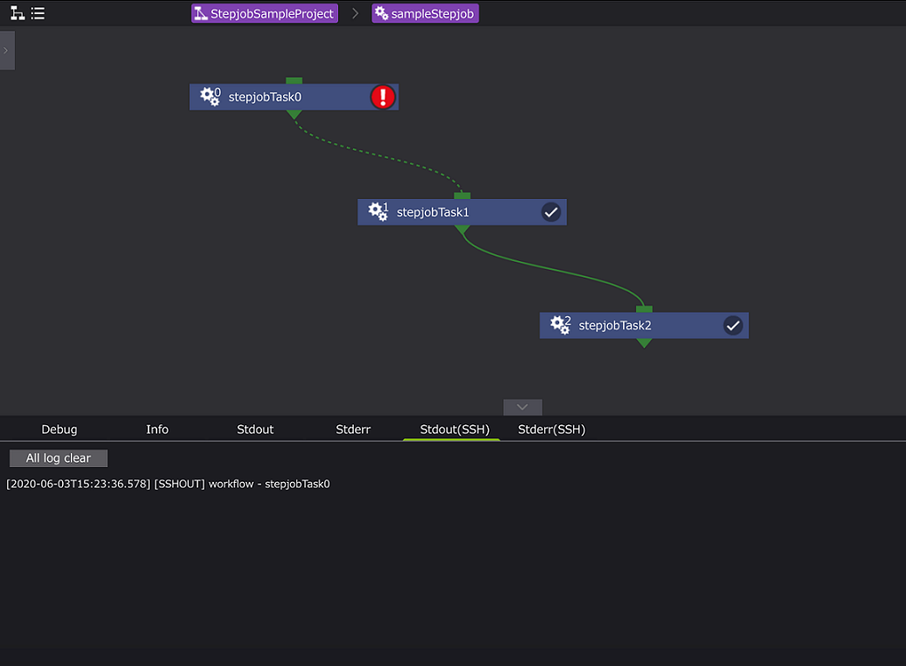

# Stepjob

  

stepjob/stepjobTaskコンポーネントは、ジョブスケジューラ「FUJITSU Software Technical Computing Suite（TCS）」のステップジョブ機能に基づいた機能です。  
ユーザがステップジョブを使用できるリモートマシンのアカウントを持つ場合にのみ使用できます。  
本機能は、stepjobコンポーネントとstepjobコンポーネント内でのみ使用できるstepjobTaskコンポーネントを組み合わせて使用します。  
TCSのステップジョブ機能に基づきstepjobTaskコンポーネントに設定されたステップナンバー、及び、依存関係式に従い、ジョブ投入されます。  
ステップジョブを使用することでジョブの投入時に設定した依存関係式によって実行条件や順序を指定することができ特定のジョブの実行結果に応じて自動的に処理させることができます。  
ステップジョブ機能の詳細に関しては、ジョブスケジューラ「FUJITSU Software Technical Computing Suite（TCS）」のドキュメントをご確認ください。  

Stepjob/StepjobTaskコンポーネントのプロパティは以下です。

#### ■ stepjob

| プロパティ | 入力値 | プロパティ説明 |
|----|----|----|
| name | 文字列 | コンポーネント名 |
| description | 文字列 | コンポーネントの説明文 |
| inputFiles | ファイルまたはディレクトリ名 | 先行コンポーネントから受け取るファイル |
| outputFiles | ファイル, ディレクトリ名またはglobパターン | 後続コンポーネントへ渡すファイル |
| host | 文字列 | Taskを実行するhost、localhostまたは登録済のremotehostのlabelを指定する *1|
| useJobscheduler | チェックボックス | true、readonly |
| queue | 文字列 | ジョブの投入先キューを指定する(useJobSchedulerを使用しない場合は設定不可) *2|
| clean up flag | ラジオボタン | リモート環境に作成した一時ファイルの取り扱い指定フラグ |
|  | clean up | 削除する |
|  | keep files | 削除しない |
|  | follow parent setting | 親コンポーネントと同じ挙動をする |
| state clean | ボタン | コンポーネントの進行状態を初期状態に戻す *3 |

*1 stepjobコンポーネントで使用するホストはステップジョブ機能を使用できるリモートホストを設定する必要があります。  
*2 設定したキューがstepjobコンポーネント内部のstepjobTaskコンポーネントのジョブ投入時に使用されます。  
*3 コンポーネントの進行状態が"finished"もしくは"failed"の時のみ表示されます。

#### ■ stepjobTask

| プロパティ | 入力値 | プロパティ説明 |
|----|----|----|
| name | 文字列 | コンポーネント名 |
| description | 文字列 | コンポーネントの説明文 |
| script | ファイル | Task内の処理を記述したスクリプトのファイルを指定 *1<br>scriptにはFilesエリアに登録されているファイルが選択可能 | 
| inputFiles | ファイルまたはディレクトリ名 | 先行コンポーネントから受け取るファイル *2|
| outputFiles | ファイル, ディレクトリ名またはglobパターン | 後続コンポーネントへ渡すファイル *2|
| useDependency | チェックボックス | 依存関係式を使用する |
| stepNumber | 入力不可 | ステップジョブの実行順を定める番号、結線によって自動採番する *3 |
| form | 文字列 | 依存関係式入力ボックス *4 |
| clean up flag | ラジオボタン | リモート環境に作成した一時ファイルの取り扱い指定フラグ |
|  | clean up | 削除する |
|  | keep files | 削除しない |
|  | follow parent setting | 親コンポーネントと同じ挙動をする |
| include | ファイル | リモート環境から回収してくるファイル *5 |
| exclude | ファイル | リモート環境から回収しないファイル *5 |
| state clean | ボタン | コンポーネントの進行状態を初期状態に戻す *6 |

*1 scriptに指定されたスクリプトの終了コードが0の場合は真、  
　それ以外の場合は、偽と判定し(プロジェクトの判定はfailedとなります)後続のノードへ遷移します。  
*2 stepjobTaskコンポーネントでは、親コンポーネント(stepjobコンポーネント)からのファイルの受け渡しは可能ですが、  
　ステップジョブ機能の性質上、stepjobTaskコンポーネント間のファイルの受け渡しを設定することができません。  
　実行するステップジョブ間でファイルの受け渡しが必要な場合は、ジョブスクリプトに処理を記述する必要があります。  
*3 ステップナンバーが小さい数から順に実行されます。  
*4 include, excludeともにglobパターンを指定することができます。  
　includeにマッチしなおかつexcludeにマッチしないファイルを回収してくることができます。  
　ただし、outputFilesに指定されたファイルは、include/excludeの指定に関わらず全て回収されます。  
*5 コンポーネントの進行状態が"finished"もしくは"failed"の時のみ表示されます。

## 依存関係式（form プロパティ）

stepjobTaskコンポーネントにおいて、実行済みstepjobTaskコンポーネントのジョブスクリプトの終了ステータス（ec, もしくはジョブの終了コードpc）によって、  
その後のstepjobTaskコンポーネントの実行可否を決定する場合、依存関係式をformプロパティに設定します。  

依存関係式の記述方法は以下になります。

```
sd=form[:[deletetype][:stepno[:stepno[...]]]]
```

| 式要素 | 説明 |
| ---- | ---- |
| sd= | 接頭辞、必須 |
| form | 投入するサブジョブを実行するかどうかを判断する条件を示す式 |
| deletetype | サブジョブを実行しない場合の詳細動作の指定 |
| stepno | どのサブジョブの実行結果に対して適用するかを示すステップナンバー |

#### form

formは、param(ec:依存するサブジョブのジョブスクリプトの終了コード, pc:依存するサブジョブのジョブ終了コード)と  
値「==, !=, <, > , <=, >=」で指定します。
```
ex.
ec==0
```
条件==や!=を指定する場合、値はコンマ(,)で区切ることで複数指定できます。

#### deletetype
deletetypeは、以下の3種類指定できます。

| deletetype | 説明 |
| ---- | ---- |
| one | このサブジョブのみ削除する。このサブジョブの結果に依存する後続のサブジョブは削除されない |
| after | このサブジョブ、及びそれに依存する後続のサブジョブのみ削除する|
| all | このサブジョブ、及び後続のサブジョブを全て削除する |

以下にformプロパティに設定する依存関係式の例を示します。
```
ex.ステップナンバー0のサブジョブのジョブスクリプトの終了コードが0以外の場合、このサブジョブ以降は実行しない

sd=ec!=0:all:0
```

# リモートホスト/ジョブスケジューラの設定
## リモートホストの設定
前述にもあるように、stepjob/stepjobTaskコンポーネントを使用する場合、  
ユーザがリモートホストのステップジョブ機能を使用する権限を有している必要があります。  
権限を有している場合、リモートホスト設定画面においてstepjob/stepjobTaskコンポーネントで使用するリモートホストのstepjobプロパティを  
有効にすることで使用可能になります。(加えてjobScheduler.jsonファイルにも設定が必要です。詳細後述。)

> リモートホスト画面  


## ジョブスケジューラの設定
stepjob/stepjobTaskコンポーネントを使用する場合、リモートホストの設定に加えて使用するジョブスケジューラの設定も必要です。    
WHEELモジュール内のapp/config/jobscheduler.jsonファイルにステップジョブ機能を有効にする以下の記述を追記してください。  

> app/config/jobscheduler.jsonへの追記例  


# stepjob/stepjobTaskコンポーネントの使用例

サンプルでは、3つのstepjobTaskコンポーネントを使用します。  
1つ目のstepjobTaskコンポーネントは、ジョブスクリプトの終了コード1となるジョブスクリプトを設定し、  
2つ目のstepjobTaskコンポーネントに依存関係式「sd=ec!=0:all:0」によって  
2つめ,3つ目のstepjobTaskコンポーネントが実行されないことを確認します。*

*3つ目のstepjobTaskコンポーネントで投入したサブジョブは実行されませんが、  
コンポーネント自体の処理は実行されるためコンポーネントのステータスはfinished(✔)となります。

## ワークフロー構成図


stepjobTaskコンポーネントに依存関係式が使用されている(useDependency=true)場合、  
先行するコンポーネントの処理結果によって当該コンポーネント(また、それ以降のコンポーネント)  
が実行される保証がないため先行コンポーネントからの結線を点線で表示します。

## 各コンポーネントのプロパティ

> stepjobTask0（stepjobTaskコンポーネント）

| プロパティ名 | 設定値 |
| ---- | ---- |
| Name | stepjobTask0 |
| Script | failed.sh |
| InputFiles | - |
| OutputFiles | - |
| useDependency | - |
| stepNumber | 0(自動採番) |  
| form | - |  

#### ・failed.sh

```
#!/bin/bash
#PJM -L "node=1"
#PJM -L "rscgrp=eap-small"
#PJM -L "elapse=1:00:00"
#PJM -j -X -S

echo stepjobTask0
exit 1
```
(注)上記スクリプトのリソース指定は富岳の記述形式です。他のホストで使用する場合は、使用するホストの記述方式を使用して下さい。  
> stepjobTask1（stepjobTaskコンポーネント）

| プロパティ名 | 設定値 |
| ---- | ---- |
| Name | stepjobTask0 |
| Script | failed.sh |
| InputFiles | - |
| OutputFiles | - |
| useDependency | true |
| stepNumber | 1(自動採番) |  
| form | sd=ec!=0:all:0 |  

#### ・script1.sh

```
#!/bin/bash
#PJM -L "node=1"
#PJM -L "rscgrp=eap-small"
#PJM -L "elapse=1:00:00"
#PJM -j -X -S

echo stepjobTask1
exit 0
```

> stepjobTask2（stepjobTaskコンポーネント）

| プロパティ名 | 設定値 |
| ---- | ---- |
| Name | stepjobTask0 |
| Script | failed.sh |
| InputFiles | - |
| OutputFiles | - |
| useDependency | - |
| stepNumber | 2(自動採番) |  
| form | - |  

#### ・script2.sh

```
#!/bin/bash
#PJM -L "node=1"
#PJM -L "rscgrp=eap-small"
#PJM -L "elapse=1:00:00"
#PJM -j -X -S

echo stepjobTask2
exit 0
```

## 実行結果

  
