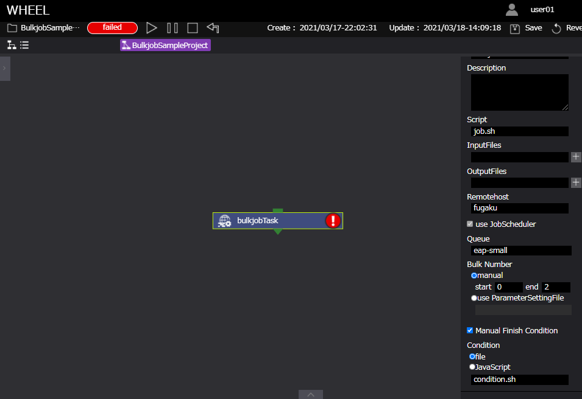

# BulkjobTask

  

bulkjobTaskコンポーネントは、ジョブスケジューラ「FUJITSU Software Technical Computing Suite（TCS）」のバルクジョブ機能に基づいた機能です。  
ユーザがバルクジョブを使用できるリモートマシンのアカウントを持つ場合にのみ使用できます。  
本機能は、bulkjobTaskコンポーネントを使用します。  
TCSのバルクジョブ機能に基づきbulkjobTaskコンポーネントに設定されたバルク番号、インプットファイルを用いてジョブ投入されます。  
バルクジョブは、一度のジョブの投入時で複数のサブジョブを投入することができるため、ジョブの充填率を挙げることが可能です。
バルクジョブ機能の詳細に関しては、ジョブスケジューラ「FUJITSU Software Technical Computing Suite（TCS）」のドキュメントをご確認ください。  

bulkjobTaskコンポーネントのプロパティは以下です。

#### ■ bulkjobTask

| プロパティ | 入力値 | プロパティ説明 |
|----|----|----|
| name | 文字列 | コンポーネント名 |
| description | 文字列 | コンポーネントの説明文 |
| script | ファイル | Task内の処理を記述したスクリプトのファイルを指定 *1<br>scriptにはFilesエリアに登録されているファイルが選択可能 |
| inputFiles | ファイルまたはディレクトリ名 | 先行コンポーネントから受け取るファイル |
| outputFiles | ファイル, ディレクトリ名またはglobパターン | 後続コンポーネントへ渡すファイル |
| useJobscheduler | チェックボックス | 依存関係式を使用する |
| manual/usePSSettingFile | ラジオボタン | バルク番号を手動入力するかパラメータセッティングファイルを使用するか |
| start | 数値 | 開始バルク番号、manualのときのみ設定可能 |
| end | 数値 | 終了バルク番号、manualのときのみ設定可能 |
| parameterfile | ファイル | パラメータセッティングファイル、usePSSettingFileのときのみ設定可能 |
| manualFinishCondition | チェックボックス | コンポーネントの終了状態判定にスクリプト(または、javascriptの式)を使用するか *2 |
| condition | ファイル名,またはJavascriptの式 | 条件判定を行うスクリプトのファイル名、またはJavascriptの式 *3 |
| clean up flag | ラジオボタン | リモート環境に作成した一時ファイルの取り扱い指定フラグ |
|  | clean up | 削除する |
|  | keep files | 削除しない |
|  | follow parent setting | 親コンポーネントと同じ挙動をする |
| include | ファイル | リモート環境から回収してくるファイル *4 |
| exclude | ファイル | リモート環境から回収しないファイル *4 |
| state clean | ボタン | コンポーネントの進行状態を初期状態に戻す *5 |

*1 scriptに指定されたスクリプトの終了コードが0の場合は真、  
　それ以外の場合は、偽と判定し(プロジェクトの判定はfailedとなります)後続のノードへ遷移します。  
*2 有効にしない場合、全サブジョブのジョブスクリプト終了コードが0以外の場合、偽、それ以外の場合、真と判定します。
*3 conditionに指定されたスクリプトの終了コードが0の場合は真、それ以外の場合は、偽と判定してコンポーネントの終了状態を決定します。  
　ただし、conditionに指定された文字列と一致するファイルが存在しなかった場合は、Javascriptの式とみなしてそのコードを実行します。  
　この場合、実行結果がtruthyな値の場合を真、falseyな値の場合を偽とします。  
　真のとき、コンポーネントの実行結果をfinish、偽のときfailedと判定します。  
*4 include, excludeともにglobパターンを指定することができます。  
　includeにマッチしなおかつexcludeにマッチしないファイルを回収してくることができます。  
　ただし、outputFilesに指定されたファイルは、include/excludeの指定に関わらず全て回収されます。  
*5 コンポーネントの進行状態が"finished"もしくは"failed"の時のみ表示されます。

# リモートホスト/ジョブスケジューラの設定
## リモートホストの設定
前述にもあるように、bulkjobTaskコンポーネントを使用する場合、  
ユーザがリモートホストのバルクジョブ機能を使用する権限を有している必要があります。  
権限を有している場合、リモートホスト設定画面においてbulkjobTaskコンポーネントで使用するリモートホストのbulkjobプロパティを  
有効にすることで使用可能になります。(加えてjobScheduler.jsonファイルにも設定が必要です。詳細後述。)

> リモートホスト画面  


## ジョブスケジューラの設定
bulkjobTaskコンポーネントを使用する場合、リモートホストの設定に加えて使用するジョブスケジューラの設定も必要です。    
WHEELモジュール内のapp/config/jobscheduler.jsonファイルにステップジョブ機能を有効にする以下の記述を追記してください。  

> app/config/jobscheduler.jsonへの追記例  


# bulkjobTaskコンポーネントの実行終了判定
bulkjobTaskコンポーネントでは、manualFinishConditionプロパティ有効時、コンポーネントの終了判定(成功/失敗)にスクリプトファイル(または、Javascriptの式)を使用することができます。  
manualFinishConditionプロパティが無効の場合は、  
・bulkjobTaskコンポーネントで投入したサブジョブが一つ以上正常終了*している場合、finished  
・bulkjobTaskコンポーネントで投入したサブジョブが全て異常終了している場合、failed
と判定します。
*ジョブスクリプトの終了ステータスで判定します。

また、bulkjobTaskコンポーネントのサブジョブの終了状態は、bulkjobTaskコンポーネントのフォルダ内に生成される  
**subjob_status.wheel.txt**から確認できます。
> subjob_status.wheel.txt例
```
RT_0=0　　　　 #ジョブスクリプトの終了ステータス(EC)
JOBSTATUS_0=0 #ジョブの終了ステータス(PC)  
RT_1=0  
JOBSTATUS_1=0  
RT_2=1  
JOBSTATUS_2=0  
```

# bulkjobTaskコンポーネントの使用例

サンプルでは、3つの使用例を記します。  
1つ目の例では、bulkjobTaskコンポーネントで使用するインプットファイルをユーザが用意(ファイルのアップロード等により)し実行します。  
2つ目の例では、インプットファイルをWHEELのパラメータスタディ機能を用いて用意し実行します。
3つ目の例では、bulkjobTaskコンポーネントの実行方法は例1と同じですが、コンポーネントの終了判定にスクリプトを用います。

## 使用例-1

例1では、bulkjobTaskコンポーネントプロパティに以下を設定します。  
(デフォルト値から変更しているもののみ記載)  
> bulkjobbTask

| プロパティ名 | 設定値 |
| ---- | ---- |
| Name | bulkjobTask |
| Script | job.sh |
| Remotehost | fugaku |
| Queue | eap-small |
| BulkNumber | manual |  
| start | 0 |
| end | 2 |
| Files | job.sh, 0.input, 1.input, 2.input |  

#### Remotehost  
リモートホスト設定画面で登録しているバルクジョブの実行権限をもつホスト名を指定します。  
#### Queue  
Remotehostで設定したホストで使用できるQueue名を選択します。  
#### BulkNumber (ラジオボタン)
バルク番号を手動で設定するため**manual**を選択します。  
#### start, end
開始バルク番号(start)と終了バルク番号(end)を設定します。この値はバルクジョブ投入コマンドに使用されます。  
下記コマンドは、開始バルク番号(0)、終了バルク番号(2)が設定されている例です。  
```
$pjsub --bulk --sparam "0-2" ./job.sh  
```
#### Files job.sh
標準出力した.inputファイルの中身を.outputファイルとして保存するスクリプトです。  
(本来このような処理はジョブとして投入しません。あくまでもbulkjobTaskコンポーネントの使用例です。)
```
#!/bin/bash
#PJM -L "node=1"               # ノード数
#PJM -L "rscgrp=eap-small"     # リソースグループの指定
#PJM -L "elapse=60:00"         # ジョブの経過時間制限値
#PJM -S                        # 統計情報ファイル出力の指示

cat ${PJM_BULKNUM}.input > ${PJM_BULKNUM}.output
exit 0
```
バルクジョブでは、環境変数**PJM_BULKNUM**によりバルク番号をジョブスクリプト内で利用することができます。  
本例では、バルク番号0,1,2を持った3つのサブジョブが投入されます。  
バルクジョブの詳細に関しては、ジョブスケジューラのドキュメントを確認してください。

## 使用例-2

例2では、bulkjobTaskコンポーネントプロパティに以下を設定します。  
例1からの変更点は、BulkNumberのみです。  
> bulkjobbTask

| プロパティ名 | 設定値 |
| ---- | ---- |
| Name | bulkjobTask |
| Script | job.sh |
| Remotehost | fugaku |
| Queue | eap-small |
| BulkNumber | use ParameterSettingFile |  
|  | parameterSetting.json |
| Files | job.sh, input, parameterSetting.json |  

#### BulkNumber (ラジオボタン)
バルク番号の設定にパラメトリックスタディ機能を使用するため**use PatameterSettingFile**を選択します。  
また、use ParameterSettingFile有効時に設定できるセレクトボックスにWHEELに搭載されているエディタから作成した
**parameterSetting.json**を選択します。  
parameterSetting.jsonの作成方法は、ドキュメント [テキストエディタ画面](../3_workflow_screen/3_rapid.md) を参考にしてください。

### パラメトリックスタディ機能を使用したbukjobTaskの実行
WHEELのテキストエディタによって、10ケース実行用のparaterSetting.jsonを作成した場合、WHEELが実行するバルクジョブは以下のように投入されます。  
```
$pjsub --bulk --sparam "0-9" ./job.sh  
```
また、実行時には、パラメータセットとバルク番号の関係を記した**parameterSet.whee.txt**ファイルがbulkjobTaskコンポーネント直下に生成されます。  
#### parameterSet.wheel.txt
WHEELテキストエディタにおいて、inputファイルのhogeをプレースホルダに設定し、min:0, max:2, step:1を設定した場合
```
BULKNUM_0_TARGETNUM_0_FILE="./input"
BULKNUM_0_TARGETNUM_0_KEY="hoge"
BULKNUM_0_TARGETNUM_0_VALUE="0"
BULKNUM_1_TARGETNUM_0_FILE="./input"
BULKNUM_1_TARGETNUM_0_KEY="hoge"
BULKNUM_1_TARGETNUM_0_VALUE="1"
BULKNUM_2_TARGETNUM_0_FILE="./input"
BULKNUM_2_TARGETNUM_0_KEY="hoge"
BULKNUM_2_TARGETNUM_0_VALUE="2"
```

## 使用例-3

例3では、例1の設定に加えてスクリプトでコンポーネントの正常/異常終了条件を設定するために**manualFinishCondition**を有効にします。  
> bulkjobbTask

| プロパティ名 | 設定値 |
| ---- | ---- |
| Name | bulkjobTask |
| Script | job.sh |
| Remotehost | fugaku |
| Queue | eap-small |
| BulkNumber | manual |  
| start | 0 |
| end | 2 |
| manualFinishCondition | true |
| condition | condition.sh |
| Files | job.sh, condition.sh, 0.input, 1.input, 2.input |  

### conditionの設定
manualFinishConditionを有効にしconditionを設定することにより、ユーザは自身が用意したスクリプトの結果によって
bulkjobTaskコンポーネントの終了ステータスを決定することができます。
conditionには、前述しているバルクジョブのサブジョブの終了状態を記した**subjob_status.wheel.txt**を使用したスクリプトを設定することも可能です。  
下記の例では、サブジョブのジョブスクリプトの終了ステータスが一つでも正常終了でない場合(EC=1)、コンポーネントの終了ステータスをfailedとします。  
#### condition.sh
```
#!/bin/bash
source ./subjob?status.wheel.txt
i=0
while [ $i -lt 3 ]
do
  RT="RT_${i}"
  if [ ${!RT} -eq 1 ]; then
    echo bulknum:${i} jobscript status 1
    exit 1
  fi
  i=`expr $i + 1`
done
exit 0
```

## 実行結果


