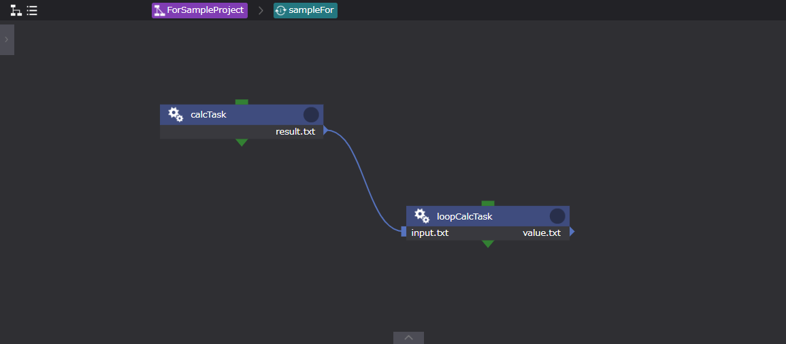
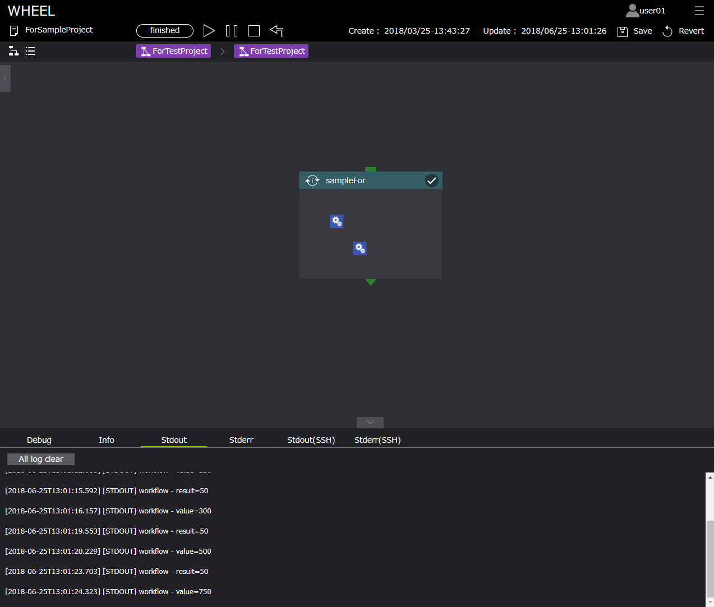
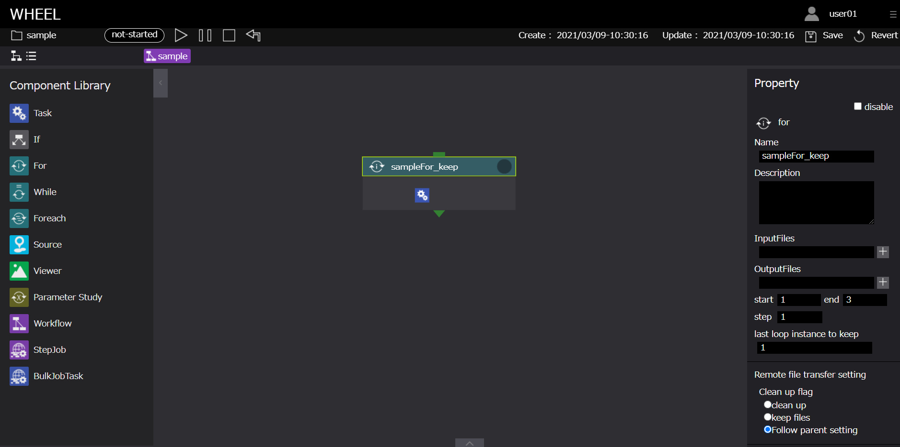
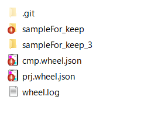

# For

  

Forコンポーネントは、[ start ], [ end ], [ step ]プロパティによる繰り返し計算の実行に使用します。  
Forコンポーネントのプロパティは以下です。

| プロパティ | 入力値 | プロパティ説明 |
|----|----|----|
| name | 文字列 |  コンポーネント名 |
| description | 文字列 | コンポーネントの説明文 |
| inputFiles | ファイルまたはディレクトリ名 | 先行コンポーネントから受け取るファイル |
| outputFiles | ファイル, ディレクトリ名またはglobパターン | 後続コンポーネントへ渡すファイル |
| start | 整数値 | ループの始値 |
| end | 整数値 | ループの終値 |
| step | 整数値 | 1回のループでのインデックスの増分（負値も可）|
| last loop instance to keep | 整数値 | 残しておくループインスタンスの数（デフォルトではすべて保存される。） |
| state clean | ボタン | コンポーネントの進行状態を初期状態に戻す *1 |

*1 コンポーネントの進行状態が"finished"もしくは"failed"の時のみ表示されます。  

## ループ系コンポーネント（For/While/Foreach）

Forコンポーネントは、While/Foreachコンポーネントと同様に**ループ系コンポーネント**としてカテゴライズされ、  
ループカウンタインデックスを環境変数`$WHEEL_CURRENT_INDEX`に持ちます。  
ループ処理では、プロジェクト実行開始時に自身と同じ階層にループカウンタインデックスの値に応じたsuffixをつけてコンポーネント内に存在する全てのコンポーネントのコピーを作成します。  
生成処理が完了したら、ループカウンタインデックスを進めて終了判定を行い、ループが終了してなければ再度コピーを作成します。  
このときコピーされるコンポーネントは、**1つ前のループ処理後のコンポーネント** です。  
以下に例を示します。

### Forコンポーネント名が「For」、ループカウンタを0から3まで1ずつ増加させる(start:0, end:3, step:1)場合

#### 実行前のプロジェクトのディレクトリ構造

```
For
```

#### 実行開始ループカウンタ0 ($WHEEL_CURRENT_INDEX：0)

```
For
For_0 ←カウンタ開始が0のため、For_0コンポーネントが生成します
```

#### 実行開始ループカウンタ1 ($WHEEL_CURRENT_INDEX：1)

```
For
For_0
For_1 ←「1」増加したFor_1を生成します  
　　　　このとき、For_1コンポーネントは、カウンタ0のFor_0コンポーネントをコピーしたものです
```

以降、ループが終了するまでコンポーネントのコピー/実行を繰り返します。  
ループが終了条件を満たした時点で、これらのコンポーネントは終了となります。  

# Forコンポーネントの使用例

Forコンポーネントのサンプルを示します。  
サンプルでは、Forコンポーネント内でのTaskコンポーネントの処理（面積計算）にループインデックス(`$WHEEL_CURRENT_INDEX`)使用します。  
ワークフローに設定されているファイルは以下です。  

このワークフローは下記の処理を行います。

1. calcTaskコンポーネントにより、面積算出ソルバーを実行する
1. 実行結果をloopCalcTaskコンポーネントに渡す
1. 「1の結果（面積の値）×ループインデックス＋3の結果」 を実行する *1
1. 3の計算結果をファイルとして出力する
1. 上記処理をループインデックスの上限値まで繰り返す（ループインデックス1～5）  

*1　ループ回数2回目以降の計算にて使用する

## Forワークフロー 構成図


> sampleFor（forコンポーネント）

| プロパティ名 | 設定値 |
| ---- | ---- |
| Name | sampleFor |
| InputFiles | - |
| OutputFiles | - |
| start | 0 |
| end | 4 |
| step | 1 |
| last loop instance to keep | - |
| Files | - |

## Forワークフロー子階層 構成図



> calkTask（Taskコンポーネント）

| プロパティ名 | 設定値 |
| ---- | ---- |
| Name | calcTask |
| Script | calc.sh |
| InputFiles | - |
| OutputFiles | result.txt |
| Remotehost | localhost |
| Files | calc.sh , wheel_tutorial_solver.cc, inputdata.txt |  

#### ・ calc.sh

```
#!/bin/bash
g++ wheel_tutorial_solver.cc -o wheel_tutorial_solver  
./wheel_tutorial_solver  
exit 0
```

#### ・ inputData.txt

```
0, 0, 0
0, 10, 0
10, 0, 0
```

> loopCalkTask（Taskコンポーネント）

| プロパティ名 | 設定値 |
| ---- | ---- |
| Name | loopCalcTask |
| Script | resultRead.sh |
| InputFiles | input.txt |
| OutputFiles | - |
| Remotehost | localhost |
| Files | resultRead.sh, value.txt *2 |

*2 result.shの計算結果ファイル、loopCalcTask内でインプットデータとして利用  

#### ・ resultRead.sh  

```
#!/bin/bash
result=$(cut -f 2 -d "=" input.txt)
if [ ! $WHEEL_CURRENT_INDEX = 0 ] ; then
    value=$(cut -f 2 -d "=" value.txt)
else
    value=0
fi
x=$(($result * $WHEEL_CURRENT_INDEX + $value))
echo $WHEEL_CURRENT_INDEX
echo value=$x
echo value=$x > value.txt
exit 0
```

## 実行結果



## ループインスタンスの削除

保持するループインスタンスを１つに設定


> sampleFor_keep（forコンポーネント）

| プロパティ名 | 設定値 |
| ---- | ---- |
| Name | sampleFor |
| InputFiles | - |
| OutputFiles | - |
| start | 1 |
| end | 3 |
| step | 1 |
| last loop instance to keep | 1 |
| Files | - |

## 実行結果

最新のループインスタンスが保持されている
