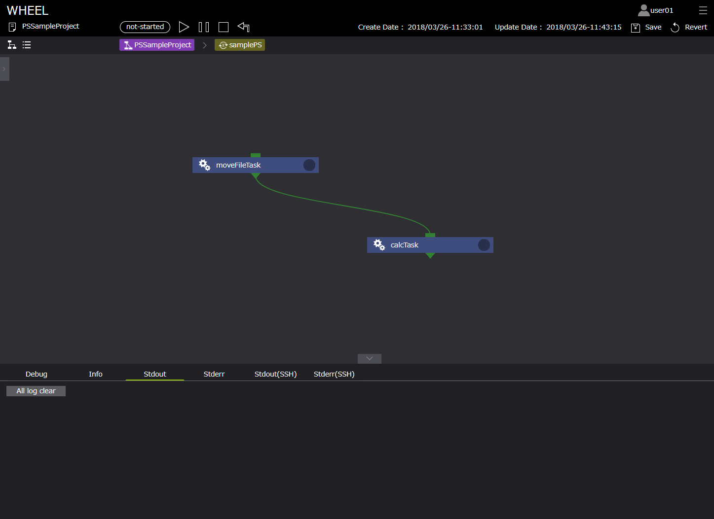
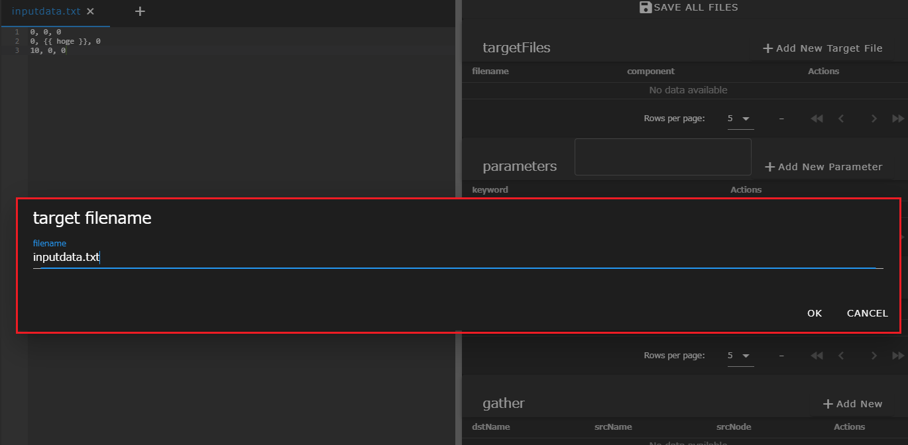
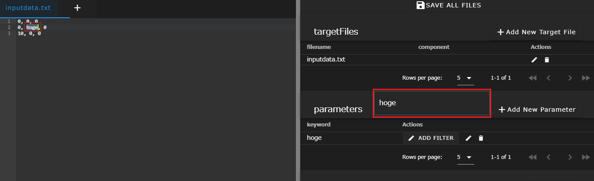
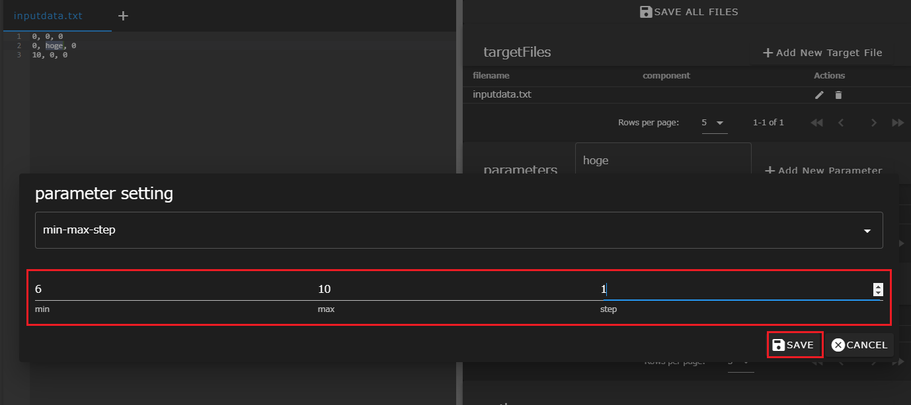
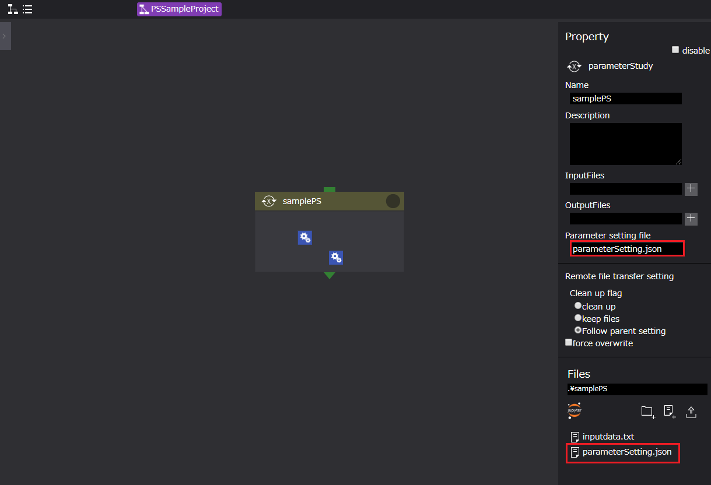

# ParameterStudy

  

ParameterStudyコンポーネント（以下、PSコンポーネント）は、parameter setting fileプロパティに設定されたファイルを読み込み、  
そのファイルに指定されたパラメータ展開を行います。  
コンポーネント実行時にはループ系コンポーネントと同様にディレクトリのコピーを作成します。  
ループ系コンポーネントとは異なり、コピーされた各ディレクトリの処理は並行して行われます。  

PSコンポーネントのプロパティは以下です。

| プロパティ | 入力値 | プロパティ説明 |
|----|----|----|
| name | 文字列 | コンポーネント名 |
| description | 文字列 | コンポーネントの説明文 |
| inputFiles | ファイルまたはディレクトリ名 | 先行コンポーネントから受け取るファイル |
| outputFiles | ファイル, ディレクトリ名またはglobパターン | 後続コンポーネントへ渡すファイル |
| parameter setting file | ファイル名 | パラメータスタディの設定を記述したファイル |
| state clean | ボタン | コンポーネントの進行状態を初期状態に戻す *1 |

*1 コンポーネントの進行状態が"finished"もしくは"failed"の時のみ表示されます。

# PSコンポーネントの使用例

PSコンポーネントは、パラメトリックスタディ用のコンポーネントです。  
WHEELのPS用ファイル編集機能によりインプットデータにパラメータ設定を行うことで、簡単にPSを実施することができます。  
以下に、サンプルを用いてPSワークフローの設定方法を示します。  

また、本章では、ソルバーの例として、ある空間に位置する3点の座標値からなる三角形の面積を導出するプログラム（面積算出ソルバー:wheel_tutorial_solver.cc）を用います。

## PSワークフロー構成図

  

> samplePS （PSコンポーネント）

| プロパティ名 | 設定値 |
| ---- | ---- |
| Name | samplePS |
| InputFiles | - |
| OutputFiles | - |
| Parameter setting file | parameterSetting.json*1 |  
| Files | inputData.txt, parameterSetting.json |
*1 inputdata.txtのパラメータ展開情報をもつJSONファイル、詳細は後述  

#### ・inputData.txt

```
0, 0, 0
0, {{ hoge }}, 0
10, 0, 0
```

#### ・parameterSetting.json

```
{
    "version": 2,
    "targetFiles": [
        {
            "targetName": "inputData.txt",
            "targetNode": "daaecfc0-26bf-11ea-85b6-b15713548352"
        }
    ],
    "params": [
        {
            "keyword": "10",
            "min": 6,
            "max": 10,
            "step": 1
        }
    ],
    "scatter": [],
    "gather": []
}
```

※ "targetNode"の値ははWHEELが一意に設定します

## PSワークフロー子階層　構成図



> moveFileTask（Taskコンポーネント）  

| プロパティ名 | 設定値 |
| ---- | ---- |
| Name | moveFileTask |
| Script | moveFiles.sh |
| InputFiles | - |
| OutputFiles | - |
| Remotehost | localhost  |  
| Files | moveFiles.sh |  

#### ・moveFiles.sh

```
#!/bin/bash  
mv ../inputData.txt ../calcTask
exit 0
```

> calcTask（Taskコンポーネント）

| プロパティ名 | 設定値 |
| ---- | ---- |
| Name | calcTask |
| Script | calc.sh |
| InputFiles | - |
| OutputFiles | - |
| Remotehost | localhost |
| Files | calc.sh, wheel_tutorial_solver.cc, inputdata.txt *3 |  

*3 inputdata.txtは、moveFileTask実行後にPSディレクトリより移動されるファイルです。

#### ・calc.sh

```
#!/bin/bash
g++ wheel_tutorial_solver.cc -o wheel_tutorial_solver
./wheel_tutorial_solver
exit 0
```

## PS用ファイル編集画面


入力データにパラメータ設定を行う場合、プロパティ画面[ Files ]エリアよりファイル編集を行います。  
手順は以下です。

1. PSコンポーネントにパラメータ設定を行う入力データファイルをインポート、または作成する
1. 準備したファイルをクリックする
1. [ Files ]エリアにあるテキストエディタ起動ボタンをクリックする

上記操作により、テキストエディタ画面が表示されます。  
以降、基本的な使用方法を示します。詳細については、[テキストエディタ画面仕様説明](../3_workflow_screen/3_rapid.md)をご参考ください。

#### PS用ファイル編集画面

  

テキストエディタ画面でのパラメータ設定手順は以下です。テキストエディタ画面右のPS用エリアを使用します。  
次の手順では、上記図 {{ hoge }}を「6から10」まで変化させる場合の設定を示しています。  

1. パラメータ書き換え対象ファイルを設定する  
　1.「＋Add New Target File」ボタンをクリックする  
　2. ターゲットファイルにinputdata.txtを設定する
1. パラメータ書き換え部分を選択する
1. 「Parameters」に選択した部分が正しく表示されていることを確認し、「+ Add New Parameter」をクリックする
1. 選択した部分に対し変化させる値を設定し、「save」をクリックする（min:6, max:10, step:1）
1. 「SAVE ALL FILES」をクリックし設定内容を保存する
1. 設定が終了したら、右上のアイコンをクリックしてグラフビュー画面に遷移する

#### 1.1 「＋Add New Target File」

  

#### 1.2 ターゲットファイルの設定

  

#### 2. パラメータ書き換え部分の選択

  

#### 3. パラメータの設定

  

#### 4. 設定の保存

  

#### 5. 編集したファイル名.jsonの確認

保存後、ワークフロー編集画面に戻りプロパティを表示すると、「 parameterSetting.json 」ファイルが作成されていることを確認します。  
このデータをプロパティ[ parameter setting file ]に設定します。

  

以上がParameter Studyワークフローにおけるパラメータ設定手順になります。

## PSワークフローの実行

PSワークフロー実行時のWHEELの動作について説明します。  
PSワークフロー実行時には、プロジェクトディレクトリ内に変化させるパラメータの数だけディレクトリを生成します。  
上記例では、三角形を構成する一つの頂点のY座標値を6から10まで変更しているため、「10-6＋1=5」計5個のディレクトリが生成されます。  
各ディレクトリには、PSコンポーネントのデータ及びパラメータ変化させたインプットデータが格納されています。

#### プロジェクトディレクトリ内に生成されるディレクトリ

  

PSワークフローを実行すると生成されたワークフローが順に実行されます。  
実行後の結果は以下です。

#### PSワークフロー実行結果


また、標準出力（Stdout）の結果は以下です。  

 

#### ループインスタンスの削除


delete all loop instanceにチェックを入れると、計算の終了したループインスタンスをすべて削除します。