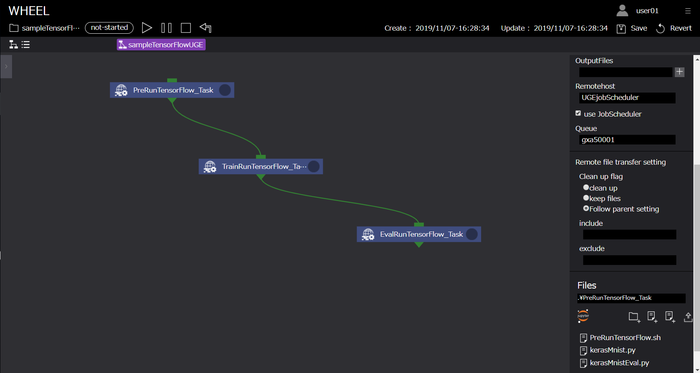
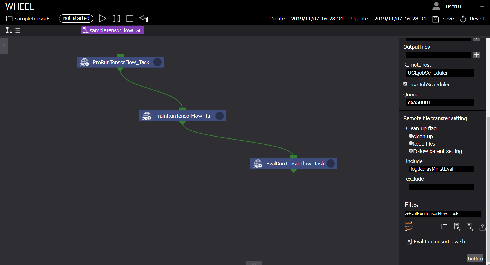

# TensorFlowを利用したMNISTデータ解析ワークフロー

本章では、WHEELを用いた計算事例として「TensorFlowを利用したMNISTデータの解析ワークフロー」を紹介します。  
本事例では、TensorFlowを利用するリモートタスクを用いて、MNISTデータを用いた手書き数字画像学習モデルを作成します。  
以降、下記の順にて事例内容を紹介します。  

1. MNISTデータについて
1. NN(Neural Network)について
1. kerasについて
1. ワークフローの作成
1. ジョブの投入
1. 解析結果の確認

また、Taskコンポーネントで使用するスクリプト例は、  
下記よりダウンロード可能です。  
<a href="./sample/runTensorFlow.zip">TensorFlowサンプルデータ</a>

## 1. MNISTデータについて

ここでは、本事例で使用するMNISTデータについて説明をします。  
MNISTとは手書き数字画像60000枚とテスト画像10000枚を集めた画像データセットのことであり、  
ニューラルネットワークを学習するうえで非常に便利な画像のデータセットとして著名です。  
データセットの中身は以下のような構造になっています。  
```
MNISTデータ
　├ 学習用データ (60,000個)
　│ 　├ 画像データ
　│ 　└ ラベルデータ(正解データ)
　│
　└ 検証用データ (10,000個)
　　 　├ 画像データ
　　 　└ ラベルデータ（正解データ）
```
各画像データに対して正解データであるラベルデータが一つずつ与えられています。

## 2. NN(Neural Network)について

ここでは、MNISTデータを解析する際に使用するNNという手法について説明します。  
NNとは、ニューラルネットワークの略で、人間の脳内にある神経細胞（ニューロン）とそのつながり、つまり神経回路網を人工ニューロンという数式的なモデルで表現したものです。  
入力層、出力層、隠れ層から構成されていて、層と層の間には、ニューロン同士のつながりの強さを示す「重み」があります。  

  

画像より特徴を抽出して、ノードの重みを更新していき学習させていきます。  
本事例では、MNISTのデータセットを用いたので28*28ピクセルの入力から0~9の数字のどれかという出力を出すために入力層を784ノード、出力層を10ノードとしています。

## 3. kerasについて

Kerasは、オープンソースのニューラルネットワークライブラリです。  
ディープニューラルネットワークを用いた迅速な実験を行えるように設計されており、「シンプル」「モジュール式」「拡張性」などの特徴があります。  
Kerasは以下のバックエンドをサポートしており、TensorFlowをデフォルトのテンソル計算ライブラリとしています。  

- TensorFlow
- Microsoft Cognitive Toolkit
- Theano

```
model = Sequential()
model.add(Dense(8, input_dim=4))
model.add(Activation('relu'))
model.add(Dense(3, input_dim=8))
model.add(Activation('softmax'))
model.compile(optimizer='SGD', loss='categorical_crossentropy', metrics=['accuracy'])
```

上記にkerasによるモデリング例を載せていますが、直感的にモデリングをすることが出来るのがkerasの特徴です。  
これにより、ニューラルネットワークの設計を容易に行うことができます。本モデル例は以下の内容となります。

- 入力層は四つのノードを持っています。
- 隠れ層の数は一つで、ノード数は8です。
- 隠れ層のそれぞれのノードは入力層のノードの重みとの線形結合された値を受け取り、活性化関数を適応させています。
- 出力層は3つのノードを持っています。
- 出力層のそれぞれのノードは入力層のノードの重みとの線形結合された値を受け取り、活性化関数を適応させています。

## 4. WHEELによるワークフローの作成

本節では、WHEELでのパラメトリックスタディ解析に必要なワークフローコンポーネントについて説明します。  
本事例で必要なコンポーネントとその役割は以下です。  

- Task コンポーネント - 1：ジョブ投入前の前処理
- Task コンポーネント - 2：MNISTデータを用いたnnモデルの学習
- Task コンポーネント - 3：nnモデルの評価

以降で、各コンポーネントについて説明します。

### Task コンポーネント - 1

続いて、ジョブ投入用及びTensorFlow解析実行用コンポーネント「PreRunTensorFlow_Task」について説明します。  
本コンポーネントは、スーパーコンピュータのキューを用いてTensorFlowによるMNISTデータ学習の前処理を実行するためのコンポーネントです。

runTensorFlow_Taskコンポーネントに設定するプロパティ、及びスクリプトの中身は以下です。

##### PreRunTensorFlow_Task

| プロパティ名 | 設定値 |
| ---- | ---- |
| Name | PreRunTensorFlow_Task |
| Script | PreRunTensorFlow.sh |
| InputFiles | - |
| OutputFiles | - |
| Remotehost | UGEjobScheduler |
| UseJobScheduler | true |
| Queue | - |
| Clean up flag | keep files |
| include | - |
| exclude | - |
| Files | kerasMNIST.py , kerasMNISTEval.py |

> PreRunTensorFlow.sh  
```
#!/bin/bash
#$ -l rt_F=1
#$ -j y
#$ -cwd

mv kerasMNIST.py kerasMNISTEval.py /${WORK}
cd /${WORK}
source /etc/profile.d/modules.sh
module load singularity/2.6.1
singularity pull docker://nvcr.io/nvidia/tensorflow:19.06-py2
```

設定は以下です。　　

1. スーパーコンピュータでTensorFlowを実行するためのディレクトリに移動します
1. プロパティ[ script ]にPreRunTensorFlow.shを設定します
1. プロパティ[ remotehost ]に事前に登録しているリモートホスト情報「UGEjobScheduler」設定します *

*　ジョブスケジューラーにUGEを使用して計算を行うため「UGEjobScheduler」としています。  
　 ユーザの環境に合わせて名称の変更が必要です。

  

以上がTaskコンポーネント - 1 の設定になります。

### Task コンポーネント - 2

続いて、ジョブ投入用及びTensorFlow解析実行用コンポーネント「TrainRunTensorFlow_Task」について説明します。  
本コンポーネントは、スーパーコンピュータのキューを用いてTensorFlowによるMNISTデータ学習処理を実行するためのコンポーネントです。

TrainRunTensorFlow_Taskコンポーネントに設定するプロパティ、及びスクリプトの中身は以下です。

##### TrainRunTensorFlow_Task

| プロパティ名 | 設定値 |
| ---- | ---- |
| Name | TrainRunTensorFlow_Task |
| Script | TrainRunTensorFlow.sh |
| InputFiles | - |
| OutputFiles | - |
| Remotehost | UGEjobScheduler |
| UseJobScheduler | true |
| Queue | - |
| Clean up flag | keep files |
| include | - |
| exclude | - |
| Files | - |

> runTensorFlow.sh  
```
#!/bin/bash
#$ -l rt_F=1
#$ -j y
#$ -cwd

cd /${WORK}
source /etc/profile.d/modules.sh
module load singularity/2.6.1
singularity run --nv tensorflow-19.06-py2.simg python kerasMNIST.py > ./log.MNIST 2>&1
```

設定は以下です。　　

1. スーパーコンピュータでTensorFlowを実行するためのジョブスクリプトTrainRunTensorFlow.shをインポートします
1. プロパティ[ script ]にTrainRunTensorFlow.shを設定します
1. プロパティ[ remotehost ]に事前に登録しているリモートホスト情報「UGEjobScheduler」設定します *

  

以上がTaskコンポーネント - 2 の設定になります。

### Task コンポーネント - 3

続いて、ジョブ投入用及びTensorFlow解析実行用コンポーネント「EvalRunTensorFlow_Task」について説明します。  
本コンポーネントは、スーパーコンピュータのキューを用いてTensorFlowによるMNISTデータを学習したモデルを評価するためのコンポーネントです。

EvalRunTensorFlow_Taskコンポーネントに設定するプロパティ、及びスクリプトの中身は以下です。

##### EvalRunTensorFlow_Task

| プロパティ名 | 設定値 |
| ---- | ---- |
| Name | EvalRunTensorFlow_Task |
| Script | EvalRunTensorFlow.sh |
| InputFiles | - |
| OutputFiles | - |
| Remotehost | UGEjobScheduler |
| UseJobScheduler | true |
| Queue | - |
| Clean up flag | keep files |
| include | - |
| exclude | - |
| Files | - |

> EvalRunTensorFlow.sh  
```
#!/bin/bash
#$ -l rt_F=1
#$ -j y
#$ -cwd

cd /${WORK}
source /etc/profile.d/modules.sh
module load singularity/2.6.1
singularity run --nv tensorflow-19.06-py2.simg python kerasMNISTEval.py > ./log.MNISTEval 2>&1
```

設定は以下です。　　

1. スーパーコンピュータでTensorFlowを実行するためのジョブスクリプトEvalRunTensorFlow.shをインポートします
1. プロパティ[ script ]にEvalRunTensorFlow.shを設定します
1. プロパティ[ remotehost ]に事前に登録しているリモートホスト情報「UGEjobScheduler」設定します *

  

以上がTaskコンポーネント - 3 の設定になります。

### ジョブスクリプトに関して

WHEELは、効率的に計算資源を利用することを目的としています。  

スーパーコンピューターでTensorFlowを実行するためのコマンドを紹介します。  

本解析では、NVIDIA GPU Cloud(NGC)が提供するDockerイメージをsingularityを用いて実行しています。
```
singularity pull docker://nvcr.io/nvidia/tensorflow:19.06-py2
```

また、処理終了後、実行結果を確認するためにログを出力するようにしておくと各タスクの動作確認が容易に実施できます。
```
singularity run --nv tensorflow-19.06-py2.simg python kerasMNISTEval.py > ./log.MNISTEval 2>&1
```

### リモートホスト登録情報に関して

本事例は、jobSchedulerにUGE利用してジョブを投入することを前提としています。  
そのため、前述のホスト情報登録方法に従い、ホスト情報を登録しておく必要があります。
本サンプルでは、UGEjobSchedulerを使用するため「UGEjobScheduler」としています。  

## 4. ジョブの投入

ジョブの投入を行います。前述の「9.ワークフローの作成」にありますように、ジョブの投入は、ワークフロー実行画面上部の実行ボタンより行います。  
実行状況の確認は、ログエリアやコンポーネント右上の実行状況表示アイコン、及びリストビュー画面から行います。  

  

## 5. 解析結果の確認

解析結果の確認を行います。  
実行完了後、リモートタスクに作成された「log.kerasMNIST」,「log.kerasMNISTEval」ファイルより以下の結果を確認することができます。
```
・
・
・
('Test loss:', 0.27075190788507464)
('Test accuracy:', 0.927)
```

用語の意味は以下の通りとなっています。

| プロパティ名 | 設定値 |
| ---- | ---- |
| Test loss | 学習用データを与えた時の損失値。小さくなればなるほど正しい結果を表せています |
| Test accuracy | 検証用データの正答率。1に近いほど検証用データにおいて精度が高いことを表しています |

accuracyが「0.927」すなわち検証用データにおいて精度92.7%の学習モデルが作成されたことが確認できます。  
TensorFlowを利用したMNISTデータ解析ワークフロー例は以上になります。
