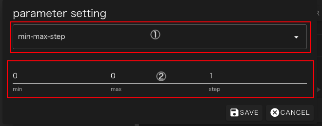
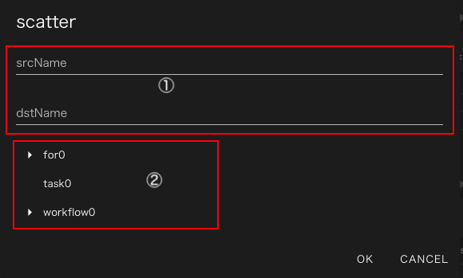

## テキストエディタ画面起動方法
テキストエディタ画面は、各コンポーネントのプロパティサブ画面の最下部の
ファイルリスト表示領域内で、ファイルを選択した状態で鉛筆アイコンをクリックすると表示されます。

 

## メイン画面
テキストエディタを起動すると次のような画面が表示されます。

 

1. タブリスト
2. テキスト表示部
3. 領域分割バー
4. 保存ボタン
5. パラメータ設定部
6. グラフビュー遷移ボタン

### 1. タブリスト
現在開いているファイルの一覧をタブとして表示します。
各ファイルの右隣に表示される X アイコンをクリックすると開いているタブを閉じることができます。
閉じる時に、ファイルに変更が加えられていた時は次のようなダイアログが表示されて、
ファイルを保存するか、変更を破棄するか、タブを閉じるのをやめるかを選ぶことができます。
もし、ファイルに変更がされていなかった場合はこのダイアログは表示されずにタブが閉じられます。

 

タブリストの末尾に表示されている ＋ アイコンをクリックすると新規ファイルを作成または開くことができます。
クリック後に表示される次のダイアログでファイル名を入力してください。

 

入力されたファイルが既に存在する時は、その内容が新規タブに読み込まれ、存在しない場合は空のファイルとして作成された上で
新規タブに空ファイルが表示されます。
このタブを編集せずに閉じても、作成された空ファイルは残りますので不要であればグラフビューで削除してください。

### 2. テキスト表示部
本エリアには、タブリストで現在選択されているファイル(青のアンダーラインが表示されているファイル)の内容が表示されます。
通常のテキストエリアと同様にこの領域でファイルの内容を編集することができます。

###  3. 領域分割バー
テキストエディタ部分と、後述のパラメータ設定部分の領域を分けるバーです。ドラッグすることで両領域の表示サイズを変更することができます。

### 4. 保存ボタン
全てのファイルおよびパラメータ設定ファイルの内容を保存します。
ただし本操作で保存したファイルはグラフビューでcleanまたはrevert操作を行なうと失われるので、
変更内容を保存するためにはグラフビューで再度save操作を行う必要があります。

### 5. パラメータ設定部
本エリアでは、パラメータスタディコンポーネントで使用するパラメータ設定ファイルを編集することができます。

### 6. グラフビュー遷移ボタン
本ボタンをクリックすると、元のグラフビュー画面に遷移します。
保存していないファイルなどは全て破棄されます。

## パラメータ設定部
テキストエディタ起動時に選択していたファイルが、パラメータスタディコンポーネントで使用するパラメータ設定ファイルの
要件を見たすJSONファイルだった時には、起動時にそのファイルの設定がパラメータ設定部に表示されています。
それ以外の場合は何も設定されていない状態で起動し、値を設定した後で保存することで、"parameterSettings.json"という名前で保存されます。

パラメータ設定部ではパラメータ設定ファイルに記述する4つのプロパティに対応して4つの部分に分かれています。

 

1. ターゲットファイル設定部
2. パラメータ設定部
3. scatter設定部
4. gather設定部

### 1. ターゲットファイル設定部
パラメータスタディ実行時にパラメータの書き換えを行なう対象ファイルをターゲットファイルと称します。
ターゲットファイル設定部では、どのファイルをターゲットファイルとして扱うかを指定することができます。

 

1. ターゲットファイルのファイル名
2. ターゲットファイルが配置されるコンポーネント、非表示の場合はパラメータ設定ファイルが存在するコンポーネントを意味します。
3. その行のターゲットファイルの設定を変更(鉛筆アイコン)または削除(ゴミ箱アイコン)します。
4. 新しくターゲットファイルの設定を追加します。

各行の鉛筆アイコンまたは"Add New Target File"ボタンをクリックすると次のダイアログが立ち上がります。

 

1のエリアにファイル名を入力し、OKボタンをクリックすると新規ターゲットファイルが追加されます。
パラメータスタディのコンポーネントより下位の別のコンポーネントにあるファイルをターゲットファイルとする場合は
2のファイルツリーで対象ファイルを配置するコンポーネントを選択してください。

### 2. パラメータ設定部
パラメータスタディ実行時にターゲットファイルとして指定されたファイルを書き換えるためのパラメータ空間の定義と
各パラメータで置き換えられるプレースホルダを設定します。

 

1. そのパラメータ設定を適用するプレースホルダを識別するための文字列です
2. テキストエディタ画面で選択している文字列が表示されます。何か選択した状態で3のAdd New Parameterボタンをクリックすると選択中の文字列をkeywordとして新しいパラメータを設定します。
3. 新規パラメータ設定を作成します。
4. その行のパラメータ設定を変更(鉛筆アイコン)または削除(ゴミ箱アイコン)します。
5. 既存のパラメータ設定に対してフィルターを追加します。

Add New Parameterボタンまたは鉛筆アイコンをクリックすると次のパラメータ作成ダイアログが表示されます。

 

1. パラメータタイプ選択リスト
2. パラメータ定義部

この画面ではmin-max-stepの3つの数値で定義できる等間隔な数列をパラメータ空間として定義できます。

1のパラメータタイプをlistまたはfileに設定すると次のような画面に変更されます

 

こちらの画面では、任意の値を陽に指定したパラメータ空間を定義できます。
1のAdd Newをクリックするとパラメータの行が1行追加されます。
値は2のvalue列をクリックすると入力欄が表示されるので、そこで編集します。
不要な行は3のゴミ箱アイコンをクリックすると削除されます。

 

### 3. scatter設定部および4.gather設定部
パラメータスタディ開始時に特定のパラメータ実行ディレクトリのみにファイルをコピーしたり、終了時に特定のディレクトリから回収する設定をそれぞれScatterおよびGatherパラメータで指定することができます。
(scatterパラメータに指定されていないファイルは全てコピーされ、gatherパラメータに指定されていないファイルは一切回収されません)
これらの設定画面はほぼ共通しているので、まとめて解説します。

 

1. srcName/dstName scatterでは配布するファイル名、gatherでは回収するファイル名が表示されます
2. dstName/srcName scatterでは配布先でのファイル名、gatherでは回収後のファイル名が表示されます
3. dstNode/srcNode 下位コンポーネントへの配布または下位コンポーネントからの回収を行なう時にはそのコンポーネント名が表示されます
4. Add Newボタン 新規設定を追加します。

4のAdd Newボタンをクリックすると次のような設定ダイアログが表示されます。この画面ではscatterの設定を行なっていますがgatherでも同様な画面です。

 

1. srcName/dstName コピー元およびコピー先でのファイル名を記述します。この欄にはファイル名のみではなくglobパターンや、パラメータのplaceholderも書くことができます。
2. 転送先またはファイル取得元コンポーネントを選択します。何も選択しなかった場合はパラスタコンポーネント直下のファイルを配布または回収します。

