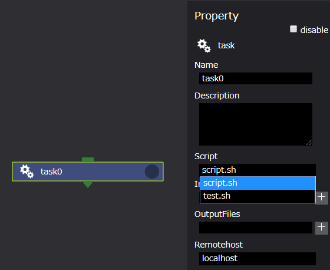
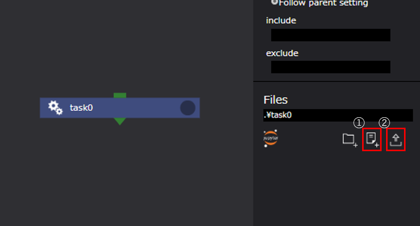
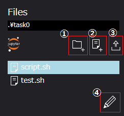
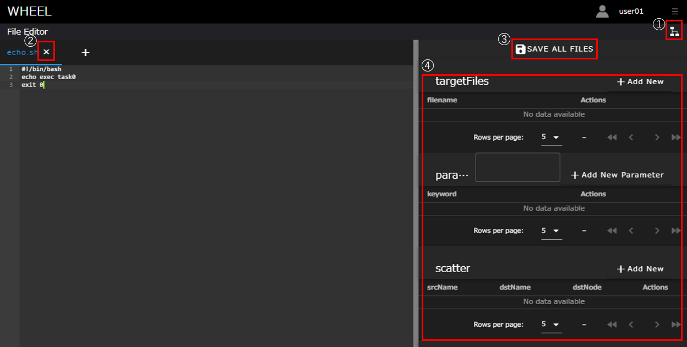
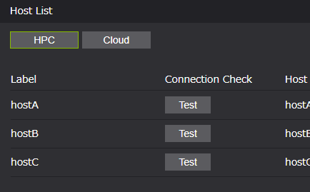

# Task

  

Taskコンポーネントは、WHEELの用意するコンポーネントの中で最も基本的かつ重要なコンポーネントです。  
scriptプロパティに設定されたスクリプトファイルを実行環境(ローカル/リモートホスト)の設定に応じて実行します。  

Taskコンポーネントのプロパティは以下です。

| プロパティ | 入力値 | プロパティ説明 |
|----|----|----|
| name | 文字列 | コンポーネントのディレクトリ名 |
| description | 文字列 | コンポーネントの説明文 |
| script | ファイル | Task内の処理を記述したスクリプトのファイルを指定する<br>scriptの選択肢はFilesエリアに登録されているファイル *1| 
| inputFiles | ファイルまたはディレクトリ名 | 先行コンポーネントから受け取るファイル |
| outputFiles | ファイル, ディレクトリ名またはglobパターン | 後続コンポーネントへ渡すファイル |
| host | 文字列 | Taskを実行するhost、localhostまたは登録済のremotehostのlabelを指定する *2|
| useJobScheduler | チェックボックス | scriptをバッチスケジューラ経由で実行するか直接実行するかのフラグ *2|
| queue | 文字列 | ジョブの投入先キューを指定する(useJobSchedulerを使用しない場合は使われない) *2|
| clean up flag | ラジオボタン | リモート環境に作成した一時ファイルの取り扱い指定フラグ |
|  | clean up | 削除する |
|  | keep files | 削除しない |
|  | follow parent setting | 親コンポーネントと同じ挙動をする |
| include | ファイル | リモート環境から回収してくるファイル *3 |
| exclude | ファイル | リモート環境から回収しないファイル *3 |
| state clean | ボタン | コンポーネントの進行状態を初期状態に戻す *4 |

*1 scriptに指定されたスクリプトの終了コードが0の場合は真、  
　それ以外の場合は、偽と判定し(プロジェクトの判定はfailedとなります)後続のノードへ遷移します。  
*2 リモートホスト使用時のみ有効です。また、queueプロパティはuseJobScheduler有効時のみ設定可能です。  
*3 include, excludeともにglobパターンを指定することができます。  
　includeにマッチしなおかつexcludeにマッチしないファイルを回収してくることができます。  
　ただし、outputFilesに指定されたファイルは、include/excludeの指定に関わらず全て回収されます。  
*4 コンポーネントの進行状態が"finished"もしくは"failed"の時のみ表示されます。

## Taskコンポーネントのタイプ

Taskコンポーネントは、実行マシン、ジョブスケジューラの使用/不使用によって、4つのタイプに分類されます。

1. ローカルタスク  
WHEELが動作するマシン上で実行されるTaskコンポーネント
1. ローカルジョブタスク  
WHEELが動作するマシン上でジョブスケジューラを使用し実行されるコンポーネント *
1. リモートタスク  
リモートマシン上で実行されるタスクコンポーネント
1. リモートジョブタスク  
リモートマシン上でジョブスケジューラを使用し実行されるコンポーネント

*現在のWHEELバージョン(ver.1.2.3)では対応していません。

## Taskコンポーネントの使用方法

Taskコンポーネントの使用方法を説明します。  

### scriptプロパティの設定

scriptの設定はタスクのタイプによらず必須です。  
セレクトボックスから使用するスクリプトファイルを選択します。  
セレクトボックスには、プロパティ画面下部Filesエリアに作成、または、アップロードしたファイルが選択肢として表示されます。

#### スクリプトファイルの設定

  

#### Filesエリア

  

#### ファイルの編集

コンポーネント内で使用するディレクトリ/ファイルは、Filesエリアより生成することができます。  
また、ファイルはファイル編集用ボタンで起動される画面で編集可能です。

  

#### ファイル編集画面  

  

1. グラフビュー画面遷移ボタン  
ファイル編集画面を終了し、グラフビュー画面に遷移します
1. 閉じるボタン  
ファイルを閉じます。保存処理も同時に実行されます
1. 全ファイル保存ボタン  
タブで開いている全ファイルを保存します
1. パラメータセッティングファイル編集画面  
ParameterStudyコンポーネントで使用するパラメータセッティングファイルの編集に使用します

#### スクリプトファイルの注意事項

Taskコンポーネントの実行成功/失敗は、scriptファイルの終了コードで判断されます。  
そのため、Taskコンポーネントの誤作動を防ぐためにスクリプトファイルには明示的に終了コードを記載することを推奨します。

```
#!/bin/bash
echo execute task0
exit 0
```

### コンポーネント間のファイルの受け渡し

inputFiles/outputFilesについて説明します。  
inputFilesは、先行コンポーネントのoutputFilesより接続されたファイルをinputFilesに設定した名称シンボリックリンクを作成します。*1  
inputFilesは、Taskコンポーネントの処理開始時に、outputFilesはTaskコンポーネントの処理終了時にファイルの存在有無を確認するため、  
inputFiles/outputFilesに設定されたファイルが存在しない場合、エラーとして処理されます。

*1 inputFiles/outputFilesに設定できる文字列の詳細は、[コンポーネント設計書](./10_component_design.md)を参考ください。

  

task0の処理終了時にtask0にoutput.txtが存在する場合、task1にiuput.txtとしてシンボリックリンクを作成します。

### リモートホストの設定

リモートタスク/リモートジョブタスクを使用する場合、使用するリモートホストをRemotehostプロパティに設定します。  
Remotehostプロパティのセレクトボックスには、リモートホスト登録画面にて登録したホストのラベルが一覧として表示ます。  
(参考：[リモートホスト登録画面](../2_remotehost_screen/remotehost.md))

#### Remotehostプロパティ

  

#### リモートホスト画面

  

### ジョブスケジューラ/キューの設定

リモートジョブタスクを使用する場合、useJobSchedulerプロパティを有効にします。  
また、useJobSchedulerプロパティを有効にした場合にのみQueueプロパティにてキューの設定が可能です。  
Queueプロパティのセレクトボックスには、Remotehostプロパティで選択したホストに設定したQueueの値が一覧として表示されます。
(参考：[リモートホスト登録画面](../2_remotehost_screen/remotehost.md))

#### Queueプロパティ

  

#### リモートホスト(hostA)の設定値

  