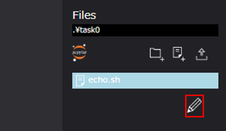

# Task

  

Taskコンポーネントは、WHEELの用意するコンポーネントの中で最も基本的かつ重要なコンポーネントです。
scriptに設定されたスクリプトファイルを実行環境(ローカル/リモートホスト)等の設定に応じて実行します。  

Taskコンポーネントのプロパティは以下です。

| プロパティ | 入力値 | プロパティ説明 |
|----|----|----|
| name | 文字列 | コンポーネントのディレクトリ名 |
| description | 文字列 | コンポーネントの説明文 | 
| script | セレクトボックス | Task内の処理を記述したスクリプトのファイルを指定する<br>scriptの選択肢はFilesエリアに登録されているファイル *1| 
| inputFiles | ファイルまたはディレクトリ名 | 先行コンポーネントから受け取るファイル | 
| outputFiles | ファイル, ディレクトリ名またはglobパターン | 後続コンポーネントへ渡すファイル | 
| host | セレクトボックス | Taskを実行するhost、localhostまたは登録済のremotehostのlabelを指定する | 
| useJobScheduler | チェックボックス | scriptをバッチスケジューラ経由で実行するか直接実行するかのフラグ | 
| queue | セレクトボックス | ジョブの投入先キューを指定する(useJobSchedulerを使用しない場合は使われない) | 
| clean up flag | ラジオボタン | リモート環境に作成した一時ファイルの取り扱い指定フラグ | 
|  | clean up | 削除する | 
|  | keep files | 削除しない | 
|  | follow parent setting | 親コンポーネントと同じ挙動をする | 
| include | ファイル名 | リモート環境から回収してくるファイル *2 | 
| exclude | ファイル名 | リモート環境から回収しないファイル *2 | 
| state clean | ボタン | コンポーネントの進行状態を初期状態に戻す *3 | 

*1 scriptに指定されたスクリプトの終了コードが0の場合は真と判定し、後続のノードへ遷移します。  
　それ以外の場合は、偽と判定しプロジェクトの実行を停止します。（プロジェクトの判定はfailedとなります。）  
　ただし、paramterStudyコンポーネントで実行するTaskのみ、後続ノードは継続実行されます。  
*2 include, excludeともにglobパターンを指定することができます。  
　includeにマッチしなおかつexcludeにマッチしないファイルを回収してくることができます。  
　ただし、outputFilesに指定されたファイルは、include/excludeの指定に関わらず全て回収されます。  
*3 コンポーネントの進行状態が"finished"もしくは"failed"の時のみ表示されます。

# Taskコンポーネントのタイプ

Taskコンポーネントは、実行場所、ジョブスケジューラの使用/不使用によって、4つのタイプに分類されます。

1. ローカルタスク  
WHEELが動作するマシン上で実行されるTaskコンポーネント
1. ローカルジョブタスク  
WHEELが動作するマシン上でジョブスケジューラを使用し実行されるコンポーネント *
1. リモートタスク  
リモートマシン上で実行されるタスクコンポーネント
1. リモートジョブタスク  
リモートマシン上でジョブスケジューラを使用し実行されるコンポーネント

*現在のWHEELバージョン(ver.1.2.3)では対応していません。

# Taskコンポーネントの使用方法

Taskコンポーネントの使用方法を説明します。  
WHEEL(ver.1.2.3)で動作するローカルタスク、リモートタスク、リモートジョブタスクについて説明します。

## ローカルタスク

  

### プロパティ

ローカルタスクで使用するプロパティは以下になります。  

| プロパティ | 入力値 | プロパティ説明 |
|----|----|----|
| name | 文字列 | コンポーネントのディレクトリ名 【必須】|
| description | 文字列 | コンポーネントの説明文 |
| script | セレクトボックス | Task内の処理を記述したスクリプトのファイルを指定する<br>scriptの選択肢はFilesエリアに登録されているファイル 【必須】|
| inputFiles | ファイルまたはディレクトリ名 | 先行コンポーネントから受け取るファイル |
| outputFiles | ファイル, ディレクトリ名またはglobパターン | 後続コンポーネントへ渡すファイル |

clean up flag, include, excludeは、リモートタスク（リモートジョブタスク）でのみ有効であるため、
パラメータは設定できますが使用されません。

### scriptの設定

タスクのタイプによらずscriptの設定は必須です。
プロパティ画面下部Filesより、タスクで使用するscriptを作成またはアップロードします。

  

1. ファイル生成用ボタン
1. アップロード用ボタン

#### ファイルの編集

ファイル生成用ボタンで生成したファイルは、ファイル編集用ボタンで起動されるファイル編集画面で編集可能です。

  

##### ファイル編集画面  

  

1. グラフビュー画面遷移ボタン  
ファイル編集画面を終了し、グラフビュー画面に遷移します
1. 閉じるボタン  
ファイルを閉じます。保存処理も同時に実行されます
1. 全ファイル保存ボタン  
タブで開いている全ファイルを保存します
1. パラメータセッティングファイル編集画面  
ParameterStudyコンポーネントで使用するパラメータセッティングファイルの編集に使用します

#### スクリプトファイルの注意事項

Taskコンポーネントの実行成功/失敗は、scriptファイルの終了コードで判断されます。  
そのため、Taskコンポーネントの誤作動を防ぐためにスクリプトファイルには明示的に終了コードを記載することを推奨します。

##### サンプル
```
#!/bin/bash
echo execute task0
exit 0
```
