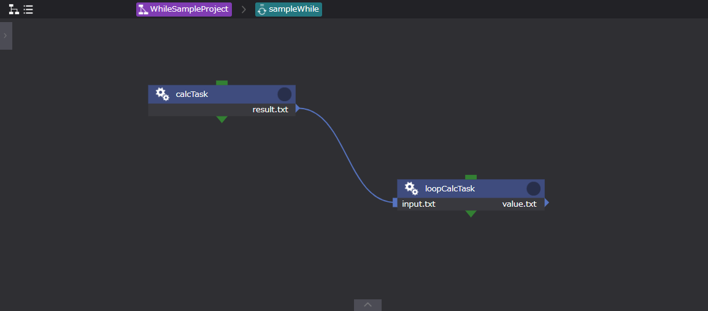

# While

  

Whileコンポーネントは、コンポーネントのプロパティconditionに設定した条件判定スクリプトを満たす限りループ処理を行います。  
conditonに設定したスクリプトには、環境変数`$WHEEL_CURRENT_INDEX`を使用することが可能です。  
Whileコンポーネントで使用する`$WHEEL_CURRENT_INDEX`は初期値を0とし、1ずつ増加します。  

| プロパティ | 入力値 | プロパティ説明 |
|----|----|----|
| name | 文字列 |  コンポーネントのディレクトリ名 |
| description | 文字列 | コンポーネントの説明文 | 
| inputFiles | ファイルまたはディレクトリ名 | 先行コンポーネントから受け取るファイル | 
| outputFiles | ファイル, ディレクトリ名またはglobパターン | 後続コンポーネントへ渡すファイル | 
| condition | ファイル名,またはJavaScriptの式 | 条件判定を行うスクリプトのファイル名、またはJavaScriptの式 *1 | 
| state clean | ボタン | コンポーネントの進行状態を初期状態に戻す *2 | 

*1 [ condition ]プロパティの条件判定要素として環境変数`$WHEEL_CURRENT_INDEX`（ループ系コンポーネントのループカウンタインデックス）を使用出来ます。  
Whileコンポーネントにおける環境変数`$WHEEL_CURRENT_INDEX`は、初期値0,増加率1として扱われます。  
[ condition ]プロパティに指定されたスクリプトファイルの終了コードが0の場合は真、それ以外の場合は、偽と判定してループ継続となります。  
ただし、conditionに指定された文字列と一致するファイルが存在しなかった場合は、Javascriptの式とみなしてそのコードを実行します。  
この場合、実行結果がtruthyな値の場合を真、falseyな値の場合を偽とします。     
*2 コンポーネントの進行状態が"finished"もしくは"failed"の時のみ表示されます。  

※ループ系コンポーネント（For, While, Foreach）は、ループカウンタインデックスを環境変数`$WHEEL_CURRENT_INDEX`に持ちます。  
自身と同じ階層に、ループカウンタインデックスの値に応じたsuffixをつけてコンポーネント内に存在する全てのコンポーネントのコピーを作成します。  
生成処理が完了したら、ループカウンタインデックスを進めて終了判定を行い、ループが終了してなければ再度コピーを作成します。  
ループが終了条件を満たした時点で、これらのコンポーネントは終了となります。  

※ループ系コンポーネントは、プロジェクトディレクトリ内にループの回数分コンポーネントが複製されます。  
複製されるコンポーネントは、**1つ前のループにより生成されたディレクトリをコピーしたもの** *1 となります。  
*1 ループ回数が3回の場合、2回目のループは1回目のループ内の処理結果を含めたディレクトリを複製します。
   同様に、3回目のループは2回目のループ実行後のディレクトリを複製したものになります。  

# Whileコンポーネントの使用例  

Whileコンポーネントのサンプルを示します。 
 
このワークフローは下記の処理を行います。  
1. calcTaskコンポーネントにより、面積算出ソルバーを実行する
1. 実行結果をloopCalcTaskコンポーネントに渡す
1. 1により得られた結果（面積の値）を読み込み、ループインデックス、及び本計算結果*1 を使用した計算を行う
1. 3の計算結果をファイルとして出力する
1. Whileコンポーネントに設定された条件判定スクリプトで、ループ継続判定をする
1. ループ継続であればループインデックスに1を加算し処理1に戻り、ループ終了であればワークフローを終了する

*1　ループ回数2回目以降の計算にて使用する

## ■ While ワークフロー構成図
   

## ■ While ワークフロー子階層　構成図


## ■  ワークフローを構成するコンポーネント
| コンポーネントタイプ | コンポーネント名 | 入力ファイル | 出力ファイル | 設定ファイル | 備考 |
|----|----|----|----|----|----|
| While | sampleWhile | ー | ー | ループ終了判定用スクリプト | 計算値がある値を超えたらループ処理を終了する |
| Task | calcTask | ー | 計算結果データファイル | ソルバー実行スクリプト | ソルバー、インプットデータを格納 | 
|  | loopCalcTask | 計算結果データファイル | ー | 計算結果データ、ループインデックスを利用した計算をするスクリプト | ー |

## ■ 各コンポーネントのプロパティ
> sampleWhile（whileコンポーネント）

| プロパティ名 | 設定値 |
| ---- | ---- |
| Name | sampleWhile |
| InputFiles | - |
| OutputFiles | - |
| Condition | condition.sh |
| Files | condition.sh |

#### ・ condition.sh  
```
#!/bin/sh
if [ $WHEEL_CURRENT_INDEX -lt 6 ] ; then
  exit 0
else
  exit 1
fi 
```
> calkTask（Taskコンポーネント）

| プロパティ名 | 設定値 |
| ---- | ---- |
| Name | calcTask |
| Script | calc.sh |
| InputFiles | - |
| OutputFiles | result.txt |
| Remotehost | localhost |
| Files | calc.sh , wheel_tutorial_solver.cc, inputdata.txt |  

 #### ・ calc.sh  
```
#!/bin/bash 
g++ wheel_tutorial_solver.cc -o wheel_tutorial_solver  
./wheel_tutorial_solver  
```

#### ・ inputData.txt

```
0, 0, 0
0, 10, 0
10, 0, 0
```

> loopCalkTask（Taskコンポーネント）

| プロパティ名 | 設定値 |
| ---- | ---- |
| Name | loopCalcTask |
| Script | resultRead.sh |
| InputFiles | input.txt |
| OutputFiles | - |
| Remotehost | localhost |
| Files | resultRead.sh, value.txt *2 |

*2 result.shの計算結果ファイル、loopCalcTask内でインプットデータとして利用  

#### ・ resultRead.sh  
```
#!/bin/bash
result=$(cut -f 2 -d "=" input.txt)
if [ ! $WHEEL_CURRENT_INDEX = 0 ] ; then
    value=$(cut -f 2 -d "=" value.txt)
else
    value=0
fi
x=$(($result * $WHEEL_CURRENT_INDEX + $value))
echo $WHEEL_CURRENT_INDEX
echo value=$x
echo value=$x > value.txt 
```

## ■ ワークフロー実行結果


