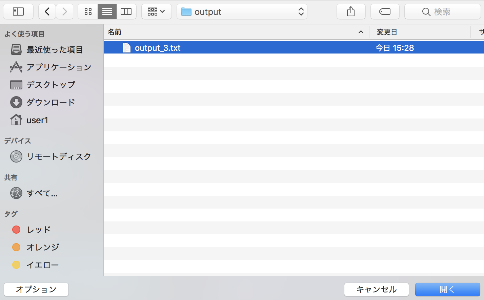

# Source

    

Sourceコンポーネントは、後続コンポーネントに渡すファイルを用意します。  
Sourceコンポーネントのプロパティは以下です。  

| プロパティ | 入力値 | プロパティ説明 |
|----|----|----|
| name | 文字列 |  コンポーネントのディレクトリ名 |
| description | 文字列 | コンポーネントの説明文 | 
| outputFiles | ファイル, ディレクトリ名またはglobパターン | 後続コンポーネントへ渡すファイル | 
| uploadOnDemand | チェックボックス | プロジェクト実行開始時にクライアントからアップロードさせるかどうかのフラグ | 

# Sourceコンポーネントの使用例
Sourceコンポーネントのサンプルワークフローを示します。  
Sourceコンポーネントで後続コンポーネントにファイルを渡す方法は3パターンあります。  

1. sourceコンポーネントにoutputファイルが1つしかない場合
1. sourceコンポーネントにoutputファイルが複数ある場合
1. outputファイルをオンデマンドを利用して選択する場合

それぞれの設定方法を以下のサンプルワークフローを用いて説明します。  
このサンプルワークフローでは、sourceコンポーネントに設定したテキストファイルを後続のtaskコンポーネントに渡して、テキストファイルの内容を標準出力させます。

## ■ source　ワークフロー構成図

  

## ■ ワークフローを構成するコンポーネント
| コンポーネントタイプ | コンポーネント名 | 入力ファイル | 出力ファイル | 設定ファイル |
|----|----|----|----|----|
| Task | task1 | テキストファイル | - | 入力ファイルの内容を標準出力するスクリプト | 
|  | task2 | テキストファイル | - | 入力ファイルの内容を標準出力するスクリプト | 
|  | task3 | テキストファイル | - | 入力ファイルの内容を標準出力するスクリプト | 
| Source | source1 | - | テキストファイル | - |  
|  | source2 | - | テキストファイル | - |   
|  | source3 | - | ダミーのファイル | - |  


## ■ 各コンポーネントのプロパティ

> task1（Taskコンポーネント）

| プロパティ名 | 設定値 |
| ---- | ---- |
| Name | task1 |
| Script | echo.sh |
| InputFiles | input.txt |
| OutputFiles | - |
| Remotehost | localhost |
| Files | echo.sh |  

#### ・echo.sh
```
#!/bin/bash
cat input.txt 
```

※ task2, task3についても同様の設定

> source1 (Sourceコンポーネント)

| プロパティ名 | 設定値 |
| ---- | ---- |
| Name | source1 |
| OutputFiles | output_1.txt |
| uploadOnDemand | チェックしない |
| Files | output_1.txt |

#### ・output_1.txt
```
Hello Task1
```

> source2 (Sourceコンポーネント)

| プロパティ名 | 設定値 |
| ---- | ---- |
| Name | source2 |
| OutputFiles | output_1.txt |
| uploadOnDemand | チェックしない |
| Files | output_1.txt, output_2.txt |

#### ・output_1.txt
```
Hello Task1
```

#### ・output_2.txt
```
Hello Task2
```

> source3 (Sourceコンポーネント)

| プロパティ名 | 設定値 |
| ---- | ---- |
| Name | source3 |
| OutputFiles | dammy |
| uploadOnDemand | チェックする |
| Files | dammy |

#### ・dammy
outputファイルはダイアログからアップロードするため、任意のダミーファイルをoutputファイルに設定します  
今回は"dammy"という名前の空ファイルを設定しました

#### ・output_3.txt
```
Hello Task3
```
output_3.txtは、ワークフローを実行した際にアップロードするファイルです  
ローカルマシンの任意のディレクトリに保存してください

## ■ source　ワークフロー実行

サンプルワークフローを実行すると、outputファイルを複数持っている"source2"コンポーネントを実行するにあたり  
下記のダイアログが表示されます。セレクトボックスで"output_2.txt"を選択して「OK」をクリックします  

  

次に、uploadOnDemandにチェックを入れている"source3"コンポーネントを実行するにあたり  
下記のダイアログが表示されます。「OK」をクリックします

  

次にアップロードするファイルを選択するダイアログが表示されます。  
任意のディレクトリに格納していた"output_3.txt"を選択します。

  

souceコンポーネントのoutputファイルの設定が完了すると、ワークフローがrunningになります  
ワークフローの結果が下記になります

  
