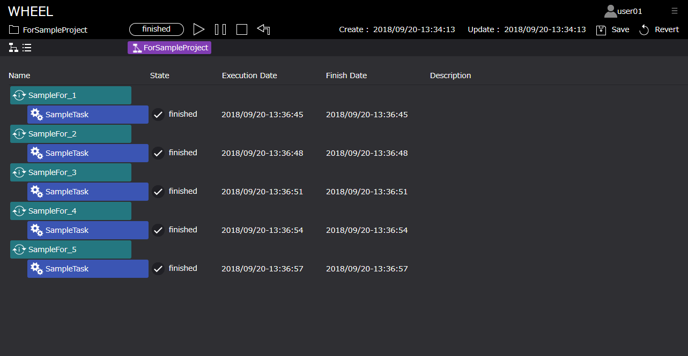

# ワークフロー実行状況確認画面（リストビュー）の機能説明
本章では、ワークフロー実行状況確認画面（リストビュー）の仕様について説明します。  

## 1. 画面仕様説明
ワークフロー実行状況確認画面（リストビュー画面）は、ワークフロー画面切替ボタンにより  
ワークフロー編集画面の「ワークフロー作成用エリア」が実況状況確認用画面に変更されます。  
リストビュー画面は、以下のように構成されています。  

  

1. Name：コンポーネント名
1. State：コンポーネント進行状況
1. Execution Date：コンポーネント実行日時
1. Finish Date：処理完了日時
1. Description：コンポーネントの説明文

Stateは、以下のように分類され、表示されます。

| State名 | State説明 |
|----|----|
| waiting | 処理の実行待ち |
| queued | ステージイン待ち |
| stage-in | ステージイン中 |
| stage-out | ステージアウト中 |
| finished | 処理の完了 |
| failed | 処理の失敗 |

リストビュー画面では、グラフビュー画面での「running」が  
・waiting  
・queued  
・stage-in    
・stage-out  
の4つの状態で細分化され、表示されます。  

複数個コンポーネント、また、Parameter Study, For, Foreach, Whileなどの1つのコンポーネントにて複数回の処理が実行される場合は、  
実行順にリスト表示されます。例としてFor実行時のリスト画面を示します。

  
