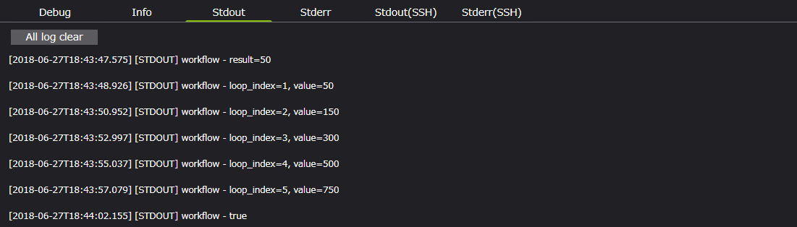
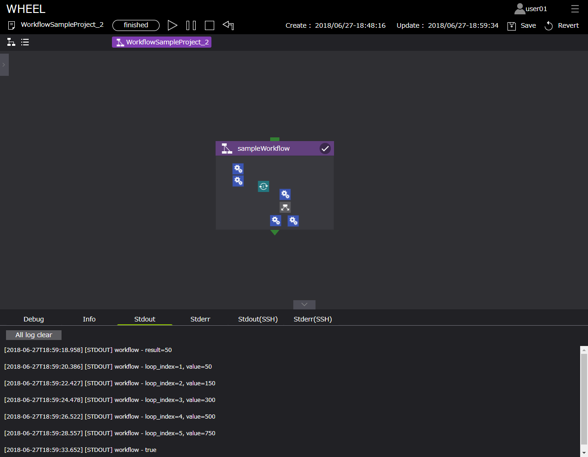

# Workflow

  

Workflowコンポーネントは、複数のコンポーネントからなる処理を一つのコンポーネントにまとめるために用います。  
Workflowコンポーネントを使用することで、ワークフロー編集画面上を処理毎に集約することができ、ワークフロー全体の見通しを良くすることができます。  

Workflowコンポーネントのプロパティは以下です。

| プロパティ | 入力値 | プロパティ説明 |
|----|----|----|
| name | 文字列 *1 |  コンポーネントのディレクトリ名 |
| description | 文字列 | コンポーネントの説明文 | 
| inputFiles | ファイルまたはディレクトリ名 *2 | 先行コンポーネントから受け取るファイル | 
| outputFiles | ファイル, ディレクトリ名またはglobパターン *2 | 後続コンポーネントへ渡すファイル | 
| clean up flag | ラジオボタン | リモート環境に作成した一時ファイルの取り扱い決定フラグ | 
|  | clean up | 削除する | 
|  | keep files | 削除しない | 
|  | follow parent setting | 親コンポーネントと同じ挙動をする *3 | 

*1 プロパティに使用できる文字列は、半角英数字[0-9 a-Z]、ハイフン[ - ]、アンダースコア[ _ ]のみです。  
　ただし、Descriptionは任意の文字列を使用できます。    
*2 詳細は次節にて説明  
*3 clean up flag の初期値は、[ follow parent setting ]です。  
　ただし、rootワークフロー作成時は、[ clean up ]へ変更します。

# Workflowコンポーネントの使用例

Workflowコンポーネントは、複数のコンポーネントからなる処理を一つのコンポーネントにまとめるために用います。  
Workflowコンポーネントを使用することで、ワークフロー編集画面上を処理毎に集約することができ、ワークフロー全体の見通しを良くすることができます。

サンプルプロジェクトは下記からダウンロード可能です。  
<a href="./sample/WorkflowSampleProject_1.wheel.zip">Workflowコンポーネント未使用</a>  
<a href="./sample/WorkflowSampleProject_2.wheel.zip">Workflowコンポーネント使用</a>  

#### Workflowコンポーネント未使用  

   

#### Workflowコンポーネント使用  

   

以下に実行結果を示します。  

#### Workflowコンポーネント未使用 実行結果  

   

#### Workflowコンポーネント未使用実行結果（ログ）

   

#### Workflowコンポーネント使用実行結果

   