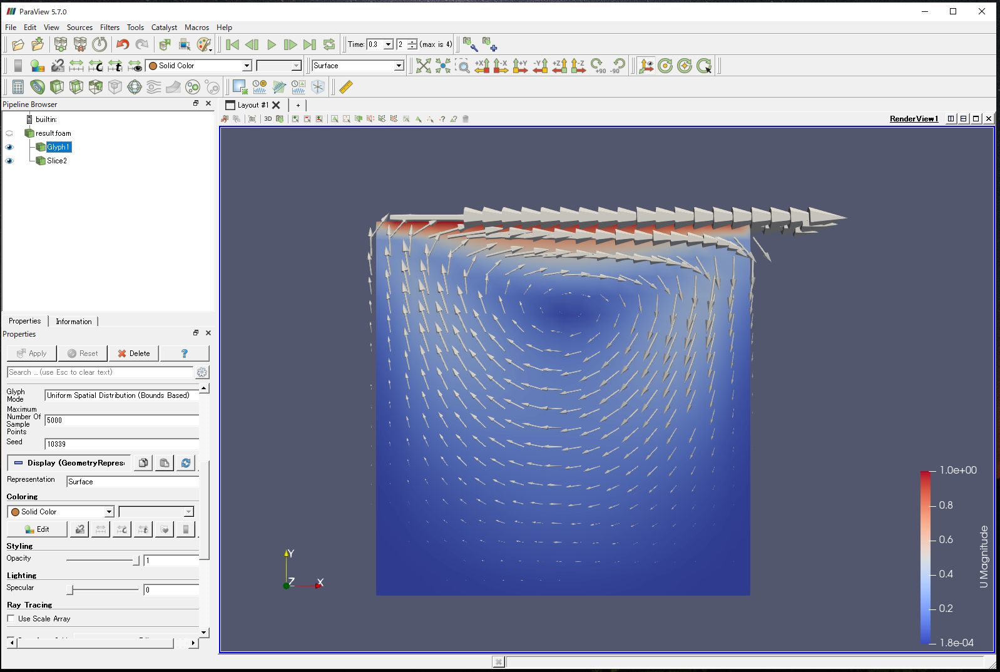

# OpenFOAMを利用したcavityケースの解析ワークフロー
本章では、WHEELを用いた計算事例として「OpenFOAMを利用したcavityケースの解析ワークフロー」を紹介します。  
九大ITOコンピュータのito-g-16-dbgキューを利用して行います。  
以降、下記の順にて事例内容を紹介します。  

また、本章で使用するモデルデータ、OpenFOAMの計算実行ファイル、及びTaskコンポーネントで使用するスクリプト例は、  
下記よりダウンロード可能です。  
<a href="./sample/OpenFOAM_tutorial_sample.zip">OpenFOAMサンプルデータ</a>

1. 解析概要
1. ワークフローの作成  
　1. Task コンポーネント - 1  
　2. Task コンポーネント - 2  
　3. Task コンポーネント - 3  
1. ジョブの投入
1. 解析結果の確認

## 1. 解析概要

本事例で使用する解析対象モデルは、CFDソフトウェアの基礎的な検証例として著名な「cavity」で行いました。  
上端の壁が水平方向に一定速度で動き、引きずられるように内部の流体が動くようなモデルの解析です。

  

## 2. WHEELによるワークフローの作成

本節では、WHEELでのパラメトリックスタディ解析に必要なワークフローコンポーネントについて説明します。  
本事例で必要なコンポーネントとその役割は以下です。

- Task コンポーネント - 1：ITOへのジョブ投入及びOpenFOAM前処理
- Task コンポーネント - 2：ITOへのジョブ投入及びOpenFOAM実行用
- Task コンポーネント - 3：ITOへのジョブ投入及びファイル回収用

以降で、各コンポーネントについて説明します。

### Task コンポーネント - 1

続いて、ITOコンピュータへのジョブ投入用及びOpenFOAM解析実行前処理用コンポーネント「PreRunOpenFOAM_Task」について説明します。  
本コンポーネントは、ITOコンピュータのito-g-1-dbgキューを用いてOpenFOAMによる分配管の流体解析を実行するための前処理を行うコンポーネントです。

PreRunOpenFOAM_Taskコンポーネントに設定するプロパティ、及びスクリプトの中身は以下です。

##### PreRunOpenFOAM_Task

| プロパティ名 | 設定値 |
| ---- | ---- |
| Name | PreRunOpenFOAM_Task |
| Script | PreRunOpenFOAM.sh |
| InputFiles | - |
| OutputFiles | - |
| Remotehost | TCSjobScheduler_1 |
| UseJobScheduler | true |
| Queue | ito-g-1-dbg |
| Clean up flag | keep files |
| include | - |
| exclude | - |
| Files | PreRunOpenFOAM.sh, cavity.tar.gz* |  

*OpenFOAMの計算実行ファイル一式

> PreRunOpenFOAM.sh  
```
#!/bin/bash
#PJM -L "rscgrp=ito-g-1-dbg"
#PJM -L "rscunit=ito-b"
#PJM -L "elapse=1:00:00"
#PJM -j -X -S

tar xvzf cavity.tar.gz
mkdir ../WORK
mv cavity ../WORK
cd ../WORK/cavity
blockMesh
decomposePar
```

  :q

設定は以下です。　　

1. ITOコンピュータでOpenFOAMを実行するために必要なデータ（OpenFOAMの入力ファイル「cavity.tar.gz」）及びジョブスクリプトPreRunOpenFOAM.shをインポートします
1. プロパティ[ script ]にPreRunOpenFOAM.shを設定します
1. プロパティ[ remotehost ]に事前に登録しているITOのリモートホスト情報「TCSjobScheduler_1」設定します*
1. プロパティ[ useJobScheduler ]をチェックし、プロパティ[ queue ]に「ito-g-1-dbg」を設定します

*　ITOコンピュータでTCSを使用して計算を行うため「TCSjobScheduler_1」としています。  
　 ユーザの環境に合わせて設定の変更が必要です。

### Task コンポーネント - 2

続いて、ITOコンピュータへのジョブ投入用及びOpenFOAM解析実行用コンポーネント「SolRunOpenFOAM_Task」について説明します。  
本コンポーネントは、ITOコンピュータのito-g-4-dbgキューを用いてOpenFOAMによるcavityの解析を実行するためのコンポーネントです。

SolRunOpenFOAM_Taskコンポーネントに設定するプロパティ、及びスクリプトの中身は以下です。

##### SolRunOpenFOAM_Task

| プロパティ名 | 設定値 |
| ---- | ---- |
| Name | SolRunOpenFOAM_Task |
| Script | SolRunOpenFOAM.sh |
| InputFiles | - |
| OutputFiles | - |
| Remotehost | TCSjobScheduler_4 |
| UseJobScheduler | true |
| Queue | ito-g-4-dbg |
| Clean up flag | keep files |
| include | - |
| exclude | - |
| Files | SolRunOpenFOAM.sh | 

> SolRunOpenFOAM.sh  
```
#!/bin/bash
#PJM -L "rscgrp=ito-g-4-dbg"
#PJM -L "rscunit=ito-b"
#PJM -L "vnode=4"
#PJM -L "vnode-core=9"
#PJM -L "elapse=1:00:00"
#PJM -j -X -S

## OpenFOAM-v1706
. /home/app/a/OpenFOAM/OpenFOAM-v1706/etc/bashrc
source /etc/bashrc
cd ../WORK/cavity
mpiexec -np 4 icoFoam -parallel > ./log.icoFoam 2>&1
```

  

設定は以下です。　　

1. ITOコンピュータでOpenFOAMを実行するために必要なジョブスクリプトSolRunOpenFOAM.shをインポートします
1. プロパティ[ script ]にSolRunOpenFOAM.shを設定します
1. プロパティ[ remotehost ]に事前に登録しているITOのリモートホスト情報「TCSjobScheduler_4」設定します*
1. プロパティ[ useJobScheduler ]をチェックし、プロパティ[ queue ]に「ito-g-4-dbg」を設定します

### Task コンポーネント - 3

続いて、ITOコンピュータへのジョブ投入用及びOpenFOAM解析実行後処理用コンポーネント「ResultRunOpenFOAM_Task」について説明します。  
本コンポーネントは、ITOコンピュータのito-g-1-dbgキューを用いてOpenFOAMによるcavityの解析を実行するためのコンポーネントです。

ResultRunOpenFOAM_Taskコンポーネントに設定するプロパティ、及びスクリプトの中身は以下です。

##### ResultRunOpenFOAM_Task

| プロパティ名 | 設定値 |
| ---- | ---- |
| Name | ResultRunOpenFOAM_Task |
| Script | ResultRunOpenFOAM.sh |
| InputFiles | - |
| OutputFiles | - |
| Remotehost | TCSjobScheduler_1 |
| UseJobScheduler | true |
| Queue | ito-g-1-dbg |
| Clean up flag | keep files |
| include | cavity.tar.gz |
| exclude | - |
| Files | ResultRunOpenFOAM.sh |

> ResultRunOpenFOAM.sh  
```
#!/bin/bash
#PJM -L "rscgrp=ito-g-1-dbg"
#PJM -L "rscunit=ito-b"
#PJM -L "elapse=1:00:00"
#PJM -j -X -S

cd ../WORK/cavity
reconstructPar  
touch result.foam  
cd ../
tar cvzf cavity.tar.gz cavity
```

  

設定は以下です。　　

1. ITOコンピュータでOpenFOAMを実行するために必要なジョブスクリプトrunOpenFOAM.shをインポートします
1. プロパティ[ script ]にResultRunOpenFOAM.shを設定します
1. プロパティ[ remotehost ]に事前に登録しているITOのリモートホスト情報「TCSjobScheduler_1」設定すします*
1. プロパティ[ useJobScheduler ]をチェックし、プロパティ[ queue ]に「ito-g-1-dbg」を設定します
1. includeに回収するファイル名「cavity.tar.gz」を設定します

### ジョブスクリプトに関して

WHEELは、リソースグループを用い、効率的に計算資源を利用することを目的としています。  
よって、キュー内で解析が完了するようにモデル規模、またノード数、プロセス数を設定しジョブを投入する必要があります。  
本解析は**4ノード36プロセス**にて解析を行っております。

また、ジョブスクリプトrunOpenFOAM.shには、#PJMで始まるジョブへのオプション設定の他に「OpenFOAMを実行するためのコマンド」を用意しています。  
ここでは、ITOでOpenFOAMを実行するためのコマンドを紹介します。

ITOで利用できるOpenFOAMのバージョンを確認するためには、  

```
$ module avail
```

コマンドで確認してください。  

また、解析完了後、Paraviewで解析結果を確認するためには、空の「○○.foam」ファイル（○○は任意の文字列）が  
必要であるため、空ファイルを作成するコマンド

```
$ touch ○○.foam
```

をスクリプト内に組み込んでおくと結果確認をスムーズに行うことができます。

### リモートホスト登録情報に関して

本事例は、ITOのリソースグループを利用してジョブを投入することを前提としております。  
そのため、前述のホスト情報登録方法に従い、ITOのリソースグループにジョブを投入するためのホスト情報を登録しておく必要があります。  
本サンプルでは、ITOコンピュータでリソースグループito-g-1-dbgを使用して計算を行うため「TCSjobScheduler_1」としています。  

参考として、本事例で設定したホスト情報の中で注意すべき項目を示します。

- Host Work Dir：/scratch/groupname/.....  
※リソースグループを用いてジョブを投入する場合、/home,/dataからジョブを投入することはできません。詳細はITOのユーザガイドをご確認ください。  
- Job Scheduler：TCS
※ジョブスケジューラの設定は、WHEELのモジュールディレクトリ内[ app/db/jobSceduler.json ]にて行ってください。  
- Queue：ito-g-1-dbg
※ホスト情報のQueue欄に[ ito-g-1-dbg ]登録を登録しておくことで、Taskのプロパティからの選択が可能となります。  

以上でワークフローの設定は終了です。

## 3. ジョブの投入

ジョブの投入を行います。前述の「9.ワークフローの作成」にありますように、ジョブの投入は、ワークフロー実行画面上部の実行ボタンより行います。  
実行状況の確認は、ログエリアやコンポーネント右上の実行状況表示アイコン、及びリストビュー画面から行います。  

  

## 4. 解析結果の確認

解析結果の確認を行います。  
リモート環境から回収した計算結果ファイルをローカル環境に移動し、「Paraview」にて確認します。  

### 解析結果のオープン

Paraviewを起動し、[ File ] -> [ Open ].... より、「result.foam *1」ファイルを選択し、[ OK ]ボタンを押下します。　　
*1 result.foam ファイルは、ジョブスクリプト内の「touch」コマンドにて作成したものです。（詳細は、前述の「ジョブスクリプトに関して」をご参照ください）

### 解析結果

参考として風速ベクトルの可視化結果を記載します。

  

OpenFOAMを利用した九大ITOによる解析ワークフロー例は以上になります。
